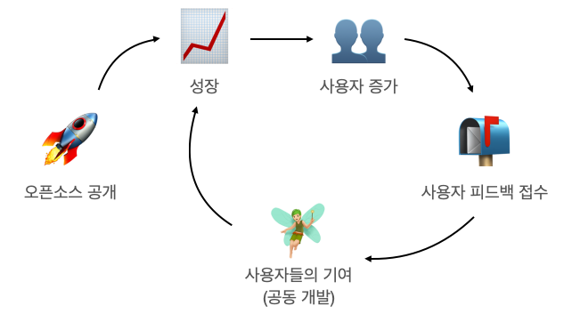

# 오픈소스 공개하기

> 본 책에서는 기업에서 오픈소스를 공개하는 과정에서 '일반적으로' 발생할 수 있는 과정에 대해 서술한다. 특정 기업의 예외 사항을 모두 다루지 않으니 유의한다. 

 이번 장에서는 두 가지 입장에 따라 오픈소스 공개 과정을 서술한다. 

1. 오픈소스 공개 가이드 - 회사 편:
   오픈소스 사무국을 운영하는 입장을 위한 가이드이다. 회사 구성원으로부터 오픈소스 공개 요청이 있을 경우, 혹은 회사의 사업 차원에서 오픈소스 공개를 진행하는 경우에 고려해야 할 내용을 다룬다.
2. 오픈소스 공개 가이드 - 개발자 편:
   회사에 속한 개발자의 입장을 위한 가이드이다. 회사 업무의 일환으로 오픈소스를 공개하는 경우, 신경 쓰면 좋을 부분에 대한 내용을 다룬다. 

## 오픈소스 공개, 왜? 

 오픈소스 공개와 운영은 여러 명의 의지가 필요한 일이다. 물론 한 명의 **강력한** 의지로 성공하는 경우도 많다. 하지만 우리는 기업에서의 오픈소스 공개에 대한 내용을 다루고 있으므로 지극히 일상적인 환경을 상상해보도록 한다. 우선 오픈소스 공개의 의지가 있는 몇몇의 사람들이 모이고, 의지가 없었던 다른 회사 구성원들의 동의를 얻었을 때 비로소 본격적으로 오픈소스 공개 절차를 시작하게 될 것이다. 실제로 어떤 과정을 거쳐서 새로운 오픈소스를 공개하는가에 대한 이야기를 하기 전에, 다른 사람들을 설득할 때 도움이 될만한 '회사에서 오픈소스를 공개해서 얻을 수 있는 이점'에 대해서 먼저 정리한다. 

### 회사에서 얻는 이점

 회사의 입장에서는 특히나 "왜 우리가 힘들여서 소스코드를 공개를 해야 하는데? 그냥 손해 아닌가?"라는 물음에 답을 하기 어려울 것이다. 하지만 분명 회사에서도 얻는 이점이 있다. 많다! 

#### 기술 브랜드 인지도 향상

 개발자를 채용하는 회사라면 어디나 채용이 어렵다고들 한다. 회사가 원하는 인재가 어디에 있는지 찾기도 어렵고, 원하는 인재가 이 회사를 맘에 들어 하기는 더더욱 어려우니 말이다. 이런 상황에서 좋은 개발자를 채용하기 위해서 회사는 여러 가지 노력을 한다. 우리 회사는 어떤 개발 문화를 가지고 있는지 설명하기 위해 간단하게는 소책자를 제작하는 일에서부터 시작해서 소셜 광고, 동영상 제작, 혹은 채용 설명회에서 장대하게 발표를 한다. 이런 많은 노력 중에서 오픈소스 공개에 대한 소식은 참 매력적인 소재가 된다. 예를 들어 안드로이드 애플리케이션 개발에 사용되는 라이브러리를 오픈소스로 공개했다면 구직 중인 안드로이드 개발자들에게 다양한 내용을 함축적으로 전달할 수 있을 것이다. 

- 회사에서 안드로이드 개발을 할 때 어떤 부분에 신경 쓰는지
- 회사에서 이미 근무 중인 안드로이드 개발자들이 어떻게 개발하고 있는지
- 회사에서 이미 근무 중인 안드로이드 개발자들이 얼마나 열정적인지

 백문이 불여일견인 법. 이 내용들을 설명으로 전달할 수도 있겠지만, 오픈소스로 직접 보여주는 것은 전달력이 한 차원 다를 것이다.

#### 직원 리텐션 효과 

 오픈소스를 공개하고 난 뒤 얻는 성취감이 있다. 평소에 서비스/제품을 개발하고 난 뒤의 성취감과는 확연히 다른 느낌일 것이다. 유능한 직원이 회사에 머물게 하기 위해서도 여러 가지 노력을 하겠지만, 이렇게 업무 만족도를 높여 자긍심을 갖도록 하는 일 또한 오픈소스 공개를 통해 할 수 있는 일이다.  

#### 직원들 기술 역량 향상

 직원들이 알아서 성장하면 좋겠지만 쉬운 일이 아니다. 새로운 기술은 쏟아지는데 제자리에 침체된 분위기 속에서는 좋은 결과물을 내기 어려운 법이다. 사내 교육 프로그램을 잘 구성하는 것도 중요하지만 오픈소스를 공개하고 운영하는 과정에서 배우게 되는 기술들은 바로 뒤에 나올 *개발자로써 얻는 이점* 을 참고하자.  

#### 오픈소스 커뮤니티로부터 받는 지지 (오픈소스 생태계 선순환)

 이 이점을 실제로 체감하기까지는 쉽지 않을 수도 있다. 하지만 먼 미래를 내다보았을 때 결정적인 큰 도움을 받을 기회가 있다면 바로 이런 경우일 것이다. 설명을 위해 동일한 오픈소스를 사용하는 다음과 같은 두 기업이 있다고 가정해보자.

- 기업 A: 오픈소스를 단순히 사용한다. 물론 사용하는 오픈소스들에서 요구하는 라이선스 의무사항은 꼼꼼히 지켰다. 이 오픈소스를 사용하여 개발한 프로그램으로 수익을 만든다.
- 기업 B: 기업 A처럼 오픈소스에 많이 의지하면서도 필요한 플러그인을 직접 개발하고 오픈소스로 공개했다. 아주 많은 사람들은 아니지만 몇몇 외부 사람들이 이 오픈소스의 목적이나 주요 기능에 대해 알고 있다.

 만약 두 기업이 각각 이 오픈소스를 사용하다가 어떤 문제를 맞닥뜨려 커뮤니티에 해결 방안을 문의한다면? 그동안 관계를 잘 쌓아왔던 기업 B의 물음에 더 우호적으로 반응할 가능성이 크다. 가능한 경우에는 단순히 질문의 대답을 얻을 뿐 아니라 직접적인 해결책을 제시하는 것까지도 기대해볼 수 있을 것이다. 정리하면 오픈소스로부터 도움을 받은 것을 시작으로 새로운 오픈소스가 탄생했으며, 서로에게 도움을 주는 단계에 이르렀다. 이것이야말로 선순환하는 좋은 예시가 아닐까? 

#### 커뮤니티 리소스 유입

 사실 위에서 언급한 장점을 모두 제치고 가장 강력한 설득 포인트가 될 부분이다. 이 장점을 제대로 이해하기 위해서 오픈소스가 잘 운영되는 방식을 보자.

 오픈소스가 공개되고 성공적으로 궤도에 오른다면 다음과 같은 순환을 기대해볼 수 있다. 사람들이 채택할 만큼 충분히 매력이 있다면 사용자들이 늘어날 것이고, 그 사용자들이 뭔가 문제에 맞닥트릴 때마다 버그를 제보하거나 새로운 기능에 대한 아이디어를 제공할지도 모른다. 더 나아가서는 사용자들이 기여자가 되어 직접 개발에 참여하게 된다면 프로젝트는 또다시 성장이 가속화될 것이다. 

 오픈소스로 공개하지 않은 내부 프로그램의 경우와 비교해본다면 다음과 같이 요약할 수 있을 것이다.
- 훨씬 더 많은 사람들로부터 제공되는 피드백, 아이디어
- 훨씬 더 다양한 환경에서의 활용으로 얻게 되는 안정성(미처 발견하지 못했던 오류를 발견할 가능성이 높아짐)
- 훨씬 더 많은 사람들의 자발적인 참여로 회사에서 투자하는 리소스를 감소시킴

 이 모든 장점들을 단기적으로는 체감하기 어렵다는 점을 꼭 덧붙이고 싶다. 처음 몇 년 동안은 사막에서 오아시스를 찾는 것처럼 허무하게 느껴지겠지만 두고 보시라. 언젠가는 사람들이 끊임없이 찾는 사막의 아름다운 호수가 될지도 모른다! 

### 개발자로써 얻는 이점

 두 가지 선택지 중에서 하나만을 골라보자. 학생 시절로 돌아가 과제를 한다면? (1) 혼자 하는 과제 vs (2) 조별 과제 중에서 어떤 과제를 선택할 것인가? 누구나 한 번쯤은 조별 과제에서 크게 고생했던 기억이 있을 것이다. 그만큼 다른 사람과 어떤 것을 같이 한다는 것은 쉬운 일이 아니다. 하지만 오픈소스의 경우에는 다른 사람(심지어 전혀 만난 적도, 만날 일도 없을 것 같은 사람)과 함께 했을 때 비로소 그 장점들이 빛을 발하는 것인데 이를 위해서 다양한 노력이 필요하다. 이런 노력들을 통해 어떤 실력이 향상되는지 정리한다.

#### 가독성 높은 코드의 작성 실력

 만약 혼자만 알아볼 수 있는 코드를 작성했고, 다른 누군가가 사용하다가 예상한 대로 동작하지 않는다고 생각해 보자. 사용자는 직접 어느 부분이 문제인지 알아내지 못하고 단순히 질문만 남기거나, 다른 제품으로 아예 대체해버릴지도 모른다. 반대로 다른 사람들이 읽기 쉬운 코드를 작성한 경우에는? 사용하다 문제가 있는 사람은 직접 문제의 원인을 찾고 해결하는 Pull Request를 보낼지도 모른다. 따라서 미래의 나에게 주어질 숙제를 줄이기 위해서는 다른 사람들이 쉽게 이해할 수 있는 코드를 작성해야 한다. 

#### 문서 작성 실력

 코드 작성 이외에도 오픈소스의 동작 방식을 잘 설명하는 문서와 주석을 적절히 추가해야 할 것이다. 너무 길고 상세하게만 작성한 글은 가독성을 떨어트린다. 그렇다고 너무 불친절하게 짧게 쓴 글은 이해도를 낮춘다. 본인의 의도를 설명하기 위한 내용을 적절한 순서로 글을 작성하는 연습을 할 것이다. 만약 사용자들이 궁금해하는 내용을 글에서 찾지 못했다면 질문을 남길 것이고, 이를 통해 글에서 부족한 부분을 보완할 수 있다. 

#### 커뮤니케이션 실력

 오픈소스 개발을 하는 경우에는 코딩보다도 커뮤니케이션에 더 많은 시간을 쏟게 되는 경우도 있다. 소통할 사람들이 서로 다른 지식을 가졌고, 서로 다른 언어를 사용하고, 또 서로 다른 시간대에 있기 때문이다. 따라서 하나의 문제를 해결하기 위해서는 효율적으로 설명하고, 질문하는 연습을 하게 된다. 꼭 기술적인 커뮤니케이션 스킬뿐만 아니라 다른 사람의 입장을 이해하고, 자만하거나 소극적이지 않은 자세 또한 효율적인 커뮤니케이션에 필수적이다. 따라서 오픈소스를 공개하고 운영하는 과정에서 다양한 방면의 커뮤니케이션 스킬을 익힐 수 있다. 

#### 오픈소스의 동작 원리 이해

 오픈소스를 잘 사용하는 방법을 누군가가 친절하게 알려주면 좋겠지만 대부분은 스스로 검색하고 찾아보고 공부해야 하는 경우가 많을 것이다. 만약 어떤 오픈소스의 사용법을 익혀서 잘 사용하다가 어떤 문제에 맞닥트렸다고 해보자. 오픈소스의 동작 방식을 모른다면 어디에 질문하고 어떻게 답을 얻는지 알기 어려울 것이다. 다양한 경우에서 오픈소스의 동작 원리를 이해하는 사람에게는 유익한 경우가 많다. 

#### 포트폴리오

 최근 경력 개발자 채용 공고에서는 특정 대형 오픈소스 사용 경험이나 오픈소스 활동 경험을 우대 사항으로 명시하는 것을 심심치 않게 볼 수 있다. 회사에서 이미 사용하고 있는 오픈소스와 관련된 활동을 한 사람은 이직을 하고 나서도 실무에 바로 투입이 가능하다고 기대하기 때문이다. 또 면접관이 이력서를 볼 때 이전 직장에서의 경력들은 지원자의 설명에만 의존해서 이해하지만, 오픈소스 경력은 직접 확인하여 직관적으로 이해할 수도 있는 이유 때문이기도 하다. 오픈소스를 직접 공개하고 운영한 경험은 바로 위에서 나열한 여러 가지 실력들을 쌓아왔다는 증거가 되어 더욱 화려한 이력서를 작성할 수 있을 것이다. 