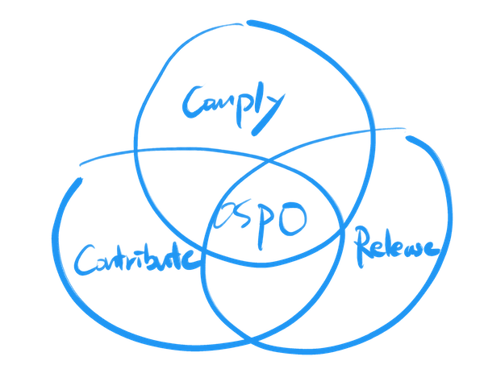
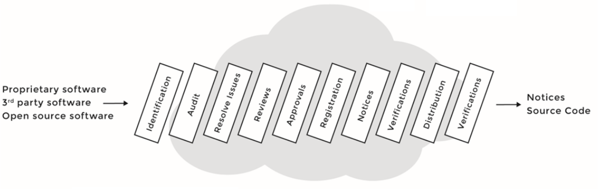

- [OSPO (Open Source Program Office)](#ospo-open-source-program-office)
  - [오픈소스 프로그램이란?](#오픈소스-프로그램이란)
  - [OSPO란?](#ospo란)
    - [1. 오픈소스 올바르게 사용하기](#1-오픈소스-올바르게-사용하기)
    - [2. 외부 오픈소스 프로젝트에 기여하기](#2-외부-오픈소스-프로젝트에-기여하기)
    - [3. 프로젝트를 오픈소스로 공개하기](#3-프로젝트를-오픈소스로-공개하기)
  - [기대 효과](#기대-효과)
  - [OSPO 설립 절차](#ospo-설립-절차)
    - [1. 리더를 임명한다.](#1-리더를-임명한다)
    - [2. OSPO의 역할을 정의한다.](#2-ospo의-역할을-정의한다)
    - [3. 피드백을 수렴한다.](#3-피드백을-수렴한다)
  - [어느 조직에 OSPO를 설립해야 하는가?](#어느-조직에-ospo를-설립해야-하는가)
    - [개발 조직 내 설립하라](#개발-조직-내-설립하라)
    - [법무 조직 내 설립하라](#법무-조직-내-설립하라)
    - [마케팅 조직 내 설립하라](#마케팅-조직-내-설립하라)
  - [OSPO에는 어떤 인원이 필요한가?](#ospo에는-어떤-인원이-필요한가)
    - [프로그램 매니저](#프로그램-매니저)
    - [컴플라이언스 담당](#컴플라이언스-담당)
    - [법무 담당](#법무-담당)
    - [IT 지원 담당](#it-지원-담당)
    - [오픈소스 에반젤리스트](#오픈소스-에반젤리스트)
  - [OSPO는 무엇을 해야 하는가?](#ospo는-무엇을-해야-하는가)
    - [정책을 수립한다](#정책을-수립한다)
    - [정책을 전파한다](#정책을-전파한다)
    - [프로세스를 구축한다](#프로세스를-구축한다)
    - [자동화 도구를 지원한다](#자동화-도구를-지원한다)
      - [FOSSology : 소스 코드 스캐닝 도구](#fossology--소스-코드-스캐닝-도구)
      - [SW360 : 소프트웨어에 포함된 구성요소를 관리하기 위한 도구](#sw360--소프트웨어에-포함된-구성요소를-관리하기-위한-도구)
      - [SPDX : 소프트웨어 정보 교환 방식 표준](#spdx--소프트웨어-정보-교환-방식-표준)
      - [ClearlyDefined : 오픈소스 데이터베이스 제공.](#clearlydefined--오픈소스-데이터베이스-제공)

# OSPO (Open Source Program Office)

오픈소스를 사용하여 소프트웨어를 개발하고 배포하는 기업이라면 효과적인 오픈소스 거버넌스 관리 체계를 구축해야 한다. 이는 기업이 오픈소스와 관련된 모든 활동을 적극적으로 관리해 오픈소스로부터 최대한의 가치를 창출함과 동시에 법적인 리스크를 감소시키기 위해서이다. 글로벌 ICT 기업들은 이러한 오픈소스 거버넌스 체계를 구축하고 이를 성장시키기 위해 OSPO(Open Source Program Office)라는 조직을 설립한다. OSPO는 기업의 오픈소스 거버넌스 체계를 구축할 뿐만 아니라 기업의 성공을 위한 오픈소스 전략을 수립하고 실행하는데 필요한 정책, 프로세스 및 필요한 도구를 제공하는 역할을 수행한다. 

Microsoft, Google, Twitter, Netflix와 같은 테크 분야 리더 기업뿐만 아니라 삼성, Comcast, Intel과 같은 전통 기업들도 OSPO를 운영하고 있다. 이러한 거대 기업이 아니더라도 테크, 가전, 금융 및 통신 분야의 기업 중 50% 이상이 OSPO를 만들었거나 만들 예정이라는 [조사 결과](https://github.com/todogroup/survey/tree/master/2019)도 있다.

여기서는 OSPO의 역할, 책임, 구성과 설립 방법을 설명한다. 

## 오픈소스 프로그램이란?

먼저, 오픈소스 프로그램이란 용어를 살펴보자. 오픈소스 프로그램이란 기업이 오픈소스의 활용을 효과적으로 관리하여 (1) 라이선스 위반 리스크는 감소시키면서 (2) 최고의 가치를 창출하기 위한 프로그램을 의미한다. 

오픈소스 프로그램은 오픈소스 정책과 절차, 그리고 이를 자동화/효율화할 수 있는 도구를 마련하는 일이 포함된다. 

## OSPO란?

OSPO는 오픈소스 프로그램을 구성하기 위한 조직으로써, 기업의 오픈소스 전략과 정책을 수립하고, 회사가 오픈소스로 미래의 혁신을 준비하는 역할을 수행한다.  어떤 오픈소스 패키지를 사용할지, 개발자가 외부 오픈소스 프로젝트에 어떻게 기여해야 할지, 사내의 어떤 프로젝트를 오픈소스로 공개할지는 모두 OSPO가 수행해야 할 전략적 비즈니스 결정이다.

기업이 오픈소스에서 최대의 이익을 창출하기 위해서는 OSPO를 설립하고 오픈소스 지원 계획을 중앙 집중화하여 다음의 역할을 수행해야 한다.

### 1. 오픈소스 올바르게 사용하기

기업이 오픈소스를 사용하면서 라이선스 의무 사항을 준수할 수 있는 정책과 프로세스를 수립해야 한다. 기업은 제품과 서비스 개발 시 사용한 오픈소스의 라이선스가 요구하는 바를 준수해야 한다. 이를 위한 활동을 오픈소스 컴플라이언스라고 한다. 기업은 올바른 오픈소스 컴플라이언스 활동을 통해 기업의 오픈소스 리스크를 관리할 뿐만 아니라 오픈소스 커뮤니티에서 브랜드 평판을 향상할 수 있다.

이를 위한 세부 사항은 OO 장에서 자세히 다룬다.

### 2. 외부 오픈소스 프로젝트에 기여하기

기업 내 구성원이 외부 오픈소스 프로젝트에 기여하도록 장려하는 것도 오픈소스를 전략적으로 활용하는 좋은 방법이다. OSPO는 이를 위한 정책을 수립하여 오픈소스 기여 문화를 확산하면서도 기업의 지식재산은 보호할 수 있게 해야 한다.

이를 위한 고려사항 및 세부 방법과 취할 수 있는 혜택은 OO장에서 자세히 다룬다.

### 3. 프로젝트를 오픈소스로 공개하기

오픈소스를 적극적으로 활용하는 ICT 기업이라면 오픈소스를 단순히 사용하는 데 그치지 않고, 다음과 같은 방법으로 오픈소스 커뮤니티에 다시 기여해야 한다.

- 오픈소스 프로젝트 공개
- 오픈소스 개발자 후원
- 오픈소스 이벤트 개최

OSPO는 기업의 비즈니스 전략을 고려하여 오픈소스 공개 정책을 수립하고, 이를 활성화하기 위한 실행 방안을 마련해야 한다.

이를 위한 세부 절차 및 방법은 OO 장에서 다룬다.

## 기대 효과

기업이 OSPO를 설립하고 운영하여 오픈소스를 적극적으로 활용한다면 다음의 효과를 기대할 수 있다고 알려져 있다.

- 소프트웨어 개발 인재를 유치하고, 기존 인력의 유출을 방지할 수 있다.
- 비즈니스 가치 창출, 혁신 추진을 가속화 할 수 있다.
- 개발자들이 비즈니스 로직 작성에 집중함으로 비용 절감과 효율 향상을 기대할 수 있다.
- 제품 리더쉽을 통해 수익 창출과 시장 점유율 확보를 기대할 수 있다.

## OSPO 설립 절차

기업이 OSPO를 설립하기 위해서는 다음 절차를 수행해야 한다.

### 1. 리더를 임명한다.

먼저 OSPO를 설립하고 운영할 수 있는 적합한 리더를 찾는 것이 중요하다. 다음과 같은 역량을 갖고 있다면 OSPO의 리더로 적합하다.

- 오픈소스의 가치와 발전 가능성에 공감하고, 이를 기업에 전파하고자 하는 열정이 있다.
- 오픈소스 프로젝트에서 개발자, 기여자로 참여한 경험이 있고, 오픈소스 개발 방법을 충분히 이해한다.
- 기업의 비즈니스 전략과 같은 방향의 오픈소스 전략을 수립할 수 있도록 기업의 비즈니스를 폭넓게 이해한다.
- 기업의 오픈소스 전략과 정책을 모든 구성원이 이해하도록 전파할 수 있는 커뮤니케이션 역량을 갖추었다.
- 개발자들과 기술적인 소통이 가능하도록 여러 기술 분야를 폭넓게 이해한다.

누군가 임시로 일을 맡아서 시작할 수도 있겠지만, 가능한 풀타임으로 책임을 맡을 수 있는 리더를 임명하는 것이 OSPO가 올바르게 시작되고, 견고히 자리를 잡을 수 있게 한다.

### 2. OSPO의 역할을 정의한다.

OSPO를 설립할 때는 기업의 OSPO가 어떤 역할을 수행할지 정의해야 한다. 기업마다 규모나 업종이 다르고, 오픈소스를 통해 얻고자 하는 목적이 다르므로 OSPO의 역할이 달라질 수 있기 때문이다. 일반적으로 OSPO의 역할은, 정책, 프로세스를 수립하고, 도구를 제공함과 동시에 반복 작업을 자동화하고, 부서 간 협업 과정에서 발생하는 이슈 해결을 담당한다.

한가지 주의해야 할 사항은 OSPO의 역할을 무조건 크게 가져가는 것이 좋은 것만은 아니다. OSPO로 업무가 과대하게 집중될 우려가 있다. 다른 조직의 사람들이 문제를 스스로 해결하려고 하기보다는 OSPO에 미루는 현상이 나타날 수 있다.

또, OSPO는 구조화된 정책과 프로세스를 제공해야 하지만, 유연성도 유지해야 한다. OSPO가 모든 분야에 전문성을 유지하며 모든 의사결정을 내리는 것은 현실적으로 불가능하다. OSPO는 오픈소스 사용자와 기여자에게 도움이 필요할 때 컨설팅을 제공하여 구성원들이 스스로 개인 또는 기업의 비즈니스 결정을 내일 수 있도록 허용해야 한다. 궁극적으로는 기업과 구성원의 요구를 모두 충족하기 위해 의무와 책임의 적절한 균형을 설정하는 것이 중요하다. 

### 3. 피드백을 수렴한다.

한 번에 OSPO의 모든 것을 구축하기는 쉽지 않다. 우선 기본적인 사항을 준비한 후 기업 내부의 모든 관련 당사자로부터 피드백을 받아서 보완해나가는 것이 필요하다. 경영진으로부터 개발자에 이르기까지 모든 구성원의 의견을 수렴해야 한다. 기업의 비즈니스 전략이나 구성원의 요구 사항을 고려하지 않고 OSPO가 단독으로 수립한 정책이 성공하기를 기대할 수는 없다.

## 어느 조직에 OSPO를 설립해야 하는가?

OSPO는 기업의 조직 내 어느 부서에서 설립하는 것이 적합하냐는 질문이 나올 수 있다. 개발 조직 내에 설립할지, 아니면 법무 조직에 있어야 하는지를 고민할 수 있는데, 이는 기업의 주요 비즈니스와 오픈소스 전략에 따라 달라진다.

### 개발 조직 내 설립하라

오픈소스를 활용하는 부서는 주로 소프트웨어 개발팀이기 때문에 일반적으로 OSPO는 개발팀 내에 존재한다. 이를 통해 개발자가 더 효과적이고 생산적으로 오픈소스를 활용하는데 집중할 수 있게 한다.

### 법무 조직 내 설립하라

대규모의 IP(지식 재산) 포트폴리오를 보유한 기업이라면 OSPO가 법무 조직 내에 있는 게 유리할 수 있다. 오픈소스를 활용하면서 법무 조직과 긴밀하게 협력하여 IP 관련 법적 문제가 발생할 가능성을 사전에 점검하고 대응할 수 있다. 주로 칩셋과 같이 IP 집약적인 하드웨어 개발 회사에 적합하다.

### 마케팅 조직 내 설립하라

기업이 주로 오픈소스를 사용하여 개발한 제품이나 서비스를 판매하는 비즈니스를 주력으로 한다면 마케팅 부서 내부에 OSPO를 설립하여 오픈소스 제품의 홍보와 마케팅에 집중하는 것이 유리하다.

## OSPO에는 어떤 인원이 필요한가?

OSPO의 인원 구성과 각 인원의 역할 및 책임을 알아보자.

~~~
단, 아래의 인원 구성은 전략적으로 OSPO에 충분한 리소스를 투입해야 할 이유가 명확히 있는 기업을 고려하여 설명하였다. 기업의 규모가 작고, 오픈소스 프로그램 활동을 이제 시작하는 기업이라면, 처음부터 아래의 모든 역할을 지정할 필요는 없다. 한 명의 프로그램 매니저를 임명하고, 프로그램 매니저가 관련 부서와의 협업을 통해 OSPO의 역할을 수행하면서 점차 OSPO의 규모를 키워갈 것을 추천한다.
~~~

### 프로그램 매니저

프로그램 매니저는 오픈소스 프로그램을 관리하고 전략을 수립하는 전담 인원으로서 다음의 역할을 담당한다.
* 기업의 수익, 채용, 브랜드 인지도, 개발자 역량 등 비즈니스 목표에 부합하는 오픈소스 전략을 수립한다.
* 기업의 오픈소스 활동을 직접적으로 감독한다.
* 오픈소스 활동을 위해 필요한 도구를 제공한다.

프로그램 매니저는 이처럼 기업 전반에 걸쳐 영향력을 미칠 수 있는 역할이기 때문에 효율성을 극대화하기 위해서는 가능하다면 임원급 직책을 가진 자가 맡는 게 좋다.

### 컴플라이언스 담당

외부로 배포 혹은 서비스하는 제품 소프트웨어 및 서비스를 담당하는 조직은 배포 소프트웨어에 포함된 오픈소스들이 무엇인지 확인하고, 해당하는 오픈소스 라이선스의 의무사항을 준수해야 한다. 이러한 활동을 오픈소스 컴플라이언스라고 한다. 컴플라이언스 담당은 기업의 오픈소스 컴플라이언스를 보장하는 역할을 담당한다.

### 법무 담당

오픈소스를 사용하거나 외부에 기여하는 활동은 저작권에 기반하여 라이선스를 받거나 부여하는 활동이다. 결국 법적인 판단이 필요한 일이 발생할 수밖에 없다. 따라서, OSPO에는 법률 전문가를 포함해야 한다. 직접 포함할 수 없으면 법률 조언을 받을 수 있는 창구를 마련해야 한다.

OSPO의 법률 담당은 다음의 역할을 수행한다.
* 오픈소스 라이선스 및 기타 법적 자문을 제공한다.
* 외부 오픈소스 프로젝트에 기여 활동이 법적인 문제를 발생시킬 우려는 없는지 점검한다. 여기에는 CLA (Contributor License Agreement) 검토 등의 활동을 포함한다.

대기업의 경우 오픈소스 전문 변호사를 고용하는 경우도 있지만, 그렇지 않을 경우, 외부 컨설팅 회사를 활용하는 것도 고려할 수 있다. NIPA의 오픈업에서는 중소기업에 무료 법률 자문을 제공하고 있다.

### IT 지원 담당

오픈소스 프로그램을 효율적으로 운영하기 위해서는 IT 도구를 활용하여 가능한 자동화해야 한다. IT 지원 담당은 IT 도구를 활용하여 오픈소스 컴플라이언스 활동을 자동화하고, 오픈소스 보안취약점 점검을 효율화하기 위한 역할을 담당한다.

### 오픈소스 에반젤리스트

기업의 프로젝트를 오픈소스로 공개하고, 외부 프로젝트에 기여하는 활동을 장려하는 기업이라면 이를 외부에 홍보하기 위한 오픈소스 에반젤리스트의 역할이 중요하다. 오픈소스 에반젤리스트는 오픈소스 콘퍼런스 참여, 발표, 프로젝트 후원, 주기적인 홍보 문서 배포 등의 방법으로 기업의 오픈소스 활동을 외부에 알리는 역할을 담당한다. 

## OSPO는 무엇을 해야 하는가?

### 정책을 수립한다

오픈소스를 사용하면서 오픈소스 라이선스를 준수하기 위해서는 준수해야 할 의무가 있다. 준수하지 않을 경우, 비즈니스 기회를 놓치거나 수익 손실 (판매 손실, 인수 실패 등), 법적 조치 (IP 소유권 손실, 수익 또는 파트너쉽 악화, 벌금 등) 및 브랜드 손상의 위험이 발생한다. 올바른 오픈소스 사용을 위한 정책을 수립해야 하며, 여기에는 오픈소스 라이선스 준수를 위한 회사의 정책, 오픈소스 커뮤니티에 구성원이 기여하는 방법, 내부 프로젝트를 오픈소스 커뮤니티에 공개하기 위한 방법이 포함된다. 즉, OSPO는 다음을 다루는 오픈소스 정책을 수립해야 한다. 

1. 오픈소스 사용 정책
 * 개발자가 Github 등 외부 저장소에서 찾은 소스 코드를 라이선스 측면에서 올바르게 사용하기 위한 방법
2. 오픈소스 기여 정책
 * 개발자가 외부 오픈소스 프로젝트에 기여하기 위한 방법
3. 오픈소스 공개 정책
 * 사내 개발 소프트웨어 프로젝트를 오픈소스로 공개하기 위한 방법

오픈소스 커뮤니티에서는 이러한 오픈소스 정책 템플릿을 작성하여 공개하고 있다.  아직 오픈소스 관리 정책이 없는 기업일 경우, 이러한 템플릿 문서를 참고하면 기업에 맞는 정책 문서를 작성하는 데 도움이 될 것으로 보인다. 한 번에 다 하려고 하기보다 계획을 수립하여 순차적으로 진행하는 곳이 좋다.

- Linux Foundation의 Generic FOSS Policy : https://wiki.linuxfoundation.org/_media/openchain/lf_compliance_generic_foss_policy.pdf 
- Google의 Sample Policy : https://opensource.google.com/docs/
- NIPA의 기업 공개SW 거버넌스 OpenChain 2.0 해설: https://openchain-project.github.io/OpenChain-KWG/guide/appendix/1-policy-template/ 

### 정책을 전파한다

오픈소스 정책을 수립하는 것에 그쳐서는 안 되며, 이를 전사에 확산하는 노력이 수반되어야 한다. 효과적인 확산을 위해서는 회사 내 고위 임원의 장기적인 지원이 필요하다. 이를 위해 CTO 또는 CIO에게 오픈소스 정책의 중요성을 설득력 있게 설명할 수 있어야 한다.

그리고 모든 개발자가 오픈소스 정책의 존재를 알 수 있도록 한다. 또한 법무팀, 구매팀과 같은 회사의 다른 영역에서도 오픈소스 정책 활동에 참여하도록 환경을 조성한다.

다음은 오픈소스 정책과 문화를 확산하기 위한 한 예이다.

1. 먼저 기업 내 오픈소스 전문가로 구성된 커뮤니티를 만든다.
 * 오픈소스 커뮤니티 활동을 경험한 개발자들을 먼저 참여하게 한다.
 * 참여자들은 정기적으로 세미나 등을 통해 다른 개발자들에게 오픈소스 활동을 알린다.
2. 교육 과정을 개설하여 회사 내 모든 개발자가 오픈소스 사용 및 기여를 이해하고, 참여하게 한다.

### 프로세스를 구축한다

정책이 기업의 올바른 오픈소스 활동을 위한 요구 사항 및 규칙이라고 한다면 프로세스는 소프트웨어 개발 단계에서 정책을 따르기 위해 수행하는 절차이다.

Linux Foundation이 출간한 Open Source Compliance in the Enterprise에서는 이러한 프로세스를 설명하고 있다.

(https://www.linuxfoundation.org/compliance-and-security/2018/12/open-source-compliance-in-the-enterprise/)

더불어 OpenChain 프로젝트에서 제공하는 Curriculum 문서에서도 단계별 프로세스와 주요 활동을 설명하고 있으니 참고할 수 있다.

(https://www.openchainproject.org/resources)

기업은 이러한 참고자료를 활용하여 기업의 환경에 맞게 오픈소스 프로세스를 구축해야 한다. 이때 소프트웨어 개발 조직의 과부하를 최소화하기 위해 노력해야 한다. 아무리 프로세스가 훌륭히 작성되었다고 할지라도 실제 활동을 수행해야 할 소프트웨어 개발 조직에 과부하가 발생한다면, 프로세스는 곧 아무 역할도 하지 못하는 단지 한 장의 종이로 전락할 수 있기 때문이다.

그러므로 반복적인 검토를 통해 불필요한 절차를 제거하고, 가능한 모든 과정을 자동화하는 지속적인 개선작업이 필요하다. 또한 회사의 비즈니스 전략 및 오픈소스 개발 환경이 변화되는 상황에 맞춰서 정책과 프로세스 역시 발전시켜야 한다. 

### 자동화 도구를 지원한다

프로세스를 자동화하고 간소화하기 위한 도구를 활용할 수 있도록 지원한다.

자동화 도구를 도입하는 방법으로는 (1) 자체개발, (2) 상용도구 구매, (3) 오픈소스 도구 사용 등이 있을 수 있다. 초기에는 오픈소스로 공개된 도구를 사용하는 것이 여러 측면에서 유리할 수 있다. 우선 오픈소스 도구는 무료로 사용할 수 있기 때문에 비용이 발생하지 않으며, 오픈소스 도구를 사용하면서 기업이 자체적으로 수정 및 추가한 부분을 다시 오픈소스 커뮤니티에 기여함으로써 오픈소스 생태계 발전 및 확산에 기여할 수도 있다. 대표적인 오픈소스 도구로는 FOSSology, SW360, SPDX, ClearlyDefined 등이 있다.

#### [FOSSology](http://www.fossology.org) : 소스 코드 스캐닝 도구
소스 파일 상단의 문구를 스캔하여 라이선스를 자동으로 확인한다.

FOSSology의 자세한 설치 및 사용 방법은 다음 사이트를 참고할 수 있다. : https://openchain-project.github.io/OpenChain-KWG/guide/appendix/3-tools/fossology/

#### [SW360](ttps://www.eclipse.org/sw360/) : 소프트웨어에 포함된 구성요소를 관리하기 위한 도구

오픈소스를 포함하는 제품을 개발하고 배포하는 기업이라면 각 제품과 릴리스 버전마다 사용한 오픈소스의 버전, 라이선스 등의 정보를 수집하고 추적해야 한다. 이를 통해 기업은 올바른 오픈소스 컴플라이언스 활동을 수행할 수 있다. SW360은 오픈소스 정보를 추적하기 위한 도구이다.

SW360의 자세한 설치 및 사용 방법은 다음 사이트를 참고할 수 있다. : https://openchain-project.github.io/OpenChain-KWG/guide/appendix/3-tools/sw360/

#### [SPDX](http://spdx.org) : 소프트웨어 정보 교환 방식 표준
SPDX(Software Package Data  소프트웨어 정보 교환 방식을 표준화하고 이를 용이하게 하기 위한 도구를 제공한다.

#### [ClearlyDefined](https://clearlydefined.io) : 오픈소스 데이터베이스 제공.

ClearlyDefined는 오픈소스 데이터베이스를 제공하여 사용자가 오픈소스의 출처, 라이선스 등의 정보를 확인할 수 있게 한다. 또한 정보의 오류가 있다면 사용자가 자발적으로 데이터를 개선할 수 있게 하여 커뮤니티 기반의 신뢰성 있는 오픈소스 데이터베이스 구축을 가능하게 한다.

이외 도구에 대해서는 OO 장에서 추가로 자세히 설명한다.

===

이상 OSPO가 무엇인지, 설립 절차, 인원 구성과 역할에 대해 알아보았다. 다시 말하지만, 처음부터 OSPO의 모든 역할을 담당할 조직을 세우는 것보다는 한 명의 오픈소스 프로그램 매나저를 임명하는 것부터 시작하는 게 중요하다. 한 명이라도 전담 인력을 지정하여 OSPO의 역할을 차근차근 수행하라. 기업 내부 활동에 그치지 말고 외부 기업 혹은 커뮤니티와 협업하라. 오픈소스의 진정한 가치를 얻게 될 것이다. 
