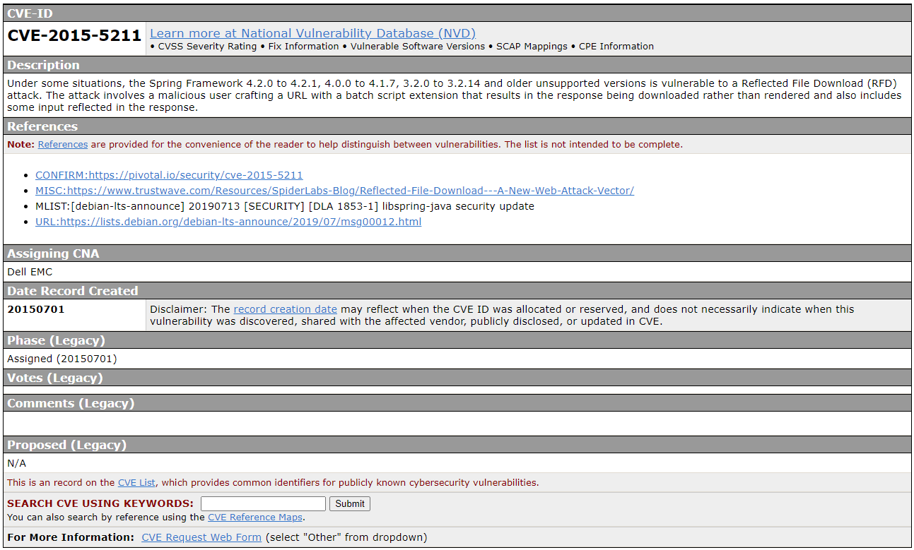
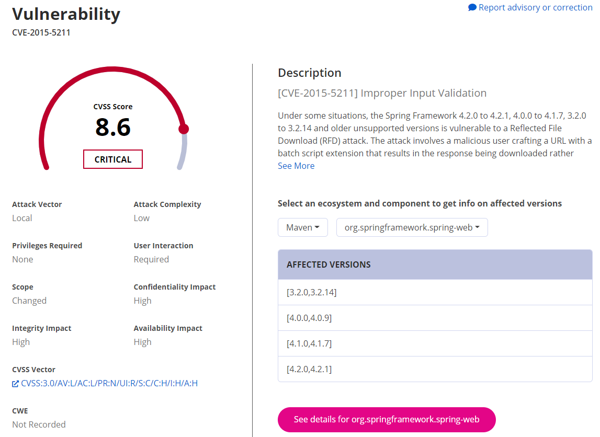
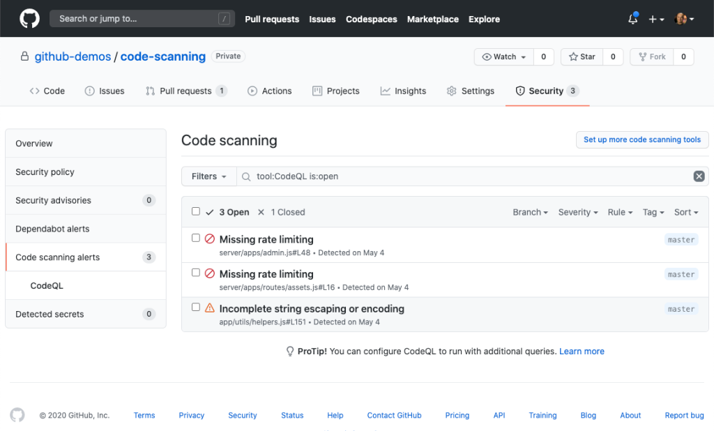

# 오픈소스 사용 가이드 - 회사편

- [오픈소스 사용 가이드 - 회사편](오픈소스_사용_가이드_-_회사편)
    - [오픈소스 관리](#오픈소스_관리)
    - [오픈소스 컴플라이언스](#오픈소스_컴플라이언스)
    - [라이선스 의무사항](#라이선스_의무사항)
    - [라이선스 컴플라이언스 실행](#라이선스_컴플라이언스_실행)
    - [오픈소스 관리도구 소개](#오픈소스_관리도구_소개)
    - [오픈소스의 보안 취약성](#오픈소스의_보안_취약성)
    - [오픈소스 보안 모범 사례](#오픈소스_보안_모범_사례)
    - [GitHub 기능을 활용한 보안 관리 사례](GitHub_기능을_활용한_보안_관리_사례)

오픈소스는 개인뿐만 아니라 엔터프라이즈 시장에서도 매우 큰 영향을 미치고 있다. 여러 컨테이너에서 마이크로서비스를 실행하기 위해 Docker를 사용하고, 오픈소스 데이터베이스인 MySQL을 사용하며, 웹 서비스를 위해 Spring 이나 Apache HTTP 를 사용하는 등 많은 오픈소스에 의존하고 있다. 이처럼 오픈소스는 기업의 인프라부터 서비스에 이르기까지 이미 많은 비중을 차지하고 있다.

오픈소스에 의존하는 정도가 증가함에 따라 기업은 어떻게 하면 올바르게 오픈소스를 사용할 수 있는지 지속해서 고민하고 정책을 수립해야 하며 이를 실무에 반영해야 한다. 오픈소스에 적용되는 라이선스의 종류는 매우 다양하며 조건에 따라 지켜야 할 의무사항도 모두 각각 다르다. 따라서 기업은 사용하고 있는 오픈소스를 추적 관리하고, 오픈소스 라이선스 의무 사항을 준수할 책임이 있다. 이번 장에서는 오픈소스 관리에 관한 내용을 알아보도록 하겠다.

## 오픈소스 관리
오픈소스 라이선스를 관리하는 것은 독점 소프트웨어의 라이선스를 관리하는 것만큼 중요하다. 실제로 오픈소스 라이선스를 위반한 기업을 상대로 많은 소송들이 제기되고 있다. 2017년 미국 연방 법원에서는 Artifex와 한컴의 오픈소스 라이선스 사건을 통해 [GPL이 법적 계약이라고 판결한 사례][1]도 있다. 이처럼 기업 입장에서는 오픈소스 라이선스를 제대로 관리하지 않는다면 분명 큰 리스크로 다가올 것이다.

## 오픈소스 컴플라이언스
### 오픈소스 컴플라이언스 정의
> “Open source compliance is the process by which users, integrators and developers of open source software observe copyright notices and satisfy license obligations for their open source software components”  
> — The Linux Foundation

오픈소스 컴플라이언스란, 오픈소스를 사용하고 개발하는 사람들이 저작권을 침해하지 않기 위해서 오픈소스의 라이선스 의무를 이행하는 과정이다.  

종종 조직에서는 오픈소스 라이선스 컴플라이언스를 성가신 것으로 간주한다. 물론, 모든 라이선스를 식별하고 각각의 라이선스 의무를 준수한다는 것은 어려운 작업이다. 하지만 오픈소스의 지속적인 실행 가능성을 보장하는 것은 기업이 맡은 책임 일부이기도 하다. 규정을 준수하기 위한 노력을 통해 기업은 오픈소스를 사용하면서 발생할 수 있는 비용이나 위험을 이해하게 된다. 반대로 말하면 기업은 오픈소스를 더 잘 이해하고 잘 사용할 수 있다는 의미이기도 하다. 오픈소스 컴플라이언스는 3rd party 공급자와 계약 의무사항을 준수를 포함하며, 뿐만 아니라 오픈소스 커뮤니티와 존중과 신뢰를 바탕으로 한 관계를 구축할 수 있기도 하다. 궁극적으로는 오픈소스 저작권자의 지적 재산권을 보호하는 데 그 목적이 있다는 것을 기억해야 한다.

### 오픈소스 컴플라이언스 프로세스
기업은 오픈소스 라이선스 의무사항을 준수할 수 있도록 오픈소스의 사용, 기여, 감사 및 배포에 이르는 일련의 과정을 관리해야 한다. 검증 단계까지 전반적인 내용을 체크 리스트를 작성하여, 일관성을 보장하고 검증 단계를 간과하지 않도록 하는 것이 중요하다. 여기서는 일반적인 오픈소스 컴플라이언스 프로세스를 소개하고 각 단계별 주요 내용을 설명한다. 

1. 오픈소스 라이브러리 식별  
   프로젝트에 사용된 오픈소스를 식별하고 목록을 도출하는 단계이다. 모든 오픈소스 컴포넌트가 식별되어야 하며, 오픈소스 원본의 위치와 라이선스 정보 등도 함께 기록이 되어야 한다. 자동화된 스캐닝 도구를 통해 식별하는 것을 권장한다. 스캔은 배포시점이나 변동 사항이 있을 때, 개발자의 요청이 있을 때, 혹은 주기적으로 수행할 수 있다.

2. 소스 코드 감사  
   코드 레벨의 스캔을 수행하여 아직 식별되지 않은 오픈소스를 추가로 더 찾아내는 단계이다. 코드 스캐닝 도구는 오픈소스의 코드를 기반으로 개발 언어가 바뀌었거나 함수명, 변수명이 변경되었더라도 식별이 되어야 하며, 기존 코드와 비교를 통해 수동으로 확인하는 과정을 거친다.

3. 이슈 해결  
   도출된 오픈소스 목록에서 이슈가 있는지 파악하고 해결하는 단계이다. 이슈가 발견되었을 경우에는 해당 오픈소스를 다른 것으로 대체하거나 제거하는 작업이 필요하기 때문에 개발 부서와의 긴밀한 협의가 필요하다. 코드를 수정한 이후에는 다시 스캔 과정으로 돌아가 이슈가 해결이 되었는지 정확히 확인해야한다.

4. 아키텍처 리뷰  
   프로젝트 전반의 아키텍처 리뷰를 진행한다. 오픈소스 코드뿐만 아니라 독점 코드, 상용 코드 확인을 한다. 또한, 코드들의 의존성 및 결합 방식을 검토한다.

5. 승인  
   이전 단계들이 모두 완료되었는지 확인하며, 검토 결과를 토대로 오픈소스 책임자는 이 단계에서 오픈소스의 사용을 승인하거나 거절한다. 승인된 오픈소스와 관련 정보들은 취합 후 등록하여 관리한다. 

6. 고지  
   오픈소스를 재배포하는 형태에서는 기본적으로 저작권과 라이선스 정보를 포함한 내용을 고지할 의무가 발생한다. 고지문은 일반적으로 NOTICE라는 이름의 파일로 작성한다. 이에 포함할 내용은 사용된 오픈소스의 명칭, 오픈소스에 접근할 수 있는 URL, 라이선스 원문, 저작권 표기 등이 있다. GPL과 같이 소스코드 공개의 의무가 발생하는 경우에는 소스 코드를 받는 방법도 함께 기재 한다.

7. 검증  
   배포한 패키지를 확인하여 고지문이 정상적으로 제공되었는지 최종적으로 확인한다. 

## 라이선스 의무사항
### 오픈소스 배포
오픈소스 라이선스의 의무 사항은 배포가 이루어질 때 적용된다. 여기서 배포란 소스 코드 또는 바이너리의 복사본을 다른 사람에게 제공하는 행위를 의미한다. 앱스토어 배포, 판매, 3rd party 제공, 공개된 코드 등이 배포에 해당한다. 개인적으로 사용하거나 외부에 공개하지 않고 사내툴로만 사용하는 경우는 배포에 해당하지 않는다.

### 오픈소스 라이선스 공통 의무사항
오픈소스 라이선스는 공통으로 4가지 의무 사항을 기반으로 한다. 오픈소스 사용자는 저작권을 고지해야 하고, 라이선스 사본을 포함해야 한다.다만 오픈소스 사용 시 보증은 되지 않으며, 책임에도 제한이 있다.

## 라이선스 컴플라이언스 실행
### 사용중인 오픈소스를 추적 해야 하는 이유
기업이 효과적으로 오픈소스를 활용하기 위해서는 각 제품별, 버전별 사용한 오픈소스 현황을 추적하여 관리해야 한다. 그 이유와 목적은 다음과 같다. 

- 오픈소스 목록 관리  
  오픈소스를 효율적으로 관리하고 조직의 정책을 준수하기 위해서는 오픈소스 목록을 관리해야 한다.

- 라이선스 확인  
  사용 중인 오픈소스의 라이선스 파악을 통해 라이선스의 의무 사항을 확인하고 준수하는 데 도움이 된다. 다만, 모든 오픈소스 라이선스가 호환되는 것이 아니다. 라이선스의 의무사항 및 조건들은 충돌할 수 있다. 조직내 모든 오픈소스 라이선스 규정 준수 요구사항을 충족하는지 확인하는 유일한 방법은 오픈소스 라이선스를 식별하고 추적하는 것이다.

- 취약점 파악  
  오픈소스는 악의적인 공격자에게 타겟이 된다. 특히 엔터프라이즈 오픈소스는 더 많은 공격의 대상이 된다. 이때 오픈소스 목록을 확보하지 않는다면, 소프트웨어 내에 사용 중인 오픈소스가 알려진 취약점이 있는지 알지 못하게 되어 알려진 취약점을 수정할 수 없게 된다.

- 패치 및 버전 업데이트  
  오픈소스는 기능 개선 및 버그 수정을 위하여 지속해서 업데이트가 이뤄진다. 오픈소스 목록을 관리하여 중요 패치 또는 버전 업데이트를 놓치지 말아야 한다.

### 오픈소스 목록 수동 관리
오픈소스 목록을 관리하는 방법으로는 수동 방식과 자동 방식이 있다. 수동 방식은 개발자 또는 오픈소스 관리자가 모든 오픈소스 사용 현황을 직접 파악하는 방법이다. 수동으로 관리하는 경우 몇 가지 문제가 발생한다.
- 오픈소스 파악의 어려움    
  소스코드 수준에서 사용된 오픈소스까지 일일이 파악하는 것은 매우 힘든 작업이다. 오픈소스 코드를 그대로 가져다 쓰거나 혹은 오픈소스를 수정하여 사용하게 되면, 일부 제한된 라이선스에서는 오픈소스를 사용하는 모든 프로젝트의 소스 코드를 공개해야 할 수도 있다. 또한 오픈소스 목록에서 누락이 된다면 추후 개선되는 패치나 버그 수정도 불가능하게 되며 오픈소스에 취약점이 발견되어도 파악이 힘들어진다.

- 사용된 오픈소스 목록 누락  
  사용 파악 시 미처 확인하지 못한 누락이 발생할 수 있다. 프로젝트 규모가 커질수록, 그 대상이 많아질수록 직접 오픈소스 파악하기는 어려워진다. 또한 개발이 진행되고, 배포까지 최종 단계에 이르기까지 수많은 변경 작업이 일어난다. 이 과정에서 사용된 오픈소스 목록과 실제 코드에 포함된 오픈소스를 완전히 똑같이 맞추기는 어려울 것이다. 현실적으로도 이러한 변경 사항을 추적하는 데 있어 상당히 많은 노력과 시간이 소모되기도 한다.

- 배포 프로세스 지연  
  어플리케이션 개발과 배포에 영향을 줄 수 있다. 오픈소스 목록을 수동으로 관리하게 되면 승인 프로세스도 수동으로 수행되어 매우 느리게 진행될 가능성이 크다. 이미 통합된 오픈소스 중 이슈가 발생하게 되면 해당 오픈소스를 제거하고 대안을 찾도록 개발자에게 요구해야 할 수도 있는데 이렇게 되면 일정에 큰 차질을 빚게 될 것이다.

### 오픈소스 목록 자동화
위에서 언급한 것처럼 여러 측면에서 오픈소스 관리는 자동화가 필요하다. 자동화를 위해서는 아래와 같은 오픈소스를 식별하기 위한 적절한 도구를 구축하거나 도입하여 사용해야 한다.
- 코드 레벨에서 사용 중인 오픈소스를 찾아내며 비교를 제공하는 소스 코드 스캐너
- 오픈소스 라이브러리 파일을 찾아내는 파일 스캐너
- 오픈소스를 패키지 단위로 가져오는 패키지 매니저 분석 도구
- 라이선스와 컴플라이언스 항목 및 리소스를 추적하기 위한 컴플라이언스 관리 도구
- 라이선스 결합 방식 분석 도구
- 오픈소스 BOM 관리 도구
- 전반적으로 프로젝트를 관리하고 오픈소스 목록을 관리할 포탈

## 오픈소스 관리도구 소개
앞서 언급한 것처럼 오픈소스 사용에 따른 의무사항 준수와 위험 요소 확인을 위해서는 SDLC(Software System Development Life Cycle) 전체에서 지속적인 스캔 및 모니터링이 필요하다. 이에 SCA(Software Composition Analysis) 라는 오픈소스 관리 도구들이 생겨났다. SCA는 보안 및 라이선스 규정 준수를 발견하고 관리하기 위한 자동화된 프로세스를 제공한다.

### SCA 도구 선택기준
Gartner의 [Technology Insight for Software Composition Analysis][2] 보고서에 SCA 도구 선택 기준이 제시되는데 아래와 같다.
- 충분한 취약성 데이터베이스가 마련되었는가?
- IDE 및 Repository 연동, 코드 커밋 전 오픈소스 평가 기능 등 개발자 지원이 잘 되어 있는가?
- 모든 라이선스를 추적하고 보고하는 기능이 있는가?
- 라이선스 정책을 자동을 설정할 수 있는가?
- 취약성을 빠르게 감지하고 우선순위를 결정하는가?
- 라이선스, 저작권, 버전 관리 등 관련 정보를 포함한 보고서 발급 기능이 있는가?

### 주요 SCA 도구 소개
- **Olive (Kakao)**  
    
  Kakao는 자사의 수많은 프로젝트의 오픈소스 관리를 위해 사용하던 시스템을 누구나 사용할 수 있도록 [Olive Platform][3] Beta를 무료로 오픈했다. Olive는 Github 프로젝트를 분석하여 사용한 오픈소스 데이터를 관리하고, 라이선스 및 의무사항을 확인하여 Report를 제공한다. 쉽고, 빠르고 정확한 오픈소스 검증을 목표로 직관적인 기능과 UI로 구성되어 있으며, 간단히 Dependency와 라이선스 확인이 가능한 심플 체크 기능 등 사용자 편의에 초점을 맞추고 있다.

- **Fossa**  
    
  2015년 설립된 실리콘밸리 스타트업에서 제공하는 서비스로, 풍부한 오픈소스 메타데이터 및 정교한 정책 거버넌스를 제공한다. CI/CD 통합 등 DevOps 환경을 지원하며 개발자 친화적 기능들로 구성되어 있다. Twitter, Uber, Zendesk 등과 파트너를 맺고 있으며, JS Foundation, Linux Foundation, NPM 등과 제휴하고 있다. 기본적인 사용은 무료이나 일부 추가 기능들을 유료로 제공하며, 팀 규모가 100명 이상이라면 엔터프라이즈 버전이 적용된다.

- **Snyk**  
    
  오픈소스 라이선스 취약성 관리를 위한 서비스를 제공하다가 2020년부터 라이선스 준수 관리 기능이 추가되었다. Dependency Tree 뷰어, 이슈 우선 순위 선별 시스템, 런타임 모니터링 등 기능을 제공하며, 전담 보안 연구팀이 리뷰를 진행한다. 현재 Docker 공식 독점 보안 파트너로 IBM Cloud, RedHat, OpenShift, Kubernetes 등과 제휴를 맺고 있다. 무료로 사용 가능하지만 팀 규모와 프리미엄 기능에 따라 유료 Plan이 세부적으로 마련되어 있다.

- **WhiteSource**  
    
  2011년 설립되어 라이선스 준수 및 취약성 관리 서비스를 제공하며, 오래된 서비스인 만큼 방대한 데이터베이스를 확보하고 있다. 110억 개 이상의 소스코드 파일, 200개 이상의 언어지원, 1억 개 이상의 라이브러리를 확보하고 있다. 컨테이너 및 서비리스 등 모든 환경을 지원하며 현재 Microsoft Azure DevOps 서비스로도 제공되고 있다. GitHub의 Ultimate에서 사용 가능한 옵션으로 제공되고 있으며 GitHub Package도 지원한다. WhiteSource도 기본적인 사용은 무료이며, 팀 규모가 20명을 넘어가면 유료로 사용 가능하며, 추가 프리미엄 기능을 제공한다.

## 오픈소스의 보안 취약성
### 오픈소스의 보안 취약성 현황
Sonatype의 [2020년 소프트웨어 공급망 현황 보고서][4]에 따르면 오픈소스를 겨냥한 차세대 사이버 공격도 작년보다 430%나 증가하였으며, 응용프로그램에서 사용되는 오픈소스 구성요소의 11%가 알려진 취약점을 가지고 있다고 한다. 가장 일반적인 공격 유형은 Typosquatting 이며, 이는 오픈소스를 검색할 때 단순한 오타를 유도하는 공격 방식으로 개발자가 "lodash"의 이름을 가진 오픈소스를 사용하려고 할 때 "lodahs"와 같은 유사한 이름의 악성 컴포넌트를 미리 등록해두어 설치하게 만드는 방식이다. 또 다른 방식으로는 프로젝트 관리자로부터 자격 증명을 가로채 악성 코드를 심는 방식 등 다양한 수단을 통해 이뤄지고 있다.

특히 소프트웨어 공급망을 통해 공격이 증가하는 이유는 하나의 오픈소스가 다른 많은 오픈소스를 포함하는 종속 관계로 구성되어 있다 보니 실제 프로젝트에서 사용되는 오픈소스는 엄청난 수의 의존성을 가진 오픈소스를 사용하게 되어 전체를 파악하기가 힘든 점이 있다. 그리고 오픈소스 정신은 **신뢰하는 공유**에 기반을 두고 있다 보니 이것은 공격자가 쉽게 접근할 수 있게 하는 토대가 되기도 한다.

### 오픈소스의 보안 취약성 사례
최근 오픈소스를 통한 취약점 사례를 살펴보면, 2020년 5월 "Octpus Scanner" 26개의 오픈소스 패키지에 악성 코드가 삽입되어 멀웨어를 전파하고 백도어를 심었다. 4월에는 RubyGems 에서도 "typosquatting" 및 "crypto" 마이닝 멀웨어등이 발견되어 현재는 제거된 상태이다. 그리고 npm 패키지를 통한 공격도 있었는데 2월에 1337qq-js npm 패키지는 설치 스크립트와 UNIX 시스템만을 대상으로 하드 코딩된 암호나 API 액세스 토큰 등 민감한 정보를 빼낸 사례도 있었다.

### 오픈소스의 보안 취약성 조치
그렇다면 이러한 취약성이 발견되었을 때 오픈소스는 얼마나 빠르게 대처할까? 

보고서를 보면 보통은 1일 ~ 1주 이내가 35%로 제일 많았으나 여기서 주목해야 할 점은 1주 이상 소요되거나 아예 고쳐지지 않는 케이스가 무려 51%나 된다는 것이다. 오픈소스 커뮤니티의 신속한 대응도 중요하지만, 해당 오픈소스 사용처에서도 바로 적용해야 하는 이슈도 존재한다. 또한, 공격자는 문제가 되는 오픈소스 버전이 배포된 후 3일 이내에 오픈소스 취약성을 악용한 것으로 제일 많이 나타나므로 더 빠른 조치가 필요한 상황이다.  

### 취약성 데이터베이스
보통 오픈소스의 취약성 내용과 이루어진 버전 정보들은 수집되어 [CVE][6]와 같은 오픈소스 취약성 데이터베이스에 저장이 된다. 다양한 유형의 취약성 정보가 포함되는데 주요 데이터베이스는 아래와 같다.  
- [Mitre의 CVE(Common Vulnerabilities and Exposures)][6]  
  상용 애플리케이션 및 비공개 소스 프로젝트를 비롯하여 다양한 유형의 취약성에 대한 정보를 제공한다. 취약성 정보는 개별 CVE 번호가 부여되어 관리된다.
- [Sonatype OSS Index][7]
  Maven, NPM, Go, Pypi 등 여러 유형의 Package Management 에서 보고된 오픈소스 취약성 정보 데이터베이스를 제공한다.
- 예) CVE-2015-5211 에 대한 정보 

## DevSecOps
2012년 가트너는 "DevOpsSec: Creating the Agile Triangle" 이란 보고서를 통해 DevOps 이니셔티브에 보안 기반을 구축할 필요가 있다는 사실을 강조하기 위해 DevSecOps라는 개념을 소개했다. DevSecOps는 소프트웨어 개발(Development)과 운영(Operation), 보안(Security)의 합성어로 애플리케이션 개발자와, 운영, 보안 실무자 간의 소통과 협업, 통합을 강조하는 개발문화를 의미한다.  

  
이미지 출처 : [RedHat][7]

SDLC(Software System Development Life Cycle) 전체에 걸쳐 가능한 빨리, 그리고 자주 보안이 통합 되도록 해야 한다. 오늘날 일반적인 애플리케이션에는 오픈소스 코드가 60~80% 포함된다는 점을 고려할 때 DevSecOps에서 중요한 것은 오픈소스 취약성에 대한 고려일 것이다. DevSecOps 전체에서 오픈소스 취약성을 추적하고 사용자에게 알려주는 것은 매우 중요하다.

컨테이너 및 마이크로서비스와 같은 혁신적인 기술로 업데이트 하면서도 분리된 팀들 간에 긴밀하게 협업하도록 하는 것은 쉽지 않은 일이다. [IBM][5]에서 제시한 모범 사례를 통해 DevSecOps 관점에서 본 오픈소스 취약성 관리에 대해 좀 더 알아보자. 

### IBM DevSecOps 모범 사례
- **자산 추적**  
  먼저 보호가 필요한 자산에 대해 알아야 한다. 오픈소스를 식별하고 추적을 통해 어떤 자산이 중요한지 파악하는 데 도움이 된다.

- **위협 평가 수행**  
  이 단계에서는 예상되는 위협 유형을 평가한다. 가능한 공격 방법과 구현할 수 있는 보안 조치의 실행 가능성을 평가한다.

- **보안 체크리스트**  
  명확한 실천 체계를 수립하여 일상 업무에서 쉽게 규정을 지킬 수 있게 한다. 이렇게 하면 패치를 쉽게 적용할 수 있어서 보안 격차를 줄일 수 있다.

- **가능한 자동화**  
  오픈소스 가시성을 높일 수 있는 애플리케이션 보안 테스트 및 오픈소스 보안 솔루션이 있다. [SonarQube][8]와 같은 모니터링 도구를 사용하면 오픈소스 구성요소를 추적하여 버그와 결함을 실시간으로 탐지할 수 있다.

- **보안 우선 문화 구축**  
  유관 부서 전반에 걸쳐 보안을 적용하고 개발프로세스의 모든 단계에 보안 사항을 관리하는 데 집중해야 한다. DevOps 전반에 Security를 결합한 DevSecOps 모델을 채택하면 보안 우선의 문화를 구축하는데 도움이 된다.

- **컨테이너 보안 모범 사례 적용**  
  컨테이너화는 자체적인 운영체제를 고려할 때 보안상의 이점이 있다.

- **모든 것을 암호화**  
  모든 데이터에 암호화를 적용한다.

### GitHub 기능을 활용한 보안 관리 사례
GiHub은 소스코드 저장소로 널리 사용되고 있는데, 2020년 [GitHub Octoverse][9] 자료를 보면, Fortune 50대 기업 중 72%가 GitHub Enterprise를 사용하고 있다고 한다. 그에 맞춰 최근 GitHub에서도 단순히 소스코드 저장소 기능을 넘어 새로운 기능들을 추가하고 있는데, 특히 보안과 관련된 다양한 기능을 제공하고 있어 주목을 받고 있다. 이러한 보안 기능들을 활용한 보안 관리 사례를 살펴보고자 한다.

- **Dependency Graph**    
  프로젝트에서 사용 중인 외부 라이브러리 정보를 보여주는 기능이다. 사용 중인 라이브러리와 라이브러리 버전 정보들을 조회할 수 있다. Ruby, Javascript, Python 등 다양한 언어와 패키지 매니저를 지원한다. Dependency Graph 는 사용 중인 것뿐만 아니라 자신의 프로젝트를 참조하고 있는 다른 프로젝트도 확인할 수 있다.
  

- **dependabot**  
  프로젝트에서 사용중인 오픈소스 중 오래된 버전이 있다면 PR(Pull Request)를 추가해 준다. 개발자는 변경된 릴리즈 정보를 검토하여 새로운 버전 을 머지(Merge) 할 수 있게 한다.
  

- **코드 스캐닝**  
  코드 스캐닝은 GitHub 네이티브 환경으로 제공된다. 코드 스캔이 활성화되면 모든 'git push'에서 새로운 잠재적 보안 취약성이 스캔 되고 결과는 풀 요청에 직접 표시된다. 코드 스캐닝은 세계에서 가장 진보된 시맨틱 분석 엔진 인 CodeQL을 사용하는데, 이는 실제 취약점을 발견하는 최고의 기록을 가지고 있다. 오픈소스 코드 스캔은 무료로 제공되고 있다.
  

- **Secret 스캐닝**  
  GitHub Private Repository와 Enterprise 버전에 추가된 기능으로 코드 내 Secret 코드를 스캔하는 기능이다. 소스코드에 포함되어 노출되면 민감한 코드 정보들을 찾아내어 실수로 커밋 된 자격 증명의 부정 사용을 방지한다. 일치하는 Secret 포멧이 발견되면 지정된 HTTP 주소로 payload가 전달된다.
  
 

[1]: https://www.linux.com/topic/open-source/artifex-v-hancom-open-source-now-enforceable-contract
[2]: https://www.gartner.com/en/documents/3971011/technology-insight-for-software-composition-analysis
[3]: https://olive.kakao.com
[4]: https://www.sonatype.com/2020ssc
[5]: https://developer.ibm.com/recipes/tutorials/open-source-security-trends-for-2020
[6]: https://cve.mitre.org
[7]: https://www.redhat.com/ko/topics/devops/what-is-devsecops
[8]: https://www.sonarqube.org/
[9]: https://octoverse.github.com
