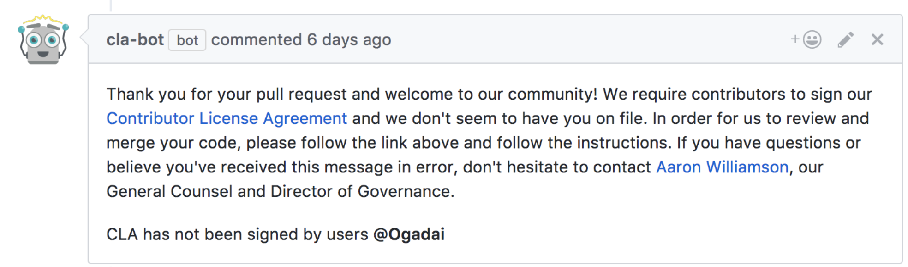
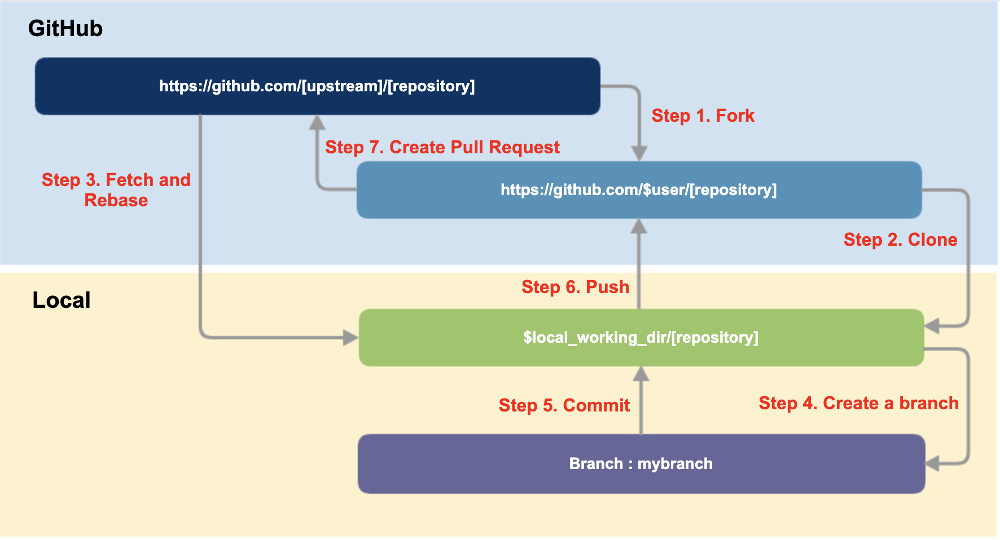

- [개발자를 위한 오픈소스 기여 가이드](#개발자를-위한-오픈소스-기여-가이드)
  - [저작권을 고려하라](#저작권을-고려하라)
  - [소속 기업의 오픈소스 정책을 확인하고 따르라](#소속-기업의-오픈소스-정책을-확인하고-따르라)
  - [소스 코드만 기여할 수 있나?](#소스-코드만-기여할-수-있나)
    - [문서 작성 / 번역](#문서-작성--번역)
    - [테스트 / 이슈 생성](#테스트--이슈-생성)
    - [디자인](#디자인)
    - [코드 작성](#코드-작성)
    - [마케팅](#마케팅)
    - [이벤트 행사](#이벤트-행사)
  - [오픈소스 프로젝트에는 누가 있나?](#오픈소스-프로젝트에는-누가-있나)
    - [리더 (Leader)](#리더-leader)
    - [메인테이너 (Maintainer)](#메인테이너-maintainer)
    - [커미터 (Committer)](#커미터-committer)
    - [기여자 (Contributor)](#기여자-contributor)
    - [사용자 (User)](#사용자-user)
  - [오픈소스 프로젝트는 어떤 문서를 제공하는가?](#오픈소스-프로젝트는-어떤-문서를-제공하는가)
    - [README](#readme)
    - [LICENSE (혹은 COPYING)](#license-혹은-copying)
    - [CONTRIBUTING](#contributing)
    - [CODE OF CONDUCT](#code-of-conduct)
    - [기타 문서](#기타-문서)
  - [어떤 프로젝트에 기여해야 하나?](#어떤-프로젝트에-기여해야-하나)
    - [오픈소스 라이선스 파일이 있는가?](#오픈소스-라이선스-파일이-있는가)
    - [프로젝트가 활발히 기여를 받고 있는가?](#프로젝트가-활발히-기여를-받고-있는가)
    - [프로젝트 이슈를 확인하라](#프로젝트-이슈를-확인하라)
    - [프로젝트의 Pull Request를 확인하라.](#프로젝트의-pull-request를-확인하라)
    - [프로젝트가 기여를 환영하는 분위기인가?](#프로젝트가-기여를-환영하는-분위기인가)
  - [기여를 준비해보자](#기여를-준비해보자)
    - [1. 오픈소스 프로젝트의 문서를 숙지하라](#1-오픈소스-프로젝트의-문서를-숙지하라)
    - [2. CLA / DCO 서명은 주의하라](#2-cla--dco-서명은-주의하라)
    - [3. 기여 코드를 점검하라](#3-기여-코드를-점검하라)
    - [4. 기업 내부 승인을 받으라](#4-기업-내부-승인을-받으라)
  - [좋은 기여자가 되기 위한 길잡이](#좋은-기여자가-되기-위한-길잡이)
    - [1. 커뮤니티에 참여하라](#1-커뮤니티에-참여하라)
    - [2. 잠시 살펴봐라](#2-잠시-살펴봐라)
    - [3. 거버넌스를 이해하라](#3-거버넌스를-이해하라)
    - [4. 작은 것부터 시작하라](#4-작은-것부터-시작하라)
    - [5. 이벤트에 참가하라](#5-이벤트에-참가하라)
    - [6. 초기 단계의 코드부터 기여하라](#6-초기-단계의-코드부터-기여하라)
  - [기여는 어떻게 제출해야 하나?](#기여는-어떻게-제출해야-하나)
    - [1. 이전 이력을 확인하라](#1-이전-이력을-확인하라)
    - [2. Issue를 생성하라](#2-issue를-생성하라)
    - [3. 커뮤니케이션을 시작하라](#3-커뮤니케이션을-시작하라)
      - [정확한 의사를 전달하라](#정확한-의사를-전달하라)
      - [무조건 물어보지 말고, 먼저 스스로 해볼 수 있는 걸 하라](#무조건-물어보지-말고-먼저-스스로-해볼-수-있는-걸-하라)
      - [대화는 가능한 간결하게 하라](#대화는-가능한-간결하게-하라)
      - [모든 커뮤니케이션은 공개하라](#모든-커뮤니케이션은-공개하라)
      - [문의하였으면 기다려라](#문의하였으면-기다려라)
      - [커뮤니티의 결정을 존중하라](#커뮤니티의-결정을-존중하라)
      - [무엇보다도 품위를 유지하라](#무엇보다도-품위를-유지하라)
    - [4. Pull Request를 생성하라](#4-pull-request를-생성하라)
      - [Pull Request 시기](#pull-request-시기)
      - [GitHub에서의 Pull Request 절차](#github에서의-pull-request-절차)
    - [5. Feedback 받기](#5-feedback-받기)
      - [응답이 없다?](#응답이-없다)
      - [수정을 요청한다?](#수정을-요청한다)
      - [거절됐다?](#거절됐다)
      - [수락됐다!](#수락됐다)


# 개발자를 위한 오픈소스 기여 가이드

개발자라면 누구나 자기계발을 통해 역량을 키우고, 더욱 능력 있는 개발자로 성장하기 위한 열망을 하고 있다. 오픈소스 커뮤니티에 참여하고, 관심 있는 오픈소스 프로젝트에 기여하는 것은 개발자로서 역량을 키우고 평판을 높일 수 있는 최고의 방법이다. 

여기서는 개발자들이 오픈소스에 기여하기 위해 알아야 할 오픈소스의 기본 지식을 알아본다.

## 저작권을 고려하라

오픈소스 기여는 저작권 관점에서 저작자가 저작물을 수정/사용/배포할 수 있는 권한을 오픈소스 프로젝트에 부여하는 것이다. 때에 따라서는 오픈소스 프로젝트에 여러분의 저작권을 양도해야 하기도 한다. 이러한 저작권 측면의 고려 없이 오픈소스 기여를 한다면 예기치 않은 저작권 침해로 인해 법적인 문제를 유발할 수 있다. 이는 기여를 하는 개인뿐만 아니라, 소속 기업에도 리스크가 된다.

일반적으로 고용 기간에 만든 저작물은 고용주가 소유한다. 따라서 기업의 구성원이 만든 저작물은 기업이 소유하게 된다. 그렇기 때문에 기업의 구성원이 오픈소스 기여를 하기 위해서는 저작물의 저작자인 기업의 승인을 받아야 한다.

어떤 이는 '나는 회사 업무 시간이 아닌 개인 시간에 회사 기기가 아닌 개인 기기로 회사 업무와 무관한 분야의 프로젝트에 기여 활동을 하고 있다. 이런 경우도 회사의 승인을 받아야만 하는가?'라고 질문한다. 이는 고용 계약 내용에 따라 달라질 수 있다. 모호한 부분이 있다면 가능한 보수적으로 판단하여 저작권 침해 위험을 발생시키지 않는 것이 좋다. 굳이 나와 기업의 리스크를 감수하고 오픈소스 기여 활동을 하는 것은 바람직하지 않다.

## 소속 기업의 오픈소스 정책을 확인하고 따르라

최근 ICT 기업들은 정책적으로 구성원의 오픈소스 기여를 허락할 뿐만 아니라 적극적으로 장려한다. 따라서, 소속 기업의 오픈소스 정책을 확인하고 따르면서 기여하는 것이 불필요한 저작권리스크를 유발하지 않는 가장 좋은 방법이다.

기업 속한 구성원이라면 오픈소스 프로젝트에 기여하기에 앞서, 소속 기업의 오픈소스 기여 정책을 확인하라. 외부 오픈소스 프로젝트로의 기여를 허용하는지, 어떤 주의 사항이 있는지, 제약 사항은 무엇인지 정확히 파악해야 한다. 어떤 기업은 오픈소스 기여가 가능한 프로젝트 리스트를 별도로 관리하기도 하고, 기업의 이메일 계정으로 기여하는 것만 허용하기도 한다.

소속 기업에 아직 오픈소스 기여 정책이 없다면 소속 조직의 팀장이나 법무 조직에 문의하여 기여에 대한 승인을 받고, 승인받은 문서를 잘 보관하라. 혹시 모를 향후 저작권 논쟁이 발생했을 때 문서화된 근거는 요긴하게 활용할 수 있다.


## 소스 코드만 기여할 수 있나?

주로 소프트웨어 개발자들이 소스 코드를 오픈소스 프로젝트에 기여한다. 소스 코드를 수정하여 버그를 고치거나, 기능을 개선하는 방식으로 프로젝트에 기여한다. 그러나 개발자들만 오픈소스 프로젝트에 기여할 수 있는 것은 아니다. 오픈소스 프로젝트는 다음과 같이 문서화, 디자인 등 다양한 유형의 기여를 필요로한다.

### 문서 작성 / 번역
* 프로젝트 문서, 튜토리얼을 작성한다.
* 프로젝트의 뉴스레터를 작성하거나 메일링 리스트의 중요 사항을 요약한다.
* 프로젝트 문서를 자국어로 번역한다.

### 테스트 / 이슈 생성
* 소프트웨어가 정상적으로 동작하는지 테스트한다.
* 문서에 기재된 대로 빌드 / 설치되는지 테스트한다.
* 문서, API가 일관성 있게 작성되었는지 확인한다.

### 디자인
* 프로젝트 웹사이트의 레이아웃, 메뉴 등을 개선한다.
* 프로젝트가 일관성 있는 디자인을 가질 수 있도록 스타일 가이드를 만든다.
* 새로운 로고 또는 티셔츠를 만드는 데 기여한다.

### 코드 작성
* 해결할 수 있는 오픈된 이슈를 찾는다.
* 새로운 기능을 추가한다.
* 자동화를 위한 도구와 테스팅을 개선한다.

### 마케팅
* SNS, 세미나 발표 등 다양한 방법으로 프로젝트의 목적과 효용성을 홍보한다.

### 이벤트 행사
* 프로젝트의 콘퍼런스, 워크숍, 밋업 등 다양한 모임을 기획하고 주관한다.


## 오픈소스 프로젝트에는 누가 있나?

오픈소스 프로젝트는 어떻게 공동 작업을 통해 고품질의 소프트웨어 개발을 지속할 수 있을까? 어떻게 서로 모르는 다수의 사람이 코드를 함께 작성하며 안정적인 소프트웨어를 만들어 낼 수 있을까? 오픈소스 프로젝트는 명확한 역할 구분을 통해 이를 가능하게 한다.


### 리더 (Leader)

모든 프로젝트에는 리더가 있으며, 일반적으로 창시자가 그 역할을 맡는다. 리더는 프로젝트의 방향을 결정하며, 의사 결정이 필요할 때 최종 결정을 담당한다. 리더는 개인일 수도 있지만, 규모가 큰 프로젝트의 경우 운영 위원회(Steering Committee)를 조직하여 리더의 역할을 수행한다.

* 예를 들어, Linus Torvalds(https://github.com/torvalds)는 Linux Kernel(https://github.com/torvalds/linux)의 원저작자로서 진행 상황의 모든 것에 대해 최종 결정권을 가지고 있다.
* Node.js 프로젝트의 경우는 Technical Steering Committee(https://github.com/nodejs/TSC)가 리더의 역할을 수행한다.


### 메인테이너 (Maintainer)
메인테이너는 핵심 기여자로서 프로젝트에서 가장 신뢰할 수 있는 기술 역량을 보유한 자들이다. 리더로부터 특정 영역을 위임받아서 주도적으로 관리하는 역할을 맡는다. 

### 커미터 (Committer)
커미터는 프로젝트 내 특정 모듈의 코드를 충분히 이해하면서 정기적인 기여 활동을 하는 자들이다. 기여자의 기여를 Review 및 승인할 권한이 있으며, 특정 모듈에 대해 메인테이너의 승인을 받지 않고도 Merge 할 권한을 갖는다.

### 기여자 (Contributor)
누구든지 간단히라도 기여 사실이 있다면 기여자이다. 기여자는 간단한 버그 수정, 문서화 등의 방법으로 오픈소스 프로젝트에 기여한다. 이러한 기여는 숙련된 커미터 및 메인테이너에 의해 리뷰 과정을 거치면서 보완이 된 후 저장소에 Merge 된다.

### 사용자 (User)
사용자는 오픈소스 프로젝트에서 가장 중요한 역할을 한다. 프로젝트가 아무리 잘 준비되었다고 해도 사용하는 사람이 없다면 프로젝트는 성공할 수 없다. 사용자는 프로젝트를 사용하면서 버그 리포트, 새로운 기능 제안 등 아이디어를 제공함으로써 프로젝트에 존재의 목적을 부여한다.
* 프로젝트의 리더나 기여자들이 사용자의 요청을 신중히 듣지 않게 되면 장기적으로 건강하게 성장하기는 어렵다. 
* 프로젝트는 사용자의 필요를 충족시키는 방향으로 성장해야 지속할 수 있다. 


## 오픈소스 프로젝트는 어떤 문서를 제공하는가?

올바르게 기여하기 위해서는 각 오픈소스 프로젝트의 동작 방식을 이해하고 프로젝트에서 원하는 대로 활동하는 것이 중요하다. 대부분의 오픈소스 프로젝트는 README, CONTRIBUTING 등의 문서를 통해 이러한 요구 사항을 사용자에게 제공한다. 오픈소스 프로젝트에서는 다음과 같이 몇 가지 공통으로 사용되는 문서가 있으며, 대개 저장소의 최상위 레벨에 위치한다. 기여하기 전에 이러한 문서를 통해 프로젝트의 문화와 행동 강령, 기여 방법을 익혀야 한다. 

### README
README 파일은 프로젝트에 처음 접근했을 때 보이는 파일로써 프로젝트 소개, 왜 이 프로젝트를 사용해야 하는지, 사용 방법 등을 설명하는 문서이다. 어떤 프로젝트인지 파악하기 위해서는 반드시 봐야 할 문서이다.

### LICENSE (혹은 COPYING)
LICENSE는 프로젝트를 누구나 사용할 수 있다고 명시하고 있는 오픈소스 라이선스를 담고 있는 파일이다. 모든 오픈소스 프로젝트는 오픈소스 라이선스가 있어야 한다. 오픈소스 라이선스가 없다면 오픈소스가 아니다. 소스 코드는 공개되었지만, 사용이나 배포할 수 있는 권리가 부여되지 않은 상태이다. 이런 소스 코드를 제품이나 서비스에 포함한다면 저작권 침해 이슈가 발생할 리스크가 있음에 주의해야 한다.

오픈소스 라이선스의 자세한 내용은 OO 장을 참고하라. 

### CONTRIBUTING

README 는 프로젝트를 사용하는 사람들에게 도움이 된다면, CONTRIBUTING은 프로젝트에 기여하는 사람들을 위한 문서이다. 어떤 유형의 기여가 필요한지와 기여하는 방법을 설명하기 때문에 오픈소스에 기여하고자 할 때는 이 문서를 자세히 살펴보아야 한다. 기여자는 이 문서에서 설명하는 기여 방법을 따라야 한다. 

기여하고자 하는 프로젝트에 CONTRIBUTING 파일이 없다면 커뮤니티에 기여 방법을 문의하라. 만약 적절한 답변을 받지 못한다면, 기여할 가치가 없는 프로젝트로 간주하고 다른 프로젝트를 찾아도 된다. 

### CODE OF CONDUCT

CODE OF CONDUCT는 행동수칙, 행동강령이라고도 불리며 프로젝트가 건강하게 유지되기 위한 참가자의 행동 규칙을 정의한다. 예를 들어 성별, 인종, 종교, 나이 등의 차별이 있어서는 안 되고 누구나 따뜻하게 환영받고, 안전한 활동을 보장하기 위해 행동해야 함을 강조한다. 그리고 누군가 그 규칙을 어길 경우, 신고할 방법을 안내하고 있다.

### 기타 문서
(규모가 큰 오픈소스 프로젝트의 경우) 튜터리얼, 거버넌스 정책과 같은 문서도 제공한다.


## 어떤 프로젝트에 기여해야 하나?

물론 업무와 연관이 있거나 기술적인 관심이 있는 분야의 오픈소스 프로젝트에 기여해야 한다. 그런 프로젝트가 여러 개일 경우, 어떤 프로젝트가 기여할 만한 프로젝트인지 확인하는 것도 필요하다. 그렇지 않으면 수고한 기여가 아무 응답도 받지 못하고 묻혀버릴 수도 있다.

다음은 관심 있는 오픈소스 프로젝트가 기여 활동에 적합한지 확인하기 위한 체크리스트이다.

### 오픈소스 라이선스 파일이 있는가?

- [x] LICENSE 파일이 있는가? 일반적으로 저장소의 루트 디렉터리 내에 LICENSE라는 파일이 있다.

오픈소스 라이선스가 적용되지 않은 프로젝트라면 오픈소스가 아니다. 소프트웨어의 저작권자가 오픈소스 라이선스를 통해 누구나 사용하고 배포할 수 있는 권리를 부여해야 기업은 그 소프트웨어를 자유롭게 사용할 수 있다. 오픈소스 라이선스가 없는 소프트웨어를 임의로 사용한다면 저작권 침해 등의 법적 리스크를 유발할 수 있다.

### 프로젝트가 활발히 기여를 받고 있는가?

- [x] 가장 최근 Commit은 언제인가?
- [x] 얼마나 많은 기여자가 있는가?
- [x] 얼마나 자주 Commit이 있는가?

기여자가 거의 없거나, 최근 수년간 Commit이 없다면 관리가 되지 않고 있는 프로젝트로 볼 수 있다.

GitHub에서의 Commit 현황은 화면 상단의 "Commits"에서 확인할 수 있다.


### 프로젝트 이슈를 확인하라

- [x] 얼마나 많은 이슈가 오픈되어 있는가?
- [x] 이슈가 오픈되면 메인테이너는 신속히 대응하는가?
- [x] 이슈에 대한 활발한 토론이 있는가?
- [x] 이슈들은 최근 것인가?
- [x] 이슈들이 Close 되고 있는가?

이슈가 오픈되지 않고 있거나, 오픈되더라도 대응이 되지 않는다면 관리가 되지 않는 프로젝트로 볼 수 있다.

GitHub에서 Issues 페이지 내 "closed" tab을 보면 Close 된 이슈 현황을 확인할 수 있다.


### 프로젝트의 Pull Request를 확인하라.

- [x] 얼마나 많은 Pull Request가 오픈되어 있는가?
- [x] Pull Request가 오픈되면 메인테이너는 신속히 대응하는가?
- [x] Pull Request에 대한 활발한 토론이 있는가?
- [x] Pull Request들은 최근 것인가?
- [x] 얼마나 최근의 Pull Request들이 머지되었는가?

GitHub에서 Pull Request 페이지 내 "closed" tab을 누르면 Close 된 Pull Request를 볼 수 있다.


### 프로젝트가 기여를 환영하는 분위기인가?

- [x] 이슈 관련 질문에 대해 메인테이너가 도움이 되는 답변을 하는가?
- [x] 이슈, 포럼, 채팅 (슬랙 등)에서 사람들이 친절한가?
- [x] Pull Request를 하면 Review가 진행되는가?
- [x] 메인테이너가 사람들의 기여에 감사 표시를 하는가?

기여를 환영하지 않는 분위기인 프로젝트는 장기적으로 발전하기가 어렵다. 이런 부분도 기여할 만한 가치가 있는 프로젝트인지를 판단하는 기준이 될 수 있다.

지금까지 오픈소스에 기여하기 위한 프로젝트의 일반적인 구조 및 동작 방식 등을 설명했다. 지금부터는 기업의 구성원이 오픈소스 프로젝트에 기여하기 위해 실제로 필요한 사항을 설명한다.


## 기여를 준비해보자

### 1. 오픈소스 프로젝트의 문서를 숙지하라

몇 차례 언급했지만, 오픈소스 프로젝트마다 기여자에게 요구하는 절차가 다르다.

> * 코딩 스타일, language, formatting, bug/ticket 관리, 릴리즈 시기 등에 대해 다양한 가이드라인을 갖고 있다.
> * 어떤 프로젝트는 CLA(Contributor License Agreement)를 요구하는 반면, 어떤 프로젝트는 DCO(Developer Certificate O 요구를 한다.
> * Patch를 받는 방식도 요즘은 대부분 Github의 Pull Request로 받지만, 어떤 프로젝트는 여전히 메일링 리스트를 이용하기도 한다.

그러므로 기여하고자 하는 프로젝트의 프로세스를 제대로 이해하기 위해서는 우선 프로젝트에서 제공하는 문서를 잘 확인해야 한다. 대개의 프로젝트는 CONTRIBUTING 또는 README 파일로 이러한 문서를 제공한다.

예를 들어, Kubernetes는 기여자를 위한 자세한 가이드를 제공한다. ([contributing.md](https://github.com/kubernetes/community/blob/master/contributors/guide/contributing.md) : Kubernetes에 기여하기 위한 가이드) 문서에서 요구하는 사항을 잘 준수할수록 여러분의 기여가 수락될 가능성이 커진다.

### 2. CLA / DCO 서명은 주의하라

‌어떤 오픈소스 프로젝트는 기여자에게 CLA (Contributor License Agreement)나 DCO(Developer Certificate O 서명할 것을 요구한다. CLA와 DCO의 자세한 사항은 앞장에서 자세히 설명하였다. [cla--dco](./02-contribution-guide-for-companies.md/#cla--dco)

여러분이 기업의 구성원으로서 오픈소스에 기여하려 한다면 이러한 문서에 서명하는 것을 기업에서 허용하고 있는지 반드시 확인해야 한다. 이러한 문서들은 여러분이 기여하려는 저작물의 저작권을 여러분이 소유하였음을 보장해야 한다고 요구한다. 만약 여러분이 기업에 속한 구성원이라면 일반적으로 여러분이 만든 저작물의 저작권은 기업이 갖는다. 따라서, 기업으로부터 허락을 받지 않은 상태에서 CLA에 서명하는 것은 예기치 않은 저작권 침해 이슈에 휘말리게 될 수 있음을 반드시 주의해야 한다. CLA에 서명하기 이전에 기업의 오픈소스 정책을 확인하거나, OSPO 혹은 법무 조직에 문의하여 위험 요소를 확실히 제거하자.

CLA를 요구하는 대부분의 프로젝트는 번거로운 서면 서명 대신 bot을 이용하여 기여자가 몇 번의 클릭만으로 서명할 수 있도록 편의를 제공한다. 그래서 오히려 기여자가 쉽게 서명하고 지나갈 수 있다는 점에 더 유의해야 한다.


(출처 : https://colineberhardt.github.io/cla-bot/)


### 3. 기여 코드를 점검하라

소스 코드를 기여하려고 하는가? 기여를 제출하기 전에 다음 사항을 확인하여 예기치 않은 저작권 침해 이슈 등을 최소화하라.

* 기여할 권리가 있는 코드인가? 만약 기여하려는 코드에 직접 작성하지 않은 코드가 포함되었다면 여러분에게 기여할 권리가 있는지 확인해야 한다.
* 기업의 민감하거나 독점적인 정보가 노출될 수 있는 코드는 제외하라.
* 기여하려는 코드에 특허가 포함되어 있는지 확인하라. 오픈소스 라이선스는 특허 라이선스까지 부여할 것을 요구하기도 한다. 이것이 기업의 정책과 충돌되지 않는지 사전에 확인해야 한다.
* 스스로 확인하기 어렵거나 모호한 부분이 있다면 기업의 OSPO에 문의하라. OSPO가 없다면 법무 조직이나 상사에게 문의하라. 

### 4. 기업 내부 승인을 받으라

기업의 오픈소스 정책이 요구하는 대로 내부 승인 절차를 따르라. 다시 한번 말하지만 오픈소스는 저작권과 라이선스를 기반으로 성장하고 있어서 기여할 때도 저작권 측면의 확인 절차가 필요하다. 기업에 오픈소스 기여 정책이 없으면 조직 내 의사 결정권자에게 기여 의사를 밝히고 승인을 받아라. 불필요하게 저작권 침해 이슈를 일으킬 필요가 없다.

## 좋은 기여자가 되기 위한 길잡이

본격적으로 기여 제출을 설명하기 전에 어떻게 하면 좋은 기여자가 될 수 있을지에 대해 간단히 알아보자. 물론 프로젝트마다 운영되는 방식이 다르므로 하나의 정답은 없다. 새로운 프로젝트에 참여할 때마다 운영 방식을 습득하기 위한 시간을 투자해야 한다. 그런데도 다음 사항들은 좋은 기여자가 되기 위해 공통으로 도움이 될 수 있는 내용이다.

### 1. 커뮤니티에 참여하라

오픈소스 프로젝트에는 사용자/개발자들이 모인 커뮤니티가 있다. 각 커뮤니티는 참여 방식이 조금씩 다르다. 커뮤니티에서 제공하는 문서를 읽고, 메일링 리스트, 포럼, IRC, Slack, Bug tracker 등 주요 커뮤니케이션 채널에 가입하라.

### 2. 잠시 살펴봐라

커뮤니티에 가입한 후에는 기여하기 전에 잠시 커뮤니티의 문화를 흡수하라. 지난 커뮤니케이션을 살펴보는 것도 좋은 방법이다. 이런 과정을 거칠수록 첫 번째 기여가 수락될 가능성이 커진다.

### 3. 거버넌스를 이해하라

기여하기 전에 프로젝트 관리 및 거버넌스 문서를 통해 프로젝트의 거버넌스 방식을 이해하라. 누가, 어떤 방법으로 결정을 내리는지 알 수 있다.

### 4. 작은 것부터 시작하라

간단한 버그나 문서 수정으로 시작하라. 중요도가 크지 않은 작은 기여를 해보면서 프로세스를 배우고, 실수를 수정해가는 것이 좋다. 이러한 경험을 바탕으로 더 크게 기여하면서 점차 프로젝트에 영향을 미칠 수 있다.

### 5. 이벤트에 참가하라

오픈소스 커뮤니티의 다른 참여자와 지속적인 관계를 구축하는 것은 중요하다. 가장 좋은 방법은 콘퍼런스 등의 이벤트에 참석하는 것이다. 직접 만나는 것만큼 관계 형성에 좋은 것은 없다.

### 6. 초기 단계의 코드부터 기여하라

어떤 이는 코드의 양이 상당히 커질 때까지 개발을 완료한 다음 이를 한 번에 기여하려고 한다. 이러한 기여는 오픈소스 프로젝트로부터 수락되기가 쉽지 않다. 프로젝트에서 많은 양의 코드를 한꺼번에 리뷰하기도 어렵고, 기여한 코드가 프로젝트가 원하는 방향과 다를 수도 있다. 아이디어 단계에서부터 커뮤니티와 논의하고, 개발 초기부터, 그리고 자주 기여하라.


## 기여는 어떻게 제출해야 하나?

이제 기여를 제출하는 방법을 알아보자. 일반적인 오픈소스 프로젝트에 기여 제출 방법과 절차는 다음과 같다.

### 1. 이전 이력을 확인하라

제출하려고 하는 기여가 이전에 다뤄진 이력이 있는지 확인하라. 프로젝트의 README, 이슈, 메일링 리스트를 살펴봐라. 모든 문서를 다 확인할 필요 없이, 몇 가지 키워드를 검색하면 쉽게 확인할 수 있다.

이전 자료에서 관련 내용을 찾을 수 없다면 이슈를 열거나 Pull Request를 통해 커뮤니케이션을 시작할 단계이다. GitHub에서는 Issues와 Pull Request 기능을 제공한다.

* Issues : 대화나 토론을 시작할 수 있다.
* Pull Request : 문제의 솔루션을 기여한다.

Issue 또는 Pull Request를 열기 전에 프로젝트가 제공하는 문서 (일반적으로 CONTRIBUTING 또는 README)를 확인하여 기여 절차 및 방법을 확인하라. 예를 들어 특정 템플릿을 따르도록 요구하거나, 사전 테스트를 요구할 수 있다.

기여를 위한 작업을 시작하기 전에 먼저 Issues를 오픈해서 커뮤니티 구성원에게 먼저 어떤 작업을 하려고 하는지 알리는 것도 좋은 방법이다. 때에 따라 불필요한 작업을 진행하지 않도록 도움을 받을 수 있다.

### 2. Issue를 생성하라

일반적으로 다음 상황에서 Issue를 생성한다.

* 스스로 해결할 수 없는 오류 보고
* 새로운 기능 또는 아이디어 제안
* 커뮤니티 비전, 또는 정책 토론

> **커뮤니케이션 Tip**
> 1. 다루고자 하는 오픈된 Issue가 있다면, 먼저 comment를 남겨서 다른 사람들이 중복으로 작업하지 않게 한다.
> 2. 오래전에 오픈된 Issue라면, 이미 해결된 것일 수 있다. 작업을 시작하기 전에 comment로 해결이 된 것은 아닌지 확인한다.
> 3. Issue를 오픈했지만, 나중에 스스로 답을 알아낸 경우, 해당 Issue의 답을 다른 사람도 알 수 있도록 comment를 작성하고 이슈를 close 한다. 이렇게 문서로 만드는 것조차도 프로젝트에 기여하는 것이다.

프로젝트에서의 커뮤니케이션 방법을 아래에서 좀 더 구체적으로 알아보자.

### 3. 커뮤니케이션을 시작하라

오픈소스에 기여하는 모든 과정은 커뮤니티 멤버들과 커뮤니케이션의 연속이다. 먼저 효과적인 커뮤니케이션을 위해 다음 사항을 기억하라.

#### 정확한 의사를 전달하라

오류 보고라면 어떤 작업에서 발생했는지, 재현 경로는 어떻게 되는지 정확히 설명하라. 새로운 아이디어 제안이라면 아이디어가 프로젝트에 유용하다고 생각하는 이유를 설명하라.

> **"좋은 예"**
> "Y를 하는 과정에서 X가 동작하지 않습니다."

> **"나쁜 예"**
> “X가 안 돼요. 고쳐주세요.”

#### 무조건 물어보지 말고, 먼저 스스로 해볼 수 있는 걸 하라

도움을 요청하기 전에 프로젝트의 README 등의 문서, 이슈, 메일링 리스트 또는 검색을 통해 답을 찾아보라. 이런 노력을 보여주는 게 좋다.

> **"좋은 예"**
> "X를 구현하는 방법을 잘 모르겠습니다. README 와 메일링 리스트 이력을 확인했지만, 내용을 찾지 못하였습니다."

> **"나쁜 예"**
> “X는 어떻게 하는 거죠?”

#### 대화는 가능한 간결하게 하라

내가 생성한 모든 기여는 누군가는 검토해야 한다. 어떤 프로젝트는 검토하기 어려울 정도로 많은 기여나 요청이 발생한다. 따라서 가능한 한 간결하게 요청해야 접수될 가능성이 커진다.

> **"좋은 예"**
> "API 튜토리얼 작성하는 일을 지원하겠습니다."

> **"나쁜 예"**
> “얼마 전에 고속도로를 운전하다가 주유소에 들렀습니다. 그때 우리가 해야 할 일에 대한 놀라운 아이디어가 떠올랐습니다. 아이디어를 설명하기 전에 한 가지 보여드릴 게 있습니다."

#### 모든 커뮤니케이션은 공개하라

메인테이너에게 개인적으로 연락하는 것은 좋지 않다. 모든 대화를 공개하라. 이를 통해 더 많은 사람이 배우고 혜택을 받을 수 있다.

> **"좋은 예"**
> (Comment로) "@maintainer 안녕하세요, 이 PR을 어떻게 진행해야 할까요?"

> **"나쁜 예"**
> (이메일로) “안녕하세요, 나의 PR을 언제 확인해줄 건가요?”

#### 문의하였으면 기다려라

메인테이너라도 모든 부분을 완벽히 대응할 수 없다. 그들에게도 확인해야 할 시간이 필요하다.

> **"좋은 예"**
> "이 오류를 검토해주셔서 감사합니다. 당신의 제안을 따랐지만, 이번에는 이러한 오류가 나타났습니다."

> **"나쁜 예"**
> "왜 내 문제를 해결할 수 없나요? 당신이 메인테이너 아닌가요?”

#### 커뮤니티의 결정을 존중하라

여러분의 아이디어가 프로젝트의 우선순위나 비전과 다를 수 있다. 커뮤니티에서 우리의 아이디어를 채택하지 않기로 할 수 있다. 이를 받아들여야 한다. 만약, 이에 대해 타협점을 찾지 못하거나, 결코 동의할 수 없다면 Fork 하여 여러분 자신의 프로젝트를 새롭게 시작하는 것을 고려해야 한다.

> **"좋은 예"**
> "내게 제출한 Use Case가 채택되지 않아서 유감이지만, 그 이유를 자세히 설명해주셔서 고맙습니다. 잘 이해했습니다."

> **"나쁜 예"**
> "왜 내 Use Case를 지원하지 않나요? 용납할 수 없습니다."


#### 무엇보다도 품위를 유지하라

오픈소스 프로젝트에서는 전 세계의 구성원과 협업을 한다. 언어, 문화, 지역 및 시간대에 따라 소통 방법에 온도 차이가 있다. 또한, 직접 대면해서 대화하는 게 아니라 글로써 의사소통하기 때문에 어조나 분위기를 정확히 전달하기가 어려울 수 있다. 이런 어려움을 극복하는 좋은 방법으로는 항상 상대방의 글은 좋은 의도라고 가정하는 것이다. 상대의 제안을 거절할 때도 정중히 하고, 자신의 입장은 명확히 표현하는 것이 좋다. 오픈소스라는 인터넷 공간에서 자신을 품위 있게 유지하라.

### 4. Pull Request를 생성하라

기여할 내용이 모두 준비가 된다면, Pull Request를 통해 기여를 제출한다.

#### Pull Request 시기

일반적으로 다음 상황에서 Pull Request를 생성한다.

* 사소한 수정 사항 제출 (예: 오타, 링크 오류 등)
* Issue에서 이미 논의가 된 사항의 작업 시작

Pull Request는 작업이 완료된 이후에 해야 하는 것은 아니다. 가능한 Pull Request를 일찍 생성하여 다른 사람들의 피드백을 받는 게 좋다. 제목 줄에 "WIP" (Work in Progress)라고 표시하여 아직 진행 중인 작업이라고 표시하고, 나중에 언제든지 더 많은 Commit을 추가할 수 있다.


#### GitHub에서의 Pull Request 절차

일반적으로 오픈소스 프로젝트는 다음 절차대로 Pull Request할 것을 요구한다. 



**Step 1. Fork**

Upstream Repository를 자신의 GitHub 계정으로 [Fork](https://help.github.com/en/github/getting-started-with-github/fork-a-repo) 한다.

**Step 2. Clone**

Fork한 Repository를 자산의 Local working directory로 Clone 한다.

```text
$ mkdir -p $working_dir
$ cd $working_dir
$ git clone https://github.com/$user/[repository]
```
Upstream Repository를 [Remote](https://git-scm.com/book/ko/v2/Git-%EB%B8%8C%EB%9E%9C%EC%B9%98-%EB%A6%AC%EB%AA%A8%ED%8A%B8-%EB%B8%8C%EB%9E%9C%EC%B9%98)에 추가한다.

```text
$ cd [repository]
$ git remote add upstream https://github.com/[upstream]/[repository]

# Confirm that your remotes make sense: 
$ git remote -v
```

**Step 3. Create a branch**

먼저 main branch를 fetch와 [rebase](https://git-scm.com/book/ko/v2/Git-%EB%B8%8C%EB%9E%9C%EC%B9%98-Rebase-%ED%95%98%EA%B8%B0)하여 최신 상태로 유지한다. 

```text
$ cd $working_dir/[repository]
$ git fetch upstream
$ git checkout main
$ git rebase upstream/main
```

그리고 개발용 [branch](https://git-scm.com/book/ko/v2/Git-%EB%B8%8C%EB%9E%9C%EC%B9%98-%EB%B8%8C%EB%9E%9C%EC%B9%98%EB%9E%80-%EB%AC%B4%EC%97%87%EC%9D%B8%EA%B0%80) \(myfeature\)를 생성한다. 

```text
$ git checkout -b myfeature
```

**Step 4. Keep your branch in sync**

Branch를 fetch와 [rebase](https://git-scm.com/book/ko/v2/Git-%EB%B8%8C%EB%9E%9C%EC%B9%98-Rebase-%ED%95%98%EA%B8%B0)하여 최신 상태로 유지한다. 

```text
# While on your myfeature branch
$ git fetch upstream
$ git rebase upstream/master
```

그 상태에서 code 작업을 한다. 

**Step 5. Commit**

수정 사항을 [commit](https://git-scm.com/book/ko/v2/Git%EC%9D%98-%EA%B8%B0%EC%B4%88-%EC%88%98%EC%A0%95%ED%95%98%EA%B3%A0-%EC%A0%80%EC%9E%A5%EC%86%8C%EC%97%90-%EC%A0%80%EC%9E%A5%ED%95%98%EA%B8%B0) 한다. 

```text
$ git commit -a -m '[commit message]'
```

**Step 6. Push**

myfeature branch의 수정 사항을 자신의 GitHub Repository에 Push한다. 

```text
git push -f origin myfeature
```

**Step 7. Create a pull request**

GitHub에서 자신의 Repository에 가면 Compare & pull request 버튼이 활성화 된 것을 볼 수 있다. 이를 눌러서 Pull Request를 생성한다. 

이후 Upstream Repository의 관리자는 요청된 Pull Request를 검토하여 Merge 여부를 결정한다. 

> **Pull Request가 처음이라면**
> * Pull Request가 처음이라면 [Make a Pull Request](http://makeapullrequest.com/)(비디오 강의)를 참고한다. 
> * 또한, [First Contributions](https://github.com/Roshanjossey/first-contributions)에서 Pull Request 만드는 것을 연습할 수 있다. 
 
### 5. Feedback 받기

기여를 제출하면 프로젝트로부터 Feedback을 받게 된다. 

~~~
일반적으로 Feedback은 개선이나 변경 사항이 어떤 방식으로 동작하는지, 왜 그런 방식을 채택하였는지 등의 설명을 요구한다. 이 Feedback은 때로는 대응하기 어려울 수도 있지만, 기여의 수준을 높이는 과정이라고 받아들이는 것이 좋다.
~~~

Feedback은 보통 다음 네 가지 중 하나에 해당한다.

#### 응답이 없다? 

기여하기 전에 프로젝트가 활발한지 먼저 확인하는 게 좋다. 어느 정도 활발한 프로젝트에서도 기여에 대해 응답을 받지 못할 수도 있다. 일주일 이상 응답을 받지 못한 경우, 동일한 스레드에 정중하게 누군가에게 검토를 요청하는 것이 좋다. 적절한 사람의 이름을 알고 있다면 @-멘션 기능을 이용한다. 

> 단, 개인적으로 연락하지는 마라. 오픈소스 프로젝트에서 공개 커뮤니케이션은 필수이다. 
 
그런데도 여러 가지 이유가 있겠지만 아무도 반응하지 않을 수도 있다. 썩 좋은 기분은 아니지만 낙담할 필요는 없다. 이는 누구에게나 일어날 수 있는 일이다. 기여할 수 있는 다른 방법이나 다른 프로젝트를 찾아보라.

#### 수정을 요청한다?

아이디어 설명이나 코드를 수정하라는 요청을 받는 것은 일반적이다. 이렇게 누군가 수정을 요청했다면 바로 응답한다. 그는 자기 시간을 내서 우리 기여를 검토했다.

Pull Request를 생성한 상태로 응답하지 않고 남겨두는 건 실례이다. 더 문제를 해결할 여건이 아닌 경우라면, 메인테이너에게 더 진행할 수 없다고 알려라. 그렇게 Pull Request를 Close 하거나 다른 사람이 인수하여 추가로 진행할 수 있게 하라. 

#### 거절됐다?

여러분의 기여는 결국 수락될 수도 있고, 수락되지 않을 수도 있다. 수락되지 않은 이유가 잘 이해되지 않을 경우, 메인테이너에게 설명을 요청할 수도 있다. 그러나 그들의 결정을 존중해야 한다. 논쟁하거나 적대적으로 행동하지 마라. 끝까지 이견이 조율되지 않으면, 언제든지 Fork 하여 자신의 프로젝트에 작업할 수 있다.

> 코드가 승인되기까지 여러 차례의 반복적인 수정 과정을 거쳐야 할 수도 있으며, 때에 따라서는 거부될 수도 있다. 이때는 낙심하거나 포기하기보다는 거부된 이유를 자세히 알아보고, 다음 기여가 향상되는 기회로 삼는 것이 좋다.

#### 수락됐다!

축하한다! 드디어 오픈소스 기여에 성공했다.

===

참고문헌

* TODO Guide : Participating in open source communities : https://todogroup.org/guides/participating/
* Google Guide : Open Source Patching : https://opensource.google/docs/patching/
* Verizon Guide : Contributing to Open Source Projects : https://verizonmedia.github.io/oss-guide/docs/contributing/contributing.html
* GitHub Guide : How to Contribute to Open Source : https://opensource.guide/how-to-contribute/
* Zalando Guide : https://opensource.zalando.com/docs/using/contributing/
* FINOS Reference FOSS Policy : https://github.com/finos/reference-foss-policy
* 오픈소스로 미래를 연마하라 (VM(비키) 브라수어 저 / 송우일 역)