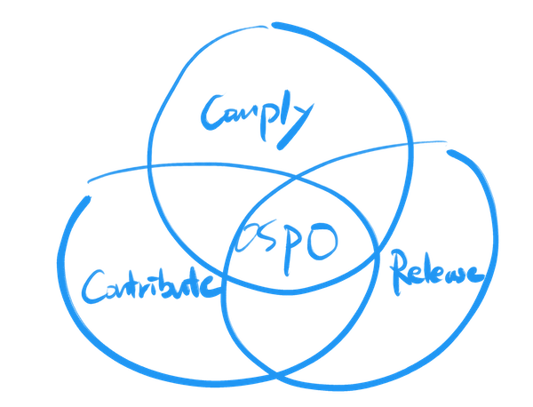
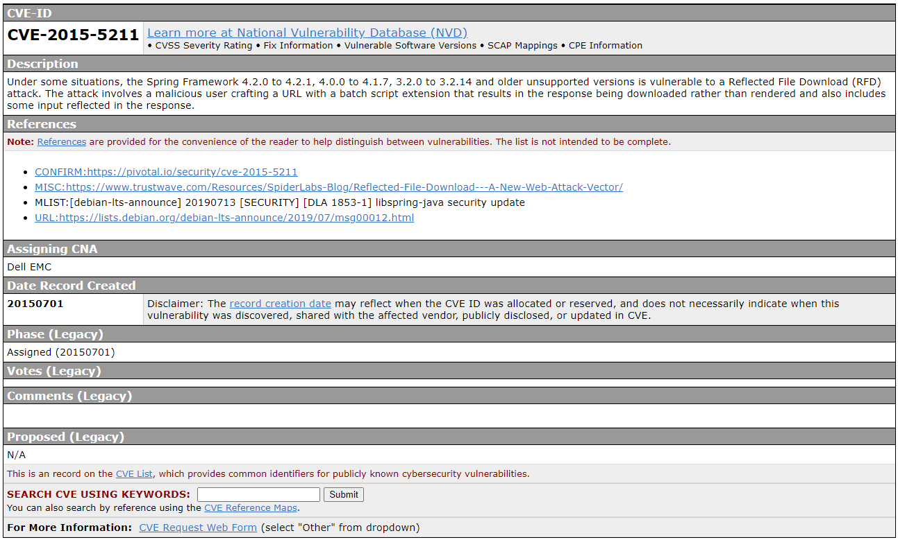
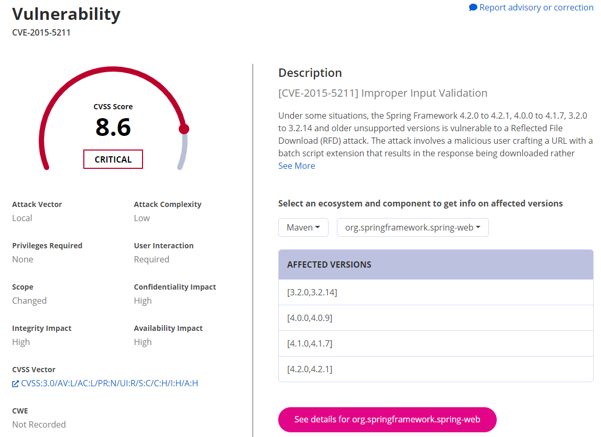
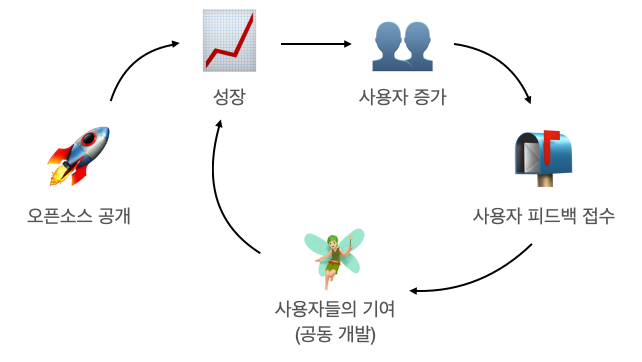

# OSPO (Open Source Program Office)

오픈소스를 사용하여 소프트웨어를 개발하고 배포하는 기업이라면 효과적인 오픈소스 거버넌스 관리 체계를 구축해야 한다. 이는 기업이 오픈소스와 관련된 모든 활동을 적극적으로 관리해 오픈소스로부터 최대한의 가치를 창출함과 동시에 법적인 리스크를 감소시키기 위해서이다. 글로벌 ICT 기업들은 이러한 오픈소스 거버넌스 체계를 구축하고 이를 성장시키기 위해 OSPO(Open Source Program Office)라는 조직을 설립한다. OSPO는 기업의 오픈소스 거버넌스 체계를 구축할 뿐만 아니라 기업의 성공을 위한 오픈소스 전략을 수립하고 실행하는데 필요한 정책, 프로세스 및 필요한 도구를 제공하는 역할을 수행한다.

Microsoft, Google, Twitter, Netflix와 같은 테크 분야 리더 기업뿐만 아니라 삼성, Comcast, Intel과 같은 전통 기업들도 OSPO를 운영하고 있다. 이러한 거대 기업이 아니더라도 테크, 가전, 금융 및 통신 분야의 기업 중 50% 이상이 OSPO를 만들었거나 만들 예정이라는 [조사 결과](https://github.com/todogroup/survey/tree/master/2019) <sup>(1)</sup>도 있다.

여기서는 OSPO의 역할, 책임, 구성과 설립 방법을 설명한다. 

> 이 장의 내용은 TODO Group의 "[How to create an open source program](https://todogroup.org/guides/create-program/) <sup>(00)</sup>"의 내용을 참조하였다. 

## 오픈소스 프로그램이란?

먼저, 오픈소스 프로그램이란 용어를 살펴보자. 오픈소스 프로그램이란 기업이 오픈소스의 활용을 효과적으로 관리하여 (1) 라이선스 위반 리스크는 감소시키면서 (2) 최고의 가치를 창출하기 위한 프로그램을 의미한다.

오픈소스 프로그램은 오픈소스 정책과 절차, 그리고 이를 자동화/효율화할 수 있는 도구를 마련하는 일이 포함된다.


## OSPO란?

OSPO는 오픈소스 프로그램을 구성하기 위한 조직이다. 어떤 오픈소스 패키지를 사용할지, 개발자가 외부 오픈소스 프로젝트에 어떻게 기여해야 할지, 사내의 어떤 프로젝트를 오픈소스로 공개할지는 모두 OSPO가 수행해야 할 전략적 비즈니스 결정이다.

기업이 오픈소스에서 최대의 이익을 창출하기 위해서는 OSPO를 설립하고 이를 통해 기업의 오픈소스 활동을 관리 및 지원해야 한다.

OSPO의 세가지 주요 관리 영역은 다음과 같다.



### 1. 오픈소스 올바르게 사용하기

기업이 오픈소스를 사용하면서 라이선스 의무 사항을 준수할 수 있는 정책과 프로세스를 수립해야 한다. 기업은 제품과 서비스 개발 시 사용한 오픈소스의 라이선스가 요구하는 바를 준수해야 한다. 이를 위한 활동을 오픈소스 컴플라이언스라고 한다. 기업은 올바른 오픈소스 컴플라이언스 활동을 통해 기업의 오픈소스 리스크를 관리할 뿐만 아니라 오픈소스 커뮤니티에서 브랜드 평판을 향상할 수 있다.

이를 위한 세부 사항은 OO 장에서 자세히 다룬다.

### 2. 외부 오픈소스 프로젝트에 기여하기

기업 내 구성원이 외부 오픈소스 프로젝트에 기여하도록 장려하는 것도 오픈소스를 전략적으로 활용하는 좋은 방법이다. OSPO는 이를 위한 정책을 수립하여 오픈소스 기여 문화를 확산하면서도 기업의 지식재산은 보호할 수 있게 해야 한다.

이를 위한 고려사항 및 세부 방법과 취할 수 있는 혜택은 OO장에서 자세히 다룬다.

### 3. 프로젝트를 오픈소스로 공개하기

오픈소스를 적극적으로 활용하는 ICT 기업이라면 오픈소스를 단순히 사용하는 데 그치지 않고, 다음과 같은 방법으로 오픈소스 커뮤니티에 다시 기여해야 한다.

- 오픈소스 프로젝트 공개
- 오픈소스 개발자 후원
- 오픈소스 이벤트 개최

OSPO는 기업의 비즈니스 전략을 고려하여 오픈소스 공개 정책을 수립하고, 이를 활성화하기 위한 실행 방안을 마련해야 한다.

이를 위한 세부 절차 및 방법은 OO 장에서 다룬다.

자, 그럼 기업이 OSPO를 설립하고 효과적으로 운영하면 어떻게 될까?

### 기대 효과

기업이 OSPO를 설립하고 운영하여 오픈소스를 적극적으로 활용한다면 다음의 효과를 기대할 수 있다고 알려져 있다.

- 소프트웨어 개발 인재를 유치하고, 기존 인력의 유출을 방지할 수 있다.
- 비즈니스 가치 창출, 혁신 추진을 가속화할 수 있다.
- 개발자들이 비즈니스 로직 작성에 집중함으로 비용 절감과 효율 향상을 기대할 수 있다.
- 제품 리더십을 통해 수익 창출과 시장 점유율 확보를 기대할 수 있다.


## OSPO 설립 절차

기업이 OSPO를 설립하기 위해서는 다음 절차를 수행해야 한다.


### 1. 리더를 임명한다.

먼저 OSPO를 설립하고 운영할 수 있는 적합한 리더를 찾는 것이 중요하다. 다음과 같은 역량을 갖고 있다면 OSPO의 리더로 적합하다.

- 오픈소스의 가치와 발전 가능성에 공감하고, 이를 기업에 전파하고자 하는 열정이 있다.
- 오픈소스 프로젝트에서 개발자, 기여자로 참여한 경험이 있고, 오픈소스 개발 방법을 충분히 이해한다.
- 기업의 비즈니스 전략과 같은 방향의 오픈소스 전략을 수립할 수 있도록 기업의 비즈니스를 폭넓게 이해한다.
- 기업의 오픈소스 전략과 정책을 모든 구성원이 이해하도록 전파할 수 있는 커뮤니케이션 역량을 갖추었다.
- 개발자들과 기술적인 소통이 가능하도록 여러 기술 분야를 폭넓게 이해한다.

누군가 임시로 일을 맡아서 시작할 수도 있겠지만, 가능한 풀타임으로 책임을 맡을 수 있는 리더를 임명하는 것이 OSPO가 올바르게 시작되고, 견고히 자리를 잡을 수 있게 한다.

### 2. OSPO의 역할을 정의한다.

OSPO를 설립할 때는 기업의 OSPO가 어떤 역할을 수행할지 정의해야 한다. 기업마다 규모나 업종이 다르고, 오픈소스를 통해 얻고자 하는 목적이 다르므로 OSPO의 역할이 달라질 수 있기 때문이다. 일반적으로 OSPO의 역할은, 정책, 프로세스를 수립하고, 도구를 제공함과 동시에 반복 작업을 자동화하고, 부서 간 협업 과정에서 발생하는 이슈 해결을 담당한다.

한가지 주의해야 할 사항은 OSPO의 역할을 무조건 크게 가져가는 것이 좋은 것만은 아니다. OSPO로 업무가 과대하게 집중될 우려가 있다. 다른 조직의 사람들이 문제를 스스로 해결하려고 하기보다는 OSPO에 미루는 현상이 나타날 수 있다.

또, OSPO는 구조화된 정책과 프로세스를 제공해야 하지만, 유연성도 유지해야 한다. OSPO가 모든 분야에 전문성을 유지하며 모든 의사결정을 내리는 것은 현실적으로 불가능하다. OSPO는 오픈소스 사용자와 기여자에게 도움이 필요할 때 컨설팅을 제공하여 구성원들이 스스로 개인 또는 기업의 비즈니스 결정을 내일 수 있도록 허용해야 한다. 궁극적으로는 기업과 구성원의 요구를 모두 충족하기 위해 의무와 책임의 적절한 균형을 설정하는 것이 중요하다.


### 3. 피드백을 수렴한다.

한 번에 OSPO의 모든 것을 구축하기는 쉽지 않다. 우선 기본적인 사항을 준비한 후 기업 내부의 모든 관련 당사자로부터 피드백을 받아서 보완해나가는 것이 필요하다. 경영진으로부터 개발자에 이르기까지 모든 구성원의 의견을 수렴해야 한다. 기업의 비즈니스 전략이나 구성원의 요구 사항을 고려하지 않고 OSPO가 단독으로 수립한 정책이 성공하기를 기대할 수는 없다.


## 어느 조직에 OSPO를 설립해야 하는가?

OSPO는 기업의 조직 내 어느 부서에서 설립하는 것이 적합하냐는 질문이 나올 수 있다. 개발 조직 내에 설립할지, 아니면 법무 조직에 있어야 하는지를 고민할 수 있는데, 이는 기업의 주요 비즈니스와 오픈소스 전략에 따라 달라진다.

### 개발 조직 속에서의 OSPO

오픈소스를 활용하는 부서는 주로 소프트웨어 개발팀이기 때문에 일반적으로 OSPO는 개발팀 내에 존재한다. 이를 통해 개발자가 더 효과적이고 생산적으로 오픈소스를 활용하는데 집중할 수 있게 한다.

### 법무 조직 속에서의 OSPO

대규모의 IP(지식 재산) 포트폴리오를 보유한 기업이라면 OSPO가 법무 조직 내에 있는 게 유리할 수 있다. 오픈소스를 활용하면서 법무 조직과 긴밀하게 협력하여 IP 관련 법적 문제가 발생할 가능성을 사전에 점검하고 대응할 수 있다. 주로 칩셋과 같이 IP 집약적인 하드웨어 개발 기업에 적합하다.

### 마케팅 조직 속에서의 OSPO

기업이 주로 오픈소스를 사용하여 개발한 제품이나 서비스를 판매하는 비즈니스를 주력으로 한다면 마케팅 부서 내부에 OSPO를 설립하여 오픈소스 제품의 홍보와 마케팅에 집중하는 것이 유리하다.

## OSPO에는 어떤 인원이 필요한가?

OSPO의 인원 구성과 각 인원의 역할 및 책임을 알아보자.

단, 아래의 인원 구성은 전략적으로 OSPO에 충분한 리소스를 투입해야 할 이유가 명확히 있는 기업을 고려하여 설명하였다. 기업의 규모가 작고, 오픈소스 프로그램 활동을 이제 시작하는 기업이라면, 처음부터 아래의 모든 역할을 지정할 필요는 없다. 한 명의 프로그램 매니저를 임명하고, 프로그램 매니저가 관련 부서와의 협업을 통해 OSPO의 역할을 수행하면서 점차 OSPO의 규모를 키워갈 것을 추천한다.


### 프로그램 매니저

프로그램 매니저는 오픈소스 프로그램을 관리하고 전략을 수립하는 전담 인원으로서 다음의 역할을 담당한다.
* 기업의 수익, 채용, 브랜드 인지도, 개발자 역량 등 비즈니스 목표에 부합하는 오픈소스 전략을 수립한다.
* 기업의 오픈소스 활동을 직접적으로 감독한다.
* 오픈소스 활동을 위해 필요한 도구를 제공한다.

프로그램 매니저는 이처럼 기업 전반에 걸쳐 영향력을 미칠 수 있는 역할이기 때문에 효율성을 극대화하기 위해서는 가능하다면 임원급 직책을 가진 자가 맡는 게 좋다.

### 컴플라이언스 담당

외부로 배포 혹은 서비스하는 제품 소프트웨어 및 서비스를 담당하는 조직은 배포 소프트웨어에 포함된 오픈소스들이 무엇인지 확인하고, 해당하는 오픈소스 라이선스의 의무사항을 준수해야 한다. 이러한 활동을 오픈소스 컴플라이언스라고 한다. 컴플라이언스 담당은 기업의 오픈소스 컴플라이언스를 보장하는 역할을 담당한다.

### 법무 담당

오픈소스를 사용하거나 외부에 기여하는 활동은 저작권에 기반하여 라이선스를 받거나 부여하는 활동이다. 결국 법적인 판단이 필요한 일이 발생할 수밖에 없다. 따라서, OSPO에는 법률 전문가를 포함해야 한다. 직접 포함할 수 없으면 법률 조언을 받을 수 있는 창구를 마련해야 한다.

OSPO의 법률 담당은 다음의 역할을 수행한다.
* 오픈소스 라이선스 및 기타 법적 자문을 제공한다.
* 외부 오픈소스 프로젝트에 기여 활동이 법적인 문제를 발생시킬 우려는 없는지 점검한다. 여기에는 CLA (Contributor License Agreement) 검토 등의 활동을 포함한다.

대기업의 경우 오픈소스 전문 변호사를 고용하는 경우도 있지만, 그렇지 않을 경우, 외부 컨설팅 기업를 활용하는 것도 고려할 수 있다.

참고로 NIPA의 오픈업에서는 오픈소스 활용을 위한 신뢰성 있는 [컨설팅 서비스](https://www.oss.kr/plaza_intro) <sup>(2)</sup>를 제공한다.

### IT 지원 담당

오픈소스 프로그램을 효율적으로 운영하기 위해서는 도구를 활용하여 가능한 자동화 해야 한다. IT 지원 담당은 도구를 활용하여 오픈소스 컴플라이언스 활동을 자동화하고, 오픈소스 보안취약점 점검을 효율화하기 위한 역할을 담당한다.

### 오픈소스 에반젤리스트

기업의 프로젝트를 오픈소스로 공개하고, 외부 프로젝트에 기여하는 활동을 장려하는 기업이라면 이를 외부에 홍보하기 위한 오픈소스 에반젤리스트의 역할이 중요하다. 오픈소스 에반젤리스트는 오픈소스 콘퍼런스 참여, 발표, 프로젝트 후원, 주기적인 홍보 문서 배포 등의 방법으로 기업의 오픈소스 활동을 외부에 알리는 역할을 담당한다.


## OSPO는 무엇을 해야 하는가?

### 정책을 수립한다

오픈소스를 사용하면서 오픈소스 라이선스를 준수하기 위해서는 준수해야 할 의무가 있다. 준수하지 않을 경우, 비즈니스 기회를 놓치거나 수익 손실 (판매 손실, 인수 실패 등), 법적 조치 (IP 소유권 손실, 수익 또는 파트너십 악화, 벌금 등) 및 브랜드 손상의 위험이 발생한다. 올바른 오픈소스 사용을 위한 정책을 수립해야 하며, 여기에는 오픈소스 라이선스 준수를 위한 기업의 정책, 오픈소스 커뮤니티에 구성원이 기여하는 방법, 내부 프로젝트를 오픈소스 커뮤니티에 공개하기 위한 방법이 포함된다. 즉, OSPO는 다음을 다루는 오픈소스 정책을 수립해야 한다.

1. 오픈소스 사용 정책 : 개발자가 Github 등 외부 저장소에서 찾은 소스 코드를 라이선스 측면에서 올바르게 사용하기 위한 방법
2. 오픈소스 기여 정책 : 개발자가 외부 오픈소스 프로젝트에 기여하기 위한 방법
3. 오픈소스 공개 정책 : 사내 개발 소프트웨어 프로젝트를 오픈소스로 공개하기 위한 방법

오픈소스 커뮤니티에서는 이러한 오픈소스 정책 템플릿을 작성하여 공개하고 있다.  아직 오픈소스 관리 정책이 없는 기업일 경우, 이러한 템플릿 문서를 참고하면 기업에 맞는 정책 문서를 작성하는 데 도움이 될 것으로 보인다. 한 번에 다 하려고 하기보다 계획을 수립하여 순차적으로 진행하는 곳이 좋다.

- Linux Foundation의 Generic FOSS Policy : https://wiki.linuxfoundation.org/_media/openchain/lf_compliance_generic_foss_policy.pdf
- Google의 Sample Policy : https://opensource.google.com/docs/
- NIPA의 기업 공개SW 거버넌스 OpenChain 2.0 해설: https://openchain-project.github.io/OpenChain-KWG/guide/appendix/1-policy-template/


### 정책을 전파한다

오픈소스 정책을 수립하는 것에 그쳐서는 안 되며, 이를 전사에 확산하는 노력이 수반되어야 한다. 효과적인 확산을 위해서는 기업 내 고위 임원의 장기적인 지원이 필요하다. 이를 위해 CTO 또는 CIO에게 오픈소스 정책의 중요성을 설득력 있게 설명할 수 있어야 한다.

그리고 모든 개발자가 오픈소스 정책의 존재를 알 수 있도록 한다. 또한 법무팀, 구매팀과 같은 기업의 다른 영역에서도 오픈소스 정책 활동에 참여하도록 환경을 조성한다.

다음은 오픈소스 정책과 문화를 확산하기 위한 한 예이다.

1. 먼저 기업 내 오픈소스 전문가로 구성된 커뮤니티를 만든다.
* 오픈소스 커뮤니티 활동을 경험한 개발자들을 먼저 참여하게 한다.
* 참여자들은 정기적으로 세미나 등을 통해 다른 개발자들에게 오픈소스 활동을 알린다.
2. 오픈소스 교육 과정을 개설하여 기업 내 모든 개발자가 오픈소스 사용 및 기여를 이해하고, 참여하게 한다.


### 프로세스를 구축한다

정책이 기업의 올바른 오픈소스 활동을 위한 요구 사항 및 규칙이라고 한다면 프로세스는 소프트웨어 개발 단계에서 정책을 따르기 위해 수행하는 절차이다.

Linux Foundation이 출간한 Open Source Compliance in the Enterprise에서는 이러한 프로세스를 설명하고 있다.

  
이미지 출처 : https://www.linuxfoundation.org/compliance-and-security/2018/12/open-source-compliance-in-the-enterprise


더불어 OpenChain 프로젝트에서 제공하는 Curriculum 문서에서도 단계별 프로세스와 주요 활동을 설명하고 있으니 참고할 수 있다.
  
이미지 출처 : https://www.openchainproject.org/resources


기업은 이러한 참고자료를 활용하여 기업의 환경에 맞게 오픈소스 프로세스를 구축해야 한다. 이때 소프트웨어 개발 조직의 병목이 되어서는 안된다. 아무리 프로세스가 훌륭히 작성되었다고 할지라도 실제 활동을 수행해야 할 소프트웨어 개발 조직에 과부하가 발생한다면, 프로세스는 곧 아무 역할도 하지 못하는 단지 한 장의 종이로 전락할 수 있기 때문이다.

그러므로 반복적인 검토를 통해 불필요한 절차를 제거하고, 가능한 모든 과정을 자동화하는 지속적인 개선 작업이 필요하다. 또한 기업의 비즈니스 전략 및 오픈소스 개발 환경이 변화되는 상황에 맞춰서 정책과 프로세스 역시 발전시켜야 한다.

### 자동화 도구를 지원한다

프로세스를 자동화하고 간소화하기 위한 도구를 활용할 수 있도록 지원한다.

자동화 도구를 도입하는 방법으로는 (1) 자체개발, (2) 상용도구 구매, (3) 오픈소스 도구 사용 등이 있을 수 있다. 초기에는 오픈소스로 공개된 도구를 사용하는 것이 여러 측면에서 유리할 수 있다. 우선 오픈소스 도구는 무료로 사용할 수 있기 때문에 비용이 발생하지 않으며, 오픈소스 도구를 사용하면서 기업이 자체적으로 수정 및 추가한 부분을 다시 오픈소스 커뮤니티에 기여함으로써 오픈소스 생태계 발전 및 확산에 기여할 수도 있다. 

오픈소스 도구에 대해서는 2장의 [주요 SCA 도구 소개](#주요_SCA_도구_소개) 에서 추가로 자세히 설명한다.


---

이상 OSPO가 무엇인지, 설립 절차, 인원 구성과 역할에 대해 알아보았다. 다시 말하지만, 처음부터 OSPO의 모든 역할을 담당할 조직을 세우는 것보다는 한 명의 오픈소스 프로그램 매니저를 임명하는 것부터 시작하는 게 중요하다. 한 명이라도 전담 인력을 지정하여 OSPO의 역할을 차근차근 수행하라. 기업 내부 활동에 그치지 말고 외부 기업 혹은 커뮤니티와 협업하라. 오픈소스의 진정한 가치를 얻게 될 것이다. 


---------------------------------------------------------------------------------

# 오픈소스 사용하기

지난 10년 동안 기업들은 대부분 독점 소프트웨어에서 오픈소스 소프트웨어 개발 환경으로 변화해왔으며, 운영체제부터 데이터베이스, 임베디드, 클라우드, 비즈니스 서비스에 이르는 모든 곳에서 오픈소스가 널리 사용되고 있다. 이 장에서는 국내외 기업들의 오픈소스 사용 현황과 오픈소스를 사용할 수밖에 없는 이유에 대해 알아보고, 오픈소스를 올바르게 사용하기 위한 가이드를 제시하고자 한다.

## 기업이 바라보는 오픈소스
최근 RedHat에서 전 세계 IT리더 950명을 대상으로 설문조사를 진행했다. 이 [오픈소스 Enterprise 현황 보고서 (2020)](https://www.redhat.com/en/enterprise-open-source-report/2020) <sup>(3)</sup>에 따르면 오픈 소스 소프트웨어가 엔터프라이즈 소프트웨어 시장을 계속 점령함에 따라 독점 소프트웨어 사용이 계속 감소하고 있는 것을 확인할 수 있다. 2019년 55%는 여전히 독점인 것으로 나타났으나 2020년에는 42%로 떨어졌다. 2년 후 그들은 독점 소프트웨어가 32%로 줄어들 것으로 예상한다. 반면에 엔터프라이즈 오픈소스는 32%이며, 2년 내 44%로 증가할 것으로 예상한다. 그리고 응답자 중 무려 95%가 오픈소스가 전략적으로 중요하다고 응답했다. 그 중 75%는 매우 중요하다고 답했다.

가트너는 [오픈소스 소프트웨어 하이프 사이클 보고서 (2016)](https://www.gartner.com/en/documents/3371817/hype-cycle-for-open-source-software-2016) <sup>(4)</sup>에서 ‘주류 IT 조직의 95%가 알고 있거나 혹은 모르는 채로 적지 않은 오픈소스 소프트웨어 자산을 활용하고 있다’라고 보고하기도 했다.

## 국내 기업들의 오픈소스 도입 현황
### 오픈소스 도입 현황
한국 IDG에서 오픈소스 도입 현황을 조사한 [오픈소스 기업에 안착하다 (2020)](https://www.itworld.co.kr/techlibrary/144662) <sup>(5)</sup>보고서에 따르면 여기서도 기업들의 오픈소스 도입은 이미 확산하였음을 확인할 수 있다. OS와 데이터베이스에 오픈소스를 사용하고 있다는 응답이 40%이며, 오픈소스 도입을 고려하고 있다는 답변도 20%나 나왔다. 전체 응답자의 95%가 오픈소스를 기업 IT 기업 환경에 적용하거나 적용하려고 시도하고 있다는 것을 알 수 있다.

응답자의 59%가 이미 오픈소스를 도입해 사용 중이며, 17%는 1년 이내에 오픈소스 도입을 하기 위해 준비 중이라는 점을 고려한다면, 기업들의 오픈소스 수용이 더욱 활발해질 것으로 예상이 된다.


### 국내 오픈소스 시장 현황
현재 국내 기업들의 오픈소스 전환 움직임은 주로 기술 지원 서비스를 보유한 상업적 버전에 초점이 맞춰져 있으나, 앞으로는 [커뮤니티 버전의 범위가 훨씬 커질 것으로 전망](https://www.itworld.co.kr/techlibrary/139540) <sup>(6)</sup>이 된다. 커뮤니티 오픈소스는 도커(Docker), 쿠버네티스(Kubernetes)를 비롯해 톰캣, 아파치 웹 서버, 마리아DB, 몽고DB, 젠킨스, 스파크(Spark) 등이 포함이 되며, 기업이 클라우드, 마이크로서비스, 인공지능, 빅데이터 등 이러한 비즈니스 전략을 수립하는데 있어서 매우 중요하다.

국내 오픈소스 시장은 [지난해 2,784억 원 수준이며, 2022년까지 연평균 20% 이상의 성장률을 보이며 4,687억 원 규모에 도달할 것으로 전망](https://rd.kdb.co.kr/fileView?groupId=633D8216-6F28-AACB-0DCA-0C5F29BD9AA0&fileId=0B5A6FCE-9061-B544-64F2-25B54AEF2A84) <sup>(7)</sup>되고 있다.


## 오픈소스 도입 이유
이처럼 해를 거듭할수록 기업들의 오픈소스 도입은 크게 늘고 있다. 기업들이 오픈소스를 도입하게 된 이유로는 비용 절감이 가장 크다. 독점 소프트웨어를 사용하게 되면 라이선스 비용이 계속 발생하며, 벤더에 종속되는 문제가 발생한다. 또한, 오픈소스보다 비용이 비싸고 변화에 빠르게 대응하지 못하는 문제점이 있다. 오픈소스가 총 소유 비용(TCO) 감소뿐만 아니라 여러 측면에서도 유리하다.

특히 소프트웨어 품질과 보안에서 독점 소프트웨어보다 더 나은 것으로 인식되고 있다. 그리고 오픈소스가 클라우드 기반 기술에서 작동되도록 설계되고 있는 점도 오픈소스를 채택하는 이유 중 하나로 부각되고 있다. 그 외에도 최신 기술 확보, IT 기술 역량 강화, 경쟁력 강화, 시장 확대 및 인재 확보 등 그 이유가 다양하게 나타난다. 기업의 오픈소스 도입 이유에 대해 좀 더 알아보자.

### 비용절감
일반적으로 오픈소스는 권리자인 저작권자가 라이선스를 통해 이용을 허락한 것이며, 라이선스에 따라서 상업적 이용이 가능하거나 비영리적 목적으로만 이용할 수 있다. 또한, 상업적으로 이용할 수 있더라도 해당 오픈소스를 사용 시 코드를 공개 해야 하는 의무 사항이 존재하기도 한다. 따라서 오픈소스의 라이선스를 꼼꼼히 따져보고 사용을 해야 추후 발생할 수 있는 리스크를 줄일 수 있다. 라이선스 의무 사항만 준수하면 기업은 자유롭게 오픈소스를 사용할 수 있다. 그리고 오픈소스는 완성된 패키지 형태로 제공되기도 하는데 보통 누구나 자유롭게 사용 가능한 커뮤니티 버전과 과금 정책이 포함된 엔터프라이즈 버전이 따로 존재한다. 엔터프라이즈 버전은 프리미엄 기능이나 보안 패치, 기술 지원 등을 통한 차별화 전략을 사용하기에 기업은 사용 환경에 따라 적절한 선택을 통해 오픈소스를 사용할 수 있다.

### 최신기술
오픈소스는 전세계 어느 개발자나 참여 가능하며, 급변하는 기술의 변화에 민첩하게 대응하다 보니 최신 기술이 자연스럽게 집약된다. 특히 최근에는 클라우드 환경을 기반으로 하는 오픈소스가 대세로 다양한 오픈소스 프로젝트가 인기를 얻고 있다. 또한 AI 기술의 발전으로 인해 AI 관련된 오픈소스도  많이 등장하고 있으며, 기업은 이러한 오픈소스를 적극적으로 도입하여 사내 개발자들에게 오픈소스 사용을 권장하고 최신 기술력을 확보하는 데 힘쓰고 있다.

### 역량 강화
독점 소프트웨어 사용 시 개발자는 내부 코드를 볼 수가 없었다. 하지만 오픈소스는 코드가 모두 공개되어 있으므로 기업 내부 개발자들의 역량 향상에도 도움을 줄 수 있다. 수많은 개발자의 손을 거친 높은 품질의 오픈소스 코드와 아키텍처는 기존 코드에 익숙한 개발자들에게 긍정적 효과가 있을 수 있다. 그뿐만 아니라 보편적 기능은 오픈소스로 대체하고, 비즈니스 로직 개발에 집중하게 됨으로써 오픈소스는 성공적인 프로젝트 완성에 필수가 되어 가고 있다.

### 경쟁력 강화
개발 프레임워크 부터 모니터링, 테스트 자동화, 부하 테스트, 빌드, 배포까지 개발 프로젝트 수행 전반에서 오픈소스를 적극적으로 도입하게 되면 부서별로 각자 따로 개발할 필요가 없고, 코드 중복도 최소화할 수 있다. 기업 전반적인 측면에서 볼 때 이는 매우 효율적이다.

### 시장확대
오픈소스를 사용하는 것에서 오픈소스에 기여하고 더 나아가 자사 코드를 오픈소스로 공개하게 되면 사용자가 세계로 확대되기도 한다. 또한, 오픈소스 커뮤니티를 통해 지속해서 오픈소스를 계속 업그레이드시킬 수도 있으며, 기술 혁신 및 표준 기술을 선점하는 효과가 있다.

### 인재확보
독점 소프트웨어를 사용하게 될 경우, 해당 소프트웨어 개발 경력이 있는 인재를 확보하는데 상당한 어려움이 따른다. 하지만 오픈소스의 경우에는 누구나 접근 가능한 코드이기 때문에 더욱 많은 인력 풀을 대상으로 인재를 확보할 기회가 늘어난다. 기존 직원들에게는 오픈소스 교육을 하는 기업이 늘어나고 있으며, 이제는 단순히 오픈소스를 사용하는 것뿐만 아니라 오픈소스에 직접 참여하고 [오픈소스 역량을 가진 오픈소스 전문가 고용을 고려한다는 채용 관리자도 늘어 가는 추세](https://training.linuxfoundation.org/resources/2020-open-source-jobs-report) <sup>(8)</sup>이다.  


## 오픈소스 도입시 고려사항
Gartner의 [Technology Insight for Software Composition Analysis (2019) 보고서](https://www.gartner.com/en/documents/3971011/technology-insight-for-software-composition-analysis) <sup>(9)</sup> 에 따르면 기업은 오픈소스를 도입할 때 고려해야 할 사항으로는 오픈소스가 장기적으로 생존할 가능성이 큰가? 보안 이슈는 없는가? 벤더 이슈는 없는가? 그리고 컴플라이언스 및 지식재산권 등 확인이 필요하다고 지적하고 있다. 그 밖에도 오픈소스가 기업에 적합한 기술인지, 오픈소스를 도입했을 때 충분한 기술 지원을 받을 수 있는지 등을 따져봐야 한다.

### 보안
오픈소스 도입 시 오픈소스가 과연 안전한지 고려해볼 필요가 있다. 실제로도 오픈소스는 코드가 공개되어 있으므로 보안에 취약한 게 사실이다. 하지만 취약점이 발견되었을 때 심각한 취약점은 보통 이른 시일 내에 보안 패치가 이뤄진다. 따라서 오픈소스는 이러한 보안 관리가 중요하기 때문에, 사용 중인 오픈소스를 모니터링하고, 보안 취약점 현황을 알려주는 도구들이 시중에 상당수 존재한다. 자세한 내용은 뒤에 나올 **오픈소스 관리 도구 소개**를 참고할 수 있다.

### 오픈소스 기술 지원
내부 인력만으로도 오픈소스의 도입과 지속적인 관리가 가능한지 검토해야 한다. 이를 위해서 내부 기술력이 뒷받침되어야 하며, 엔터프라이즈 오픈소스를 도입할 경우에는 어느 수준까지 기술 지원을 받을 수 있는지도 확인이 필요하다.

### 오픈소스 커뮤니티
오픈소스는 특정 단체가 관리하기도 하고, 개인 혹은 기업이 관리하기도 한다. 따라서 오픈소스를 운영하는 방식도 다양하므로 사전에 꼼꼼히 체크를 해야 향후 발생할 수 있는 리스크를 최소화할 수 있다. 얼마나 많은 사용자를 보유하고 있는지, 업데이트는 자주 이뤄지는지, 이슈가 발생했을 때 대응은 신속하게 이뤄지고 있는지 등 따져봐야 한다. 자세한 내용은 **오픈소스 선택 가이드** 편에서 다뤄질 예정이다.

### 호환성
오픈소스가 기업에 적합한지 따져보려면 먼저 현재 기업 내 IT 시스템에 대한 충분한 파악이 선행되어야 한다. 현재 시스템의 아키텍처와 현황 등을 문서화하고 오픈소스를 도입했을 때 이슈가 될 부분은 없는지 확인이 되어야 한다. 또한 케이스에 따라 장기적으로 계획을 세워 점진적으로 도입해야 할 수 도 있다.

### 컴플라이언스, 지식재산권
오픈소스에도 일반 사용 소프트웨어와 마찬가지로 저작권 등 지식재산권이 있다. 오픈소스 권리자는 라이선스를 통해 오픈소스를 사용하는데 지켜야 할 의무 사항을 명시한다. 자유롭게 복제 및 배포를 할 수 있게 하거나 수정을 할 수 있게 하기도 한다. 하지만 GPL과 같은 라이선스는 오픈소스를 사용하게 되면 소프트웨어를 배포할 때 소스 코드를 전부 공개하도록 요구하기도 한다. 오픈소스 라이선스를 미리 파악하고 의무 사항을 준수해야 한다. 자세한 내용은 **오픈소스 관리하기** 편에서 다뤄질 예정이다.


## 오픈소스가 상용 소프트웨어보다 안전한 이유
### 이슈를 발견하고 해결해 나가는 주기가 빠르다
오픈소스는 코드가 공개되어 있으므로 해커가 보안 취약점 및 약점을 찾기가 더 쉽다는 주장도 있지만 실제로는 수많은 기여자들에 의해 더 빨리 발견될 가능성이 크다. 커뮤니티가 활성화된 오픈소스일수록 이슈가 발생했을 때 더 빠르게 개선이 이루어진다.

### 패치와 버전 배포가 빠르다
오픈소스에서 취약점이 보고되면 심각도가 높은 이슈면 빠르면 하루나 이틀 이내에도 수정 사항이 배포된다. 반면에 상용 소프트웨어는 업데이트 주기가 길고 대응이 늦을 수밖에 없다. 상용 소프트웨어는 개발 인력이 제한적이라 소프트웨어의 우선순위를 지정하여 패치가 이뤄지고, 보통 6개월에서 길게는 12개월의 배포 주기를 갖게 된다.

### 상용 소프트웨어의 상당 부분도 이미 오픈소스를 사용 중이다
상용 소프트웨어 공급업체가 사용 중인 오픈소스의 보안 이슈를 제대로 추적하고 관리하지 않으면 버그 및 취약점을 그대로 갖은채로 배포될 가능성이 크다. 또한, 개선 되었다고 하더라도 실제 배포까지는 오랜 시간이 걸린다.


---

이처럼 기업의 오픈소스는 사용은 선택이 아닌 소프트웨어 개발의 필수가 되었다. 기업에서 오픈소스를 사용하는데 있어 올바른 방향성을 가이드를 제시해보고자 한다.

---

# 오픈소스 사용 가이드 - 기업편

오픈소스는 개인뿐만 아니라 엔터프라이즈 시장에서도 매우 큰 영향을 미치고 있다. 여러 컨테이너에서 마이크로서비스를 실행하기 위해 Docker를 사용하고, 오픈소스 데이터베이스인 MySQL을 사용하며, 웹 서비스를 위해 Spring 이나 Apache HTTP 를 사용하는 등 많은 오픈소스에 의존하고 있다. 이처럼 오픈소스는 기업의 인프라부터 서비스에 이르기까지 이미 많은 비중을 차지하고 있다.

오픈소스에 의존하는 정도가 증가함에 따라 기업은 어떻게 하면 올바르게 오픈소스를 사용할 수 있는지 지속해서 고민하고 정책을 수립해야 하며 이를 실무에 반영해야 한다. 오픈소스에 적용되는 라이선스의 종류는 매우 다양하며 조건에 따라 지켜야 할 의무사항도 모두 각각 다르다. 따라서 기업은 사용하고 있는 오픈소스를 추적 관리하고, 오픈소스 라이선스 의무 사항을 준수할 책임이 있다. 이번 장에서는 오픈소스 관리에 관한 내용을 알아보도록 하겠다.


## 오픈소스 관리
오픈소스 라이선스를 관리하는 것은 독점 소프트웨어의 라이선스를 관리하는 것만큼 중요하다. 실제로 오픈소스 라이선스를 위반한 기업을 상대로 많은 소송들이 제기되고 있다. 2017년 미국 연방 법원에서는 Artifex와 한컴의 오픈소스 라이선스 사건을 통해 [GPL이 법적 계약이라고 판결한 사례](https://www.linux.com/topic/open-source/artifex-v-hancom-open-source-now-enforceable-contract) <sup>(10)</sup>도 있다. 이처럼 기업 입장에서는 오픈소스 라이선스를 제대로 관리하지 않는다면 분명 큰 리스크로 다가올 것이다.


## 오픈소스 컴플라이언스
### 오픈소스 컴플라이언스 정의
> “Open source compliance is the process by which users, integrators and developers of open source software observe copyright notices and satisfy license obligations for their open source software components”  
> — The Linux Foundation

오픈소스 컴플라이언스란, 오픈소스를 사용하고 개발하는 사람들이 저작권을 침해하지 않기 위해서 오픈소스의 라이선스 의무를 이행하는 과정이다.

종종 조직에서는 오픈소스 라이선스 컴플라이언스를 성가신 것으로 간주한다. 물론, 모든 라이선스를 식별하고 각각의 라이선스 의무를 준수한다는 것은 어려운 작업이다. 하지만 오픈소스의 지속적인 실행 가능성을 보장하는 것은 기업이 맡은 책임 일부이기도 하다. 규정을 준수하기 위한 노력을 통해 기업은 오픈소스를 사용하면서 발생할 수 있는 비용이나 위험을 이해하게 된다. 반대로 말하면 기업은 오픈소스를 더 잘 이해하고 잘 사용할 수 있다는 의미이기도 하다. 오픈소스 컴플라이언스는 3rd party 공급자와 계약 의무사항을 준수를 포함하며, 뿐만 아니라 오픈소스 커뮤니티와 존중과 신뢰를 바탕으로 한 관계를 구축할 수 있기도 하다. 궁극적으로는 오픈소스 저작권자의 지적 재산권을 보호하는 데 그 목적이 있다는 것을 기억해야 한다.


### 오픈소스 컴플라이언스 프로세스
기업은 오픈소스 라이선스 의무사항을 준수할 수 있도록 오픈소스의 사용, 기여, 감사 및 배포에 이르는 일련의 과정을 관리해야 한다. 검증 단계까지 전반적인 내용을 체크 리스트를 작성하여, 일관성을 보장하고 검증 단계를 간과하지 않도록 하는 것이 중요하다. 여기서는 일반적인 오픈소스 컴플라이언스 프로세스를 소개하고 각 단계별 주요 내용을 설명한다.


#### **1. 오픈소스 라이브러리 식별**  
   프로젝트에 사용된 오픈소스를 식별하고 목록을 도출하는 단계이다. 모든 오픈소스 컴포넌트가 식별되어야 하며, 오픈소스 원본의 위치와 라이선스 정보 등도 함께 기록이 되어야 한다. 자동화된 스캐닝 도구를 통해 식별하는 것을 권장한다. 스캔은 배포시점이나 변동 사항이 있을 때, 개발자의 요청이 있을 때, 혹은 주기적으로 수행할 수 있다.

#### **2. 소스 코드 감사**  
   코드 레벨의 스캔을 수행하여 아직 식별되지 않은 오픈소스를 추가로 더 찾아내는 단계이다. 코드 스캐닝 도구는 오픈소스의 코드를 기반으로 개발 언어가 바뀌었거나 함수명, 변수명이 변경되었더라도 식별이 되어야 하며, 기존 코드와 비교를 통해 수동으로 확인하는 과정을 거친다.

#### **3. 이슈 해결**  
   도출된 오픈소스 목록에서 이슈가 있는지 파악하고 해결하는 단계이다. 이슈가 발견되었을 경우에는 해당 오픈소스를 다른 것으로 대체하거나 제거하는 작업이 필요하기 때문에 개발 부서와의 긴밀한 협의가 필요하다. 코드를 수정한 이후에는 다시 스캔 과정으로 돌아가 이슈가 해결이 되었는지 정확히 확인해야한다.

####  **4. 아키텍처 리뷰**  
   프로젝트 전반의 아키텍처 리뷰를 진행한다. 오픈소스 코드뿐만 아니라 독점 코드, 상용 코드 확인을 한다. 또한, 코드들의 의존성 및 결합 방식을 검토한다.

####  **5. 승인**  
   이전 단계들이 모두 완료되었는지 확인하며, 검토 결과를 토대로 오픈소스 책임자는 이 단계에서 오픈소스의 사용을 승인하거나 거절한다. 승인된 오픈소스와 관련 정보들은 취합 후 등록하여 관리한다.

####  **6. 고지**  
   오픈소스를 재배포하는 형태에서는 기본적으로 저작권과 라이선스 정보를 포함한 내용을 고지할 의무가 발생한다. 고지문은 일반적으로 NOTICE라는 이름의 파일로 작성한다. 이에 포함할 내용은 사용된 오픈소스의 명칭, 오픈소스에 접근할 수 있는 URL, 라이선스 원문, 저작권 표기 등이 있다. GPL과 같이 소스코드 공개의 의무가 발생하는 경우에는 소스 코드를 받는 방법도 함께 기재 한다.

#### **7. 검증**  
   배포한 패키지를 확인하여 고지문이 정상적으로 제공되었는지 최종적으로 확인한다.

## 라이선스 의무사항
### 오픈소스 배포
오픈소스 라이선스의 의무 사항은 배포가 이루어질 때 적용된다. 여기서 배포란 소스 코드 또는 바이너리의 복사본을 다른 사람에게 제공하는 행위를 의미한다. 앱스토어 배포, 판매, 3rd party 제공, 공개된 코드 등이 배포에 해당한다. 개인적으로 사용하거나 외부에 공개하지 않고 사내툴로만 사용하는 경우는 배포에 해당하지 않는다.

### 오픈소스 라이선스 공통 의무사항
오픈소스 라이선스는 공통으로 4가지 의무 사항을 기반으로 한다. 오픈소스 사용자는 저작권을 고지해야 하고, 라이선스 사본을 포함해야 한다.다만 오픈소스 사용 시 보증은 되지 않으며, 책임에도 제한이 있다.  


## 라이선스 컴플라이언스 실행
### 사용중인 오픈소스를 추적 해야 하는 이유
기업이 효과적으로 오픈소스를 활용하기 위해서는 각 제품별, 버전별 사용한 오픈소스 현황을 추적하여 관리해야 한다. 그 이유와 목적은 다음과 같다.

#### **오픈소스 목록 관리**  
  오픈소스를 효율적으로 관리하고 조직의 정책을 준수하기 위해서는 오픈소스 목록을 관리해야 한다.


#### **라이선스 확인**  
  사용 중인 오픈소스의 라이선스 파악을 통해 라이선스의 의무 사항을 확인하고 준수하는 데 도움이 된다. 다만, 모든 오픈소스 라이선스가 호환되는 것이 아니다. 라이선스의 의무사항 및 조건들은 충돌할 수 있다. 조직내 모든 오픈소스 라이선스 규정 준수 요구사항을 충족하는지 확인하는 유일한 방법은 오픈소스 라이선스를 식별하고 추적하는 것이다.


#### **취약점 파악**  
  오픈소스는 악의적인 공격자에게 타겟이 된다. 특히 엔터프라이즈 오픈소스는 더 많은 공격의 대상이 된다. 이때 오픈소스 목록을 확보하지 않는다면, 소프트웨어 내에 사용 중인 오픈소스가 알려진 취약점이 있는지 알지 못하게 되어 알려진 취약점을 수정할 수 없게 된다.


#### **패치 및 버전 업데이트**  
  오픈소스는 기능 개선 및 버그 수정을 위하여 지속해서 업데이트가 이뤄진다. 오픈소스 목록을 관리하여 중요 패치 또는 버전 업데이트를 놓치지 말아야 한다.

### 오픈소스 목록 수동 관리
오픈소스 목록을 관리하는 방법으로는 수동 방식과 자동 방식이 있다. 수동 방식은 개발자 또는 오픈소스 관리자가 모든 오픈소스 사용 현황을 직접 파악하는 방법이다. 수동으로 관리하는 경우 몇 가지 문제가 발생한다.
#### **오픈소스 파악의 어려움**    
  소스코드 수준에서 사용된 오픈소스까지 일일이 파악하는 것은 매우 힘든 작업이다. 오픈소스 코드를 그대로 가져다 쓰거나 혹은 오픈소스를 수정하여 사용하게 되면, 일부 제한된 라이선스에서는 오픈소스를 사용하는 모든 프로젝트의 소스 코드를 공개해야 할 수도 있다. 또한 오픈소스 목록에서 누락이 된다면 추후 개선되는 패치나 버그 수정도 불가능하게 되며 오픈소스에 취약점이 발견되어도 파악이 힘들어진다.

#### **사용된 오픈소스 목록 누락**  
  사용 파악 시 미처 확인하지 못한 누락이 발생할 수 있다. 프로젝트 규모가 커질수록, 그 대상이 많아질수록 직접 오픈소스 파악하기는 어려워진다. 또한 개발이 진행되고, 배포까지 최종 단계에 이르기까지 수많은 변경 작업이 일어난다. 이 과정에서 사용된 오픈소스 목록과 실제 코드에 포함된 오픈소스를 완전히 똑같이 맞추기는 어려울 것이다. 현실적으로도 이러한 변경 사항을 추적하는 데 있어 상당히 많은 노력과 시간이 소모되기도 한다.

#### **배포 프로세스 지연** 
  어플리케이션 개발과 배포에 영향을 줄 수 있다. 오픈소스 목록을 수동으로 관리하게 되면 승인 프로세스도 수동으로 수행되어 매우 느리게 진행될 가능성이 크다. 이미 통합된 오픈소스 중 이슈가 발생하게 되면 해당 오픈소스를 제거하고 대안을 찾도록 개발자에게 요구해야 할 수도 있는데 이렇게 되면 일정에 큰 차질을 빚게 될 것이다.

### 오픈소스 목록 자동화
위에서 언급한 것처럼 여러 측면에서 오픈소스 관리는 자동화가 필요하다. 자동화를 위해서는 아래와 같은 오픈소스를 식별하기 위한 적절한 도구를 구축하거나 도입하여 사용해야 한다.
- 코드 레벨에서 사용 중인 오픈소스를 찾아내며 비교를 제공하는 소스 코드 스캐너
- 오픈소스 라이브러리 파일을 찾아내는 파일 스캐너
- 오픈소스를 패키지 단위로 가져오는 패키지 매니저 분석 도구
- 라이선스와 컴플라이언스 항목 및 리소스를 추적하기 위한 컴플라이언스 관리 도구
- 라이선스 결합 방식 분석 도구
- 오픈소스 BOM 관리 도구
- 전반적으로 프로젝트를 관리하고 오픈소스 목록을 관리할 포탈

## 오픈소스 관리도구 소개
앞서 언급한 것처럼 오픈소스 사용에 따른 의무사항 준수와 위험 요소 확인을 위해서는 SDLC(Software System Development Life Cycle) 전체에서 지속적인 스캔 및 모니터링이 필요하다. 이에 **SCA(Software Composition Analysis)** 라는 오픈소스 관리 도구들이 생겨났다. SCA는 보안 및 라이선스 규정 준수를 발견하고 관리하기 위한 자동화된 프로세스를 제공한다.

### 오픈소스 관리도구 선택기준
Gartner의 [Technology Insight for Software Composition Analysis](https://www.gartner.com/en/documents/3971011/technology-insight-for-software-composition-analysis) <sup>(9)</sup>보고서에서 SCA 도구 선택 기준이 제시되는데 아래와 같다.
- [x] 충분한 취약성 데이터베이스가 마련되었는가?
- [x] IDE 및 Repository 연동, 코드 커밋 전 오픈소스 평가 기능 등 개발자 지원이 잘 되어 있는가?
- [x] 모든 라이선스를 추적하고 보고하는 기능이 있는가?
- [x] 라이선스 정책을 자동을 설정할 수 있는가?
- [x] 취약성을 빠르게 감지하고 우선순위를 결정하는가?
- [x] 라이선스, 저작권, 버전 관리 등 관련 정보를 포함한 보고서 발급 기능이 있는가?

### 주요 오픈소스 관리도구 소개
#### [**Olive (Kakao)**](https://olive.kakao.com) - https://olive.kakao.com 
    
  Kakao는 자사의 수많은 프로젝트의 오픈소스 관리를 위해 사용하던 시스템을 누구나 사용할 수 있도록 [Olive Platform](https://olive.kakao.com) <sup>(11)</sup> Beta를 무료로 오픈했다. Olive는 Github 프로젝트를 분석하여 사용한 오픈소스 데이터를 관리하고, 라이선스 및 의무사항을 확인하여 Report를 제공한다. 쉽고, 빠르고 정확한 오픈소스 검증을 목표로 직관적인 기능과 UI로 구성되어 있으며, 간단히 Dependency와 라이선스 확인이 가능한 심플 체크 기능 등 사용자 편의에 초점을 맞추고 있다.

#### [**Fossa**](https://fossa.com) - https://fossa.com
    
  2015년 설립된 실리콘밸리 스타트업에서 제공하는 서비스로, 풍부한 오픈소스 메타데이터 및 정교한 정책 거버넌스를 제공한다. CI/CD 통합 등 DevOps 환경을 지원하며 개발자 친화적 기능들로 구성되어 있다. Twitter, Uber, Zendesk 등과 파트너를 맺고 있으며, JS Foundation, Linux Foundation, NPM 등과 제휴하고 있다. 기본적인 사용은 무료이나 일부 추가 기능들을 유료로 제공하며, 팀 규모가 100명 이상이라면 엔터프라이즈 버전이 적용된다.

#### [**Snyk**](https://snyk.io) - https://snyk.io
    
  오픈소스 라이선스 취약성 관리를 위한 서비스를 제공하다가 2020년부터 라이선스 준수 관리 기능이 추가되었다. Dependency Tree 뷰어, 이슈 우선 순위 선별 시스템, 런타임 모니터링 등 기능을 제공하며, 전담 보안 연구팀이 리뷰를 진행한다. 현재 Docker 공식 독점 보안 파트너로 IBM Cloud, RedHat, OpenShift, Kubernetes 등과 제휴를 맺고 있다. 무료로 사용 가능하지만 팀 규모와 프리미엄 기능에 따라 유료 Plan이 세부적으로 마련되어 있다.

#### [**WhiteSource**](https://www.whitesourcesoftware.com) - https://www.whitesourcesoftware.com
      
  2011년 설립되어 라이선스 준수 및 취약성 관리 서비스를 제공하며, 오래된 서비스인 만큼 방대한 데이터베이스를 확보하고 있다. 110억 개 이상의 소스코드 파일, 200개 이상의 언어지원, 1억 개 이상의 라이브러리를 확보하고 있다. 컨테이너 및 서비리스 등 모든 환경을 지원하며 현재 Microsoft Azure DevOps 서비스로도 제공되고 있다. GitHub의 Ultimate에서 사용 가능한 옵션으로 제공되고 있으며 GitHub Package도 지원한다. WhiteSource도 기본적인 사용은 무료이며, 팀 규모가 20명을 넘어가면 유료로 사용 가능하며, 추가 프리미엄 기능을 제공한다.

#### [**FOSSology**](https://www.fossology.org) - https://www.fossology.org
    
  소스 코드 스캐닝 도구로 소스 파일 상단의 문구를 스캔하여 라이선스를 자동으로 확인한다. FOSSology의 자세한 설치 및 사용 방법은 다음 사이트를 참고할 수 있다.  
  https://openchain-project.github.io/OpenChain-KWG/guide/appendix/3-tools/fossology

#### [**SW360**](https://www.eclipse.org/sw360) - https://www.eclipse.org/sw360
    
  소프트웨어에 포함된 구성요소를 관리하기 위한 도구이다. 오픈소스를 포함하는 제품을 개발하고 배포하는 기업이라면 각 제품과 릴리스 버전마다 사용한 오픈소스의 버전, 라이선스 등의 정보를 수집하고 추적해야 한다. 이를 통해 기업은 올바른 오픈소스 컴플라이언스 활동을 수행할 수 있다. SW360은 오픈소스 정보를 추적하기 위한 도구이다. SW360의 자세한 설치 및 사용 방법은 다음 사이트를 참고할 수 있다.  
  https://openchain-project.github.io/OpenChain-KWG/guide/appendix/3-tools/sw360

#### [**SPDX**](https://spdx.dev) - https://spdx.dev
    
  SPDX(Software Package Data  소프트웨어 정보 교환 방식을 표준화하고 이를 용이하게 하기 위한 도구를 제공한다.

#### [**ClearlyDefined**](https://clearlydefined.io) - https://clearlydefined.io
    
  ClearlyDefined는 오픈소스 데이터베이스를 제공하여 사용자가 오픈소스의 출처, 라이선스 등의 정보를 확인할 수 있게 한다. 또한 정보의 오류가 있다면 사용자가 자발적으로 데이터를 개선할 수 있게 하여 커뮤니티 기반의 신뢰성 있는 오픈소스 데이터베이스 구축을 가능하게 한다.


## 오픈소스의 보안 취약성
### 오픈소스의 보안 취약성 현황
Sonatype의 [소프트웨어 공급망 현황 보고서(2020)](https://www.sonatype.com/2020ssc) <sup>(12)</sup> 에 따르면 오픈소스를 겨냥한 차세대 사이버 공격도 작년보다 430%나 증가하였으며, 응용프로그램에서 사용되는 오픈소스 구성요소의 11%가 알려진 취약점을 가지고 있다고 한다. 가장 일반적인 공격 유형은 Typosquatting 이며, 이는 오픈소스를 검색할 때 단순한 오타를 유도하는 공격 방식으로 개발자가 "lodash"의 이름을 가진 오픈소스를 사용하려고 할 때 "lodahs"와 같은 유사한 이름의 악성 컴포넌트를 미리 등록해두어 설치하게 만드는 방식이다. 또 다른 방식으로는 프로젝트 관리자로부터 자격 증명을 가로채 악성 코드를 심는 방식 등 다양한 수단을 통해 이뤄지고 있다.

특히 소프트웨어 공급망을 통해 공격이 증가하는 이유는 하나의 오픈소스가 다른 많은 오픈소스를 포함하는 종속 관계로 구성되어 있다 보니 실제 프로젝트에서 사용되는 오픈소스는 엄청난 수의 의존성을 가진 오픈소스를 사용하게 되어 전체를 파악하기가 힘든 점이 있다. 그리고 오픈소스 정신은 **신뢰하는 공유**에 기반을 두고 있다 보니 이것은 공격자가 쉽게 접근할 수 있게 하는 토대가 되기도 한다.

### 오픈소스의 보안 취약성 사례
최근 오픈소스를 통한 취약점 사례를 살펴보면, 2020년 5월 "Octpus Scanner" 26개의 오픈소스 패키지에 악성 코드가 삽입되어 멀웨어를 전파하고 백도어를 심었다. 4월에는 RubyGems 에서도 "typosquatting" 및 "crypto" 마이닝 멀웨어등이 발견되어 현재는 제거된 상태이다. 그리고 npm 패키지를 통한 공격도 있었는데 2월에 1337qq-js npm 패키지는 설치 스크립트와 UNIX 시스템만을 대상으로 하드 코딩된 암호나 API 액세스 토큰 등 민감한 정보를 빼낸 사례도 있었다.

### 오픈소스의 보안 취약성 조치
그렇다면 이러한 취약성이 발견되었을 때 오픈소스는 얼마나 빠르게 대처할까?

보고서를 보면 보통은 1일 ~ 1주 이내가 35%로 제일 많았으나 여기서 주목해야 할 점은 1주 이상 소요되거나 아예 고쳐지지 않는 케이스가 무려 51%나 된다는 것이다. 오픈소스 커뮤니티의 신속한 대응도 중요하지만, 해당 오픈소스 사용처에서도 바로 적용해야 하는 이슈도 존재한다. 또한, 공격자는 문제가 되는 오픈소스 버전이 배포된 후 3일 이내에 오픈소스 취약성을 악용한 것으로 제일 많이 나타나므로 더 빠른 조치가 필요한 상황이다.

### 취약성 데이터베이스
보통 오픈소스의 취약성 내용과 이루어진 버전 정보들은 수집되어 [CVE](https://cve.mitre.org) <sup>(13)</sup>와 같은 오픈소스 취약성 데이터베이스에 저장이 된다. 다양한 유형의 취약성 정보가 포함되는데 주요 데이터베이스는 아래와 같다.
#### [Mitre의 CVE(Common Vulnerabilities and Exposures)](https://cve.mitre.org) - https://cve.mitre.org
  상용 애플리케이션 및 비공개 소스 프로젝트를 비롯하여 다양한 유형의 취약성에 대한 정보를 제공한다. 취약성 정보는 개별 CVE 번호가 부여되어 관리된다.
- 예) CVE-2015-5211 에 대한 CVE 정보
  
#### [Sonatype OSS Index](https://ossindex.sonatype.org) - https://ossindex.sonatype.org
  Maven, NPM, Go, Pypi 등 여러 유형의 Package Management 에서 보고된 오픈소스 취약성 정보 데이터베이스를 제공한다.
- 예) CVE-2015-5211 에 대한 OSS Index 정보
  

## DevSecOps
2012년 가트너는 "DevOpsSec: Creating the Agile Triangle" 이란 보고서를 통해 DevOps 이니셔티브에 보안 기반을 구축할 필요가 있다는 사실을 강조하기 위해 DevSecOps라는 개념을 소개했다. DevSecOps는 소프트웨어 개발(Development)과 운영(Operation), 보안(Security)의 합성어로 애플리케이션 개발자와, 운영, 보안 실무자 간의 소통과 협업, 통합을 강조하는 개발문화를 의미한다.

  
이미지 출처 : [RedHat](https://www.redhat.com/ko/topics/devops/what-is-devsecops)

SDLC(Software System Development Life Cycle) 전체에 걸쳐 가능한 빨리, 그리고 자주 보안이 통합 되도록 해야 한다. 오늘날 일반적인 애플리케이션에는 오픈소스 코드가 60~80% 포함된다는 점을 고려할 때 DevSecOps에서 중요한 것은 오픈소스 취약성에 대한 고려일 것이다. DevSecOps 전체에서 오픈소스 취약성을 추적하고 사용자에게 알려주는 것은 매우 중요하다.

컨테이너 및 마이크로서비스와 같은 혁신적인 기술로 업데이트 하면서도 분리된 팀들 간에 긴밀하게 협업하도록 하는 것은 쉽지 않은 일이다. IBM에서 제시한 [모범 사례 (2020)](https://developer.ibm.com/recipes/tutorials/open-source-security-trends-for-2020) <sup>(14)</sup>를 통해 DevSecOps 관점에서 본 오픈소스 취약성 관리에 대해 좀 더 알아보자.

### IBM DevSecOps 모범 사례
#### **자산 추적**  
  먼저 보호가 필요한 자산에 대해 알아야 한다. 오픈소스를 식별하고 추적을 통해 어떤 자산이 중요한지 파악하는 데 도움이 된다.


#### **위협 평가 수행**  
  이 단계에서는 예상되는 위협 유형을 평가한다. 가능한 공격 방법과 구현할 수 있는 보안 조치의 실행 가능성을 평가한다.


#### **보안 체크리스트**  
  명확한 실천 체계를 수립하여 일상 업무에서 쉽게 규정을 지킬 수 있게 한다. 이렇게 하면 패치를 쉽게 적용할 수 있어서 보안 격차를 줄일 수 있다.


#### **가능한 자동화**  
  오픈소스 가시성을 높일 수 있는 애플리케이션 보안 테스트 및 오픈소스 보안 솔루션이 있다. [SonarQube](https://www.sonarqube.org) <sup>(15)</sup>와 같은 모니터링 도구를 사용하면 오픈소스 구성요소를 추적하여 버그와 결함을 실시간으로 탐지할 수 있다.


#### **보안 우선 문화 구축**  
  유관 부서 전반에 걸쳐 보안을 적용하고 개발프로세스의 모든 단계에 보안 사항을 관리하는 데 집중해야 한다. DevOps 전반에 Security를 결합한 DevSecOps 모델을 채택하면 보안 우선의 문화를 구축하는데 도움이 된다.


#### **컨테이너 보안 모범 사례 적용**  
  컨테이너화는 자체적인 운영체제를 고려할 때 보안상의 이점이 있다.


#### **모든 것을 암호화**  
  모든 데이터에 암호화를 적용한다.


### GitHub 기능을 활용한 보안 관리 사례
GiHub은 소스코드 저장소로 널리 사용되고 있는데, 최근 [GitHub Octoverse (2020)](https://octoverse.github.com) <sup>(16)</sup> 자료를 보면, **Fortune 50대 기업 중 72%가 GitHub Enterprise를 사용**하고 있다고 한다. 그에 맞춰 최근 GitHub에서도 단순히 소스코드 저장소 기능을 넘어 새로운 기능들을 추가하고 있는데, 특히 보안과 관련된 다양한 기능을 제공하고 있어 주목을 받고 있다. 이러한 보안 기능들을 활용한 보안 관리 사례를 살펴보고자 한다.

#### **Dependency Graph**    
  프로젝트에서 사용 중인 외부 라이브러리 정보를 보여주는 기능이다. 사용 중인 라이브러리와 라이브러리 버전 정보들을 조회할 수 있다. Ruby, Javascript, Python 등 다양한 언어와 패키지 매니저를 지원한다. Dependency Graph 는 사용 중인 것뿐만 아니라 자신의 프로젝트를 참조하고 있는 다른 프로젝트도 확인할 수 있다.
  


#### **dependabot**  
  프로젝트에서 사용중인 오픈소스 중 오래된 버전이 있다면 PR(Pull Request)를 추가해 준다. 개발자는 변경된 릴리즈 정보를 검토하여 새로운 버전 을 머지(Merge) 할 수 있게 한다.
  


#### **코드 스캐닝**  
  코드 스캐닝은 GitHub 네이티브 환경으로 제공된다. 코드 스캔이 활성화되면 모든 'git push'에서 새로운 잠재적 보안 취약성이 스캔 되고 결과는 풀 요청에 직접 표시된다. 코드 스캐닝은 세계에서 가장 진보된 시맨틱 분석 엔진 인 CodeQL을 사용하는데, 이는 실제 취약점을 발견하는 최고의 기록을 가지고 있다. 오픈소스 코드 스캔은 무료로 제공되고 있다.
  

#### **Secret 스캐닝**  
  GitHub Private Repository와 Enterprise 버전에 추가된 기능으로 코드 내 Secret 코드를 스캔하는 기능이다. 소스코드에 포함되어 노출되면 민감한 코드 정보들을 찾아내어 실수로 커밋 된 자격 증명의 부정 사용을 방지한다. 일치하는 Secret 포멧이 발견되면 지정된 HTTP 주소로 payload가 전달된다.
  

---

여기까지 오픈소스 사용하는데 있어 기업이 활용할 수 있는 가이드를 알아보았다. 이제 개발자는 어떻게 오픈소스를 사용하고 관리해야 하는지에 대해 알아보자.

---


# 오픈소스 사용 가이드 - 개발자편

오픈소스는 생태계는 매년 그 규모가 매우 빠르게 발전하고 있다. 오픈소스 거버넌스 플랫폼을 운영하는 Sonatype 에서 최근 발표한 [소프트웨어 공급망 현황 보고서 (2020)](https://www.sonatype.com/campaign/wp-2020-state-of-the-software-supply-chain-report) <sup>(16)</sup>에 따르면 Java 패키지의 2020년도 다운로드 수가 3,700억 건을 웃돌며 이는 작년 대비 무려 55%나 증가한 것으로 나타난다. Javascript 패키지의 경우에는 주로 NPM을 통해 유통 되는데 이 역시 패키지 다운로드가 1조에 이르러 매년 100% 성장세로 발전하고 있다. 2019년에는 50만 개 이상의 새로운 오픈소스가 릴리즈 되었는데 2020년에는 130만 개로 지난해보다도 63%가 증가했다.

이처럼 수많은 오픈소스가 생겨나면서 오픈소스를 선택하는 폭도 그만큼 넓어졌다. 이번 장에서는 오픈소스를 올바르게 선택하는 방법에 대한 내용을 알아보고자 한다.

## 오픈소스 생태계의 이해
오픈소스 선택에 관한 내용에 앞서 오픈소스 생태계를 이해할 필요가 있다. 오픈소스 생태계의 구성은 크게 생산자, 공급자와 소비자로 나뉘는데 생산자는 오픈소스 커뮤니티 및 재단, 그리고 오픈소스 기여자 등으로 구성된다. 공급자로는 소프트웨어 인프라 공급자, 교육 및 컨설팅 기업, 기술지원 기업 등이 있다. 소비자로는 일반 사용자와 오픈소스를 활용하는 조직이 해당한다.

### 오픈소스 생태계 구성

#### **생산자**
  - **오픈소스 커뮤니티** : 오픈소스 생태계에서 허브 역할
  - **오픈소스 재단** : 오픈소스 커뮤니티와 상용 오픈소스 밴더 사이에서 공동 작업을 지원
  - **오픈소스 기여자** : 오픈소스를 개발하고 다양한 오픈소스 이슈를 처리하는 개발자

#### **공급자**
  - **소프트웨어 인프라 공급자** : 오픈소스 공급망 제공
  - **교육 및 컨설팅 기업** : 오픈소스 프로젝트를 중심으로 비즈니스 생태계 조성
  - **기술 지원 기업** : 오픈소스 커뮤니티와 협력 관계를 유지하며 오픈소스를 지원하기 위한 기술 인력을 운영

#### **소비자**
  - **일반 사용자** : 오픈소스를 사용하고, 커뮤니티를 통해 오픈소스의 개선에 참여
  - **오픈소스 유료 사용자** : 유료 서비스를 통해 차별화된 지원을 받는 사용자 또는 조직


### 오픈소스 커뮤니티
오픈소스 커뮤니티의 구성은 양파 구조에 비유를 많이 하게 되는데, 프로젝트 리더(또는 창시자)와 핵심 기여자, 기여자, 신입 기여자, 사용자로 구성된다. 이 중 프로젝트 리더는 오픈소스 프로젝트 전반적인 사항에 대해 최종 의사 결정을 내린다. 핵심 기여자는 프로젝트에서 경험이 제일 많은 실력자이며, 커뮤니티 구성원들을 지도하거나 멘토링을 하게 된다. 그 외 자세한 내용은 오픈소스 기여하기 편에서 다루기로 한다.

### 오픈소스 재단
오픈소스 생태계에는 다양한 오픈소스 재단이 존재한다. 오픈소스 이니셔티브(OSI, Open Source Initiative)의 앨리슨 랜달 회장은 "기업들이 신뢰할 수 있는 비영리 독립 단체를 통해 오픈소스 프로젝트를 공동 추진할 수 있다고 생각함에 따라 재단 설립이 증가하고 있다. 이는 아주 중요한 의미를 지닌다. 경쟁 관계에 있는 기업들이 협력 할 경우 통상 많은 장애물은 만나게 된다. 중립적이면서도 경쟁적이지 않은 재단을 매개체로 삼는 방법이 아주 유용할 수 있다"라고 설명했다.

몇 가지 주요 오픈소스 재단은 아래와 같다.
#### **OSI (Open Source Initiative)**  
  이 조직은 1998년 Netscape에서 영감을 받아 시작되었으며, 오픈소스 소프트웨어 사용을 장려하기 위해 만들어진 단체이다. 현재는 OSI 라이선스 검토와 승인 등 OSD(Open Source Definition)을 관리하고 있다.


#### **Free Software Foundation**  
  오픈소스 분야에서 유명한 리차드 스톨만이 1985년에 설립한 재단으로 자유(Free) 소프트웨어의 생산과 보급을 장려하고 있다. 주로 컴퓨터 소프트웨어를 만들어 배포하고 수정하는 보편적인 자유를 재고한다.


#### **Linux Foundation**  
  리눅스의 성장을 지원하고 상업적 지원을 진행하고 있는 기술 컨소시엄이다. 최근에는 오픈소스 이벤트, 교육 및 인증, 오픈소스 프로젝트 지원 프로그램 등으로 영역을 확장하고 있다.


#### **Apache Software Foundation**  
  1993년 Apache HTTP 개발자들에서 시작한 이 그룹은 전 세계 분산 개발자 커뮤니티로 발전하여, 다양한 오픈소스 프로젝트를 진행하고 있다. 그들이 개발하고 있는 소프트웨어는 아파치 라이선스 조항 아래 배포된다. 재단의 목적 중 하나는 아파치 프로젝트에서 일하는 지원자들에 대한 법적 보호와 허가 없이 다른 조직에서 아파치 브랜드의 사용을 막는 데에 있다. 그리고 아파치 프로젝트와 관련된 기술과 아파치 개발자들이 함께 모이는 데에 초점을 맞춘 ApacheCon 콘퍼런스를 해마다 열고 있다.


#### **Cloud Foundry Foundation**  
  클라우드 파운드리 재단은 클라우드 파운드리 오픈소스 프로젝트의 전 세계적인 인식 및 채택을 이끌고 기여자 공동체를 성장시키고, 프로젝트 성공을 위해 모든 파트너 기업들을 통해 전략 및 조치의 일관성을 구축하기 위해 존재한다. EMC, HP, IBM, 인텔, SAP가 공동 참여하고 있다.


## 오픈소스 라이선스
오픈소스는 저작권법에 따른 보호를 받는다. 오픈소스는 일반적으로 소스가 공개되어서 접근할 수 있게 설계되었고 누구나 자유롭게 사용, 수정, 배포할 수 있다. 오픈소스는 라이선스는 해당 오픈소스를 사용하기 위해 사용자가 지켜야 할 의무 사항을 명시하고 있다. 이러한 의무 사항을 제대로 준수하지 않고 사용하면 저작권법 위반이 된다.

오픈소스 라이선스 중 GPL 라이선스의 경우에는 오픈소스를 사용하는 조건으로 사용된 애플리케이션의 모든 코드를 공개해야 하는 의무 사항을 가지고 있다. 만약 상용 소프트웨어에서 코드 공개를 하지 않고 GPL 라이선스의 오픈소스를 사용하면 저작권법 위반으로 형사처벌을 받을 수도 있다.


### 오픈소스 라이선스 구분
오픈소스 라이선스는 크게 permissive 라이선스와 copyleft 라이선스로 나눌 수 있다.


두 가지 라이선스의 특징은 아래와 같이 나눌 수 있다.

#### **permissive 라이선스**
  - 고지 의무를 지키면 자유롭게 사용 가능
  - 대표적인 라이선스: MIT, BSD, Apache 등

#### **copyleft 라이선스**
  - 고지 의무 + 코드 공개 의무
  - 사용한 오픈소스의 라이선스와 동일한 조건으로 배포 의무
  - 대표적인 라이선스: GPL, LGPL, AGPL, MPL 등

오픈소스 라이선스에 대한 세부 사항은 NIPA에서 출간한 "오픈소스 라이선스 가이드" (링크)를 참고할 수 있다.


## 오픈소스 선택 가이드
수많은 오픈소스로 인해 요구 사항에 가장 적합한 오픈소스를 선택하기가 어려울 수 있다. 여기서 오픈소스 선택을 위한 기준을 몇 가지 제시해보고자 한다.

### 오픈소스 선택 기준
#### **기능성**    
  자신의 프로젝트에서 필요한 기능을 충분히 충족할 수 있고 사용하기에 적합한지 따져봐야 한다. 예를 들어 메세지 큐 기능을 위한 오픈소스를 선택하는 데 있어서 기본 메세징 기능 적합한지 확인하고, 업계에서 널리 사용되는 프로토콜과 일치하는지 확인을 해야 한다. 필요한 기능 이상으로 지나치게 과도한 기능을 제공하진 않는지도 중요하다. 예를 들어 단순히 문서  파일 포멧 변환이 필요한데 이미지, 영상 포멧까지 다양하게 제공하는 오픈소스라면 현재 필요하지 않은 기능 때문에 더 많은 용량이나 리소스를 차지할 수도 있다.
  오픈소스가 프로젝트에서 요구하는 기능에 완벽하게 충족시키지 못한다면 필요한 추가 기능을 직접 수정하여 사용하는 것도 고려될 수 있다. 그러나 이 수정하게 되는 경우 오픈소스 기여와 변경에 따른 라이선스와 같은 다양한 내용을 살펴보고 진행해야 한다.


#### **오픈소스 사용 조건 및 성능**  
  오픈소스 사용 조건과 같은 비기능적인 부분도 반드시 살펴봐야 한다. 프로젝트에서 사용하는 아키텍처나 운영체제와 호환이 되어야 하고, 프로젝트가 현재 Linux 에서 작동하지만, Windows도 다음에 확장될 계획이라면 두 시스템 모두 지원하는 오픈소스여야 한다. 그리고 오픈소스의 성능이 조건에 충족하는지 살펴보고, 성능이 중요하다면 벤치마킹을 수행하여 성능을 반드시 측정해보아야 한다.


#### **라이선스**  
  오픈소스에 명시된 라이선스를 반드시 확인해야 한다. 상업용 프로젝트에 비상업용 라이선스를 가진 오픈소스를 사용하거나, GPL 라이선스를 가진 오픈소스를 사용하게 되어 의도하지 않게 자신의 코드를 전부 공개해야 하는 상황은 피해야 한다. 이 경우 Apache나 MIT와 같은 상대적으로 관대한 허용적 라이선스를 사용하는 오픈소스를 선택하는 것이 바람직하다.


#### **보안**  
  [2020년 소프트웨어 공급망 현황 보고서](https://www.sonatype.com/resources/white-paper-state-of-the-software-supply-chain-2020) <sup>(16)</sup>를 보면 오픈소스의 11%가 알려진 취약점을 가지고 있다는 통계가 있다. 오픈소스 검토 보안과 관련된 부분을 반드시 확인하고 사용해야 하며, 취약점이 발견되었을 때 빠르게 조치가 이뤄지고 있는지 등도 검토 대상이 되어야 한다. 오픈소스의 마지막 릴리즈가 오래되었다면, 그 만큼 보안 취약점을 가지고 있을 가능성이 높다. GitHub 이슈 또는 오픈소스 설명에 명시된 이슈 트래커등을 통해 보안 문제가 있는지 확인하고, 지난 버전 릴리즈 노트를 살펴보자.


#### **인기도**  
오픈소스가 GitHub 에서 관리 중이라면, Star 개수나 Watch, Fork 횟수 등으로 얼마나 많은 사용자가 오픈소스를 활용할 수 있는지 가늠해볼 수 있다. 그뿐만 아니라 오픈된 이슈 개수나 PR 수, 마지막 커밋 일시 등을 통해 얼마나 활발하게 오픈소스 개발이 이뤄지고 있고 계속 발전할 가능성이 얼마나 되는지 파악할 수 있다. 그 밖에도 해당 오픈소스와 관련된 StackOverflow 질문 수, 오픈소스 다운로드 수, Google 쿼리 결과 수 등과 같은 간단한 측정을 통해서 인기도를 확인해 볼 수 있다. 이러한 여러 지표를 측정하여 오픈소스 커뮤니티의 건강성을 측정하는 [CHAOSS](https://chaoss.community/metrics) <sup>(17)</sup> 와 같은 도구도 있다.
  - Star 수
  - 참조 횟수
  - 오픈된 이슈 수
  - 오픈된 PR 수
  - 마지막 커밋일시
  - 릴리즈 주기


#### **소스 코드**  
  오픈소스의 소스 코드와 코드의 품질도 중요하다. 프로젝트에서 사용 중이거나 익숙한 프로그래밍 언어로 작성된 오픈소스를 사용하는 것이 유리하다. 이는 오픈소스를 직접 수정하지 않더라도 이슈가 발생했을 때 디버깅을 하거나 원인을 파악하는 데 도움이 된다. 낮은 코드 품질의 오픈소스는 잠재적으로 버그, 보안 취약성, 성능 저하와 유지 관리 이슈를 갖고 있습니다. 코드 품질을 파악하는 방법으로는 세부적인 로직을 모르더라도 단위 테스트 코드가 포함되어 있는지, 메서드 또는 함수가 읽기 쉽게 명명되어 사용 중인지, 코딩 컨벤션은 올바르게 지켜지고 있는지 등을 참고하여 판단할 수 있다.


#### **문서화**  
  오픈소스 코드 품질과 더불어 문서화가 잘 되어 있는지 살펴보는 것도 중요하다. 설치 방법, 튜토리얼, 참조 설명서 등 문서화가 잘되어 있는 오픈소스는 그만큼 성숙한 오픈소스라고 볼 수 있다. 문서화가 잘되어 있으면 직접 오픈소스 코드를 보지 않더라도 세부적인 사용 방법도 손쉽게 파악할 수 있고 빠르고 다양하게 적용할 수 있어서 오픈소스 활용도도 그만큼 올라가게 된다.


### 오픈소스 선택 체크리스트
- [x] 많이 쓰이고 있는 오픈소스인가?
- [x] 팀에서 오픈소스를 배우는데 어렵진 않은가? (레퍼런스가 충분한가?)
- [x] 유지보수가 잘 되고 있는가?
- [x] 유사 오픈소스와의 차이점은 무엇인가? (얼마나 효율적인가?)
- [x] 쓰지 않는다면 어떤 문제가 생기는가?
- [x] 라이선스에는 문제가 없는가?
- [x] 커뮤니티는 활성화되어 있는가?

---

( 오픈소스 사용하기 정리글 추가)


---

# 오픈소스 기여하기

우수한 ICT 기업은 오픈소스를 제품개발에 사용하기에 그치지 않고 오픈소스 프로젝트에 다시 기여하여 가치를 창출하는 전략도 중요하게 여긴다. 그러나 기업이 오픈소스 프로젝트 및 운영 방식을 제대로 이해하지 못하거나, 견고한 전략 없이 오픈소스 기여 활동에 참여하면 오픈소스 커뮤니티에서 기업의 명성이 훼손되거나 법적 위험을 초래할 수도 있다.

이 가이드에서는 기업이 오픈소스 프로젝트에 기여함으로 얻을 수 있는 이익과 올바른 기여 정책의 필요성 및 정책 수립 방법을 다룬다. 이어서 기업의 구성원이 오픈소스 프로젝트에 기여하는 방법을 세부적으로 설명한다.

> 이 장의 내용은 다음 문헌을 참고하였다. 
> * TODO Group의 [Participating in open source communities](https://todogroup.org/guides/participating/) <sup>(00)</sup>
> * GitHub Open Source Guide의 [How to Contribute to Open Source](https://opensource.guide/how-to-contribute/) <sup>(00)</sup>

## 기업은 왜 오픈소스에 기여해야 하나?

기업이 오픈소스에 기여하는 목적과 이익은 무엇인가? 기업은 왜 구성원의 오픈소스 기여 활동을 장려해야 하나? 기업의 비즈니스 관점에서도 오픈소스에 기여해야 하는 이유는 다음과 같다.

### 1. 유지 관리 비용을 절감할 수 있다

기업은 오픈소스를 사용하여 제품을 만들면서 버그를 수정하거나 새로운 기능을 추가한다. 그런데 이를 다시 오픈소스 프로젝트로 기여하지 않는다면 어떻게 될까? ‌
오픈소스 프로젝트는 중요한 보안 패치 등 새로운 버전을 계속해서 배포할 텐데, 그때마다 기업은 새로운 버전을 적용하기 전에 자체적으로 수정한 사항을 다시 새로운 버전에 반영한 후, 기능은 이상 없이 동작하는지, 성능에는 영향이 없는지 매번 테스트해야 하는 노력이 필요하다. 이러한 수고가 반복된다면 이에 투입해야 하는 인력과 시간 등의 관리 비용은 악몽과도 같이 크게 증가할 것이다. 만약 수정 사항을 오픈소스 프로젝트에 기여했다면 향후 새로운 버전이 배포될 때 수정 사항이 이미 포함되어 있기 때문에 추가로 유지 관리해야 할 필요가 없게 된다.

따라서 오픈소스를 사용하는 기업은 기여의 중요성을 개발자들에게 교육해야 한다. 물론, 오픈소스 프로젝트에 기여하는 것은 적지 않은 수고와 시간이 들어갈 수 있다. 개발자들은 타이트한 개발 일정 때문에 패치를 만들어도 당장 제품에만 적용하려고 하지, 이를 오픈소스 프로젝트에 기여하지 않으려고 할 수 있다. 그러나 패치를 기여하지 않으면 신규 버전의 오픈소스가 새롭게 배포될 때마다 개발자는 자기가 만든 패치를 재적용해야 한다는 점을 재차 강조하는 바이다. 이러한 작업이 반복될수록 더 많은 시간과 노력을 쏟는 악순환이 된다.

### 2. 오픈소스 프로젝트의 방향에 영향을 미칠 수 있다

기업이 제품개발에 중요하게 사용하는 오픈소스 프로젝트에서 기업에 꼭 필요한 기능을 추가해주기를 바라는가? 그렇다면 그 오픈소스 프로젝트에 바라는 기능을 제안하고, 경우에 따라서는 일부분을 직접 개발하고 기여하는 등, 활발히 활동할 것을 권한다. 기업에서 이렇게 기여한 이후에는 여러 사람의 참여를 통해 해당 기능을 안정화하고 고도화하여 결과적으로는 기업이 원하는 방향으로 성장하게 된다.

### 3. 우수한 개발자를 고용할 수 있다

우수한 오픈소스 개발자를 찾을 수 있는 가장 좋은 장소는 바로 오픈소스 커뮤니티이다. 오픈소스에 적극적으로 기여하는 기업은 오픈소스 커뮤니티에서 좋은 평판을 쌓게 된다. 오픈소스 커뮤니티의 우수한 개발자는 오픈소스에 적극적으로 기여하는 기업이 어디인지 알고 있고, 그런 기업에서 일하고 싶어 한다. 오픈소스 기여 활동을 전혀 하지 않는 기업이 우수한 오픈소스 개발자를 채용하기는 쉽지 않다.


## 개발자는 왜 오픈소스에 기여해야 하나?

### 1. 공공의 이익에 기여할 수 있다

사용 중인 오픈소스의 버그를 직접 수정하거나 새로운 기능을 추가하면 소프트웨어가 개선될 뿐만 아니라 이 소프트웨어를 사용하는 모두에게 이익을 제공하게 된다. 작은 기여로 글로벌 커뮤니티에 공헌하는 것이다.

### 2. 실력을 키울 수 있다

오픈소스에 기여하는 활동을 통해 새로운 기술을 배울 수 있다. 그뿐만 아니라 반복적인 연습과 훈련을 통해 역량을 향상할 수 있다. 버전 관리, Unit Test, Integration Test, CI/CD 등은 오픈소스 프로젝트 개발에서 탄생하여 지금은 거의 모든 소프트웨어 개발 시 사용되고 있는 개발방법론이다. 이들을 오픈소스 프로젝트에서 배울 수 있다. 더구나, 오픈소스 프로젝트는 기업 업무와는 달리 오픈소스 프로젝트에서는 초보자의 실수에 비교적 관대하여 본인의 의지만 확고하다면 기술 역량을 향상할 수 있는 최고의 공간이다. 오픈소스 프로젝트에서는 코딩뿐만 아니라 UI, 그래픽 디자인, 문서 작성 등의 실무를 배울 수 있다.

### 3. 오픈소스를 깊은 수준에서 이해하고 기술을 습득할 수 있다.
단순히 오픈소스를 사용하는 수준을 넘어 오픈소스 기여를 위해 이슈를 이해하고, 문제를 해결하게 되면 보다 더 깊은 수준으로 오픈소스 기술을 습득하게 된다. 이러한 활동은 오픈소스의 향후 변경 사항을 쉽게 식별하여 유연하게 대응할 수 있게 하며, 오픈소스 활용을 더 확장해나갈 수도 있다.

### 4. 협업을 배울 수 있다

오픈소스 커뮤니티는 전 세계의 다양한 지역, 다른 시간대의 사람들이 모여 있는 공간이다. 이러한 제약 가운데 공통 과제를 수행하기 위해서는 고도의 협업 능력이 필요하다. 오픈소스 프로젝트에서는 분업, 위험관리를 고려한 진정한 협업이 이뤄진다. 이와 더불어 협업을 가능하게 하는 여러 도구에도 익숙해질 수 있다. 이슈 트래커, 버전 관리 시스템, 메일링리스트와 같은 도구가 대표적이다.

### 5. 새로운 사람을 만날 수 있다

오픈소스에는 커뮤니티가 있다. 공통 관심사가 있는 사람들이 참여하고 만남으로써 관계를 만들어 갈 수 있다. 어떤 사람을 만나느냐가 경력의 방향에 큰 영향을 미칠 수 있다. 신뢰할 수 있는 관계가 되고 나면 서로 새로운 업무나 직장으로 이끌어줄 수 있다. 오픈소스 커뮤니티에서는 항상 전문적으로 협업하면서 서로 업무 스타일과 인성을 깊이 있게 파악할 수 있어서 가능한 일이다. 이처럼 오픈소스 프로젝트에 기여하면서 형성된 관계야말로 왜 기여해야 하는지를 설명하는 분명한 답변 중 하나이다.

### 6. 평판과 경력을 키울 수 있다

오픈소스 작업은 모두에게 공개된다. 오픈소스에서 수행한 작업은 어디에서나 누구에게든 보여줄 수 있으며, 이는 개인의 평판을 높이는 데 큰 도움이 된다.

### 7. 리더쉽을 배울 수 있다

오픈소스에서는 팀 구성, 갈등 해결 및 우선순위 조정과 같은 리더십과 관리 기술을 배울 수 있다. 오픈소스 프로젝트에서 공동 작업을 하려면 누군가에게 업무 수행 방식을 설명해야 하고, 다른 사람들에게 도움을 요청해야 할 일이 있다. 이렇게 배우고 가르치는 일을 통해 리더쉽을 경험하고, 성취감을 맛보게 된다.

---

이렇게 오픈소스 기여는 전략적으로 활용한다면 기업과 개인에게 모두 유익한 활동이다. 다음 장에서는 기업과 개인 각각의 측면에서 효과적이고 안전한 오픈소스 기여를 위해 알아야 할 사항들을 설명한다. 

---

# 기업을 위한 오픈소스 기여 가이드

이 장에서는 기업이 오픈소스 기여 정책을 올바르게 수립하여 저작권 침해 리스크를 최소화하면서도 구성원들에게 기여를 장려하여 오픈소스로부터 최대한의 이익을 취하기 위한 가이드를 제공한다.

기업은 올바른 오픈소스 기여 문화 조성과 예기치 않은 법적 리스크를 최소화하기 위해 오픈소스 기여 정책과 프로세스를 구축해야 한다.

## 오픈소스 기여 전략을 수립하라

기업은 오픈소스 기여 전략을 수립하여 (1) 오픈소스 프로젝트에 기여하려는 구성원에게 기업의 정책을 안내할 뿐만 아니라 (2) 오픈소스 기여 활동을 기업의 비즈니스 전략과 연계하여 경영진이 오픈소스 기여의 필요성과 정당성을 이해하는 데 도움을 줄 수 있게 해야 한다.

기업은 비즈니스 목표와 연계된 오픈소스 기여의 목표와 전략을 수립하고 이를 실행하기 위한 계획을 수립해야 한다. 이때 고려해야 할 사항들은 다음과 같다.

### 1. 기업에 오픈소스 기여가 중요한 이유가 무엇인가?
오픈소스 기여가 기업의 비즈니스에 왜 중요한지에 대한 설득력 있는 주장을 준비해야 한다. 그래야 경영진을 설득하고, 적극적인 지원을 받을 수 있다. 이러한 준비 없이 기업이 오픈소스 커뮤니티에 참여하려 한다면 시작하기조차 어려울 수 있다.

### 2. 기업이 전략적으로 사용하는 오픈소스 프로젝트가 무엇인가?
기업에서 비즈니스에 전략적으로 사용하는 오픈소스 프로젝트가 무엇인지 확인하라. 중요한 비즈니스 인프라일 수도 있고, 제품 성능에 영향을 미치는 중요한 기능을 제공하는 소프트웨어일 수도 있다.

### 3. 어떤 프로젝트에 기여해야 하는가?
기업이 사용하는 모든 오픈소스에 기여를 고려하기보다는 중요한 프로젝트에 집중하는 것이 필요하다. 물론, 중요한 프로젝트가 아니라고 해서 기여할 수 없다는 것은 아니다. 다만, 중요한 프로젝트에 기여 역량을 집중하는 것이 기업에 도움이 된다는 의미이다. 기업의 비즈니스와 제품 및 서비스에 큰 영향을 미치는 프로젝트를 주요 기여 대상으로 지정하라.

### 4. 이미 기여하고 있는 현황을 파악하라
이미 구성원들이 자발적으로 오픈소스 프로젝트에 기여하고 있을 것이다. 내부적으로 유지보수를 위해 생성한 패치를 업스트림에 기여하였을 수 있다. 이렇게 기업 내 오픈소스 기여에 관심과 역량이 있는 구성원을 파악하라. 그들이 기업의 큰 자산이다.

### 5. 이미 전문가를 보유하고 있는가? 아니면 추가로 채용해야 하는가?
오픈소스 기여 역량을 갖춘 인재를 찾는 것은 중요하다. 기업 내 구성원 중에서 찾을 수도 있지만, 그렇지 않다면 기업이 주요 기여 대상으로 선택한 오픈소스 프로젝트에 이미 활발하게 기여하고 있는 오픈소스 개발자의 채용을 고려해야 한다. 이를 위해 필요한 자원과 예산을 확보하라.

### 6. 오픈소스 프로젝트를 후원하기 위한 자금이 필요한가?
기업이 선택한 오픈소스 프로젝트의 거버넌스 모델을 확인하여 기업 멤버십 자격 또는 후원을 위한 방법이 있는지, 또는 이를 담당하는 비영리 재단이 있는지 확인하라. 프로젝트의 성공을 위해 자금을 지원할 수 있으며, 기업이 운영 위원회에 참가하여 프로젝트의 방향에 영향을 줄 수도 있다. 프로젝트에 직접 자금을 지원하는 것 외에도 관련 콘퍼런스를 후원하는 것도 좋은 방법이다. 이를 통해 기업의 오픈소스 전략과 비전을 커뮤니티에 홍보할 수 있다.

### 7. 기업의 오픈소스 활동을 어떻게 홍보할 것인가?
기업의 오픈소스 기여 활동을 홍보하기 위해 오픈소스 프로젝트의 콘퍼런스나 이벤트를 후원하고, 세션 발표를 하는 것은 좋은 방법이 될 수 있다. 특히, 기업 내 구성원이 오픈소스 프로젝트의 커뮤니티 활동에 참여하는 것을 허용하고 적극적으로 권장하라. 그렇게 함으로써 중요한 오픈소스 프로젝트 내에 기업의 적극적인 활동이 홍보되고, 열정적인 외부 개발자들을 채용할 기회가 증가한다.

### 8. 기업의 오픈소스 기여 가이드와 프로세스는 준비했는가?
강제적인 정책과 규정보다는 기업의 구성원이 오픈소스 프로젝트에 성공적으로 기여할 수 있도록 지원하는 것이 더 중요하다. 물론, 라이선스 침해, 영업비밀 누수 등의 문제 없이 기여하기 위한 정책과 가이드를 제공하여 오픈소스 기여 시 발생할 리스크를 최소화해야 한다. 특히, 신규 기여자가 법적, 기술적 피드백을 받을 수 있는 내부 검토 프로세스를 제공하라.

### 9. 충분한 교육은 제공하는가?
기업이 구성원에게 오픈소스 라이선스, 거버넌스 및 오픈소스 커뮤니티 참여, 오픈소스 기여 모범 사례 등의 교육을 제공한다면 오픈소스 기여 문화 확산에 매우 유용하다. 신규 기여자 양성을 위해 숙련된 기여자를 멘토로 지원하는 멘토링 프로그램도 큰 도움이 된다.


## 오픈소스 기여 정책의 방향을 설정하라

기업의 소프트웨어 개발 환경에 따라 오픈소스 기여 정책은 개방적일 수도 있고 보수적일 수도 있다. 오픈소스 기여에 개방적인 기업이라면 다음과 같이 구성원의 기여를 독려하는 정책을 마련할 수 있다.

> 우리는 [기업] 외부의 오픈소스 (및 유사) 프로젝트에 참여할 것을 권장한다. 프로젝트에 참여하고 싶은 경우 자세한 내용은 오픈소스 컴플라이언스 책임자에게 문의할 수 있다. [기업]이 관여하는 프로젝트 외에도 자신의 시간에 다른 프로젝트에 자유롭게 기여할 수 있다. 그러나 [기업]의 영업 비밀 및 지적 재산 보호 의무가 있음에 유의해야 한다. 따라서 [기업]에서의 업무와 관련이 있을 수 있는 오픈소스 프로젝트에 기여하기 전에 오픈소스 컴플라이언스 책임자와 문제 될 만한 여지를 모두 제거해야 한다.

반면에, 영업비밀 노출 최소화를 위해 구성원의 기여를 세밀하게 관리하고자 한다면 다음과 같이 정책을 수립할 수 있다.

> 일반적으로 [기업] 외부의 오픈소스 (및 유사) 프로젝트에 참여하는 것을 권장하지 않는다. [기업] 외부 프로젝트에 참여하고 싶다면 오픈소스 연락 담당자에게 명시적인 허가를 요청해야 한다. 이것은 [기업]의 영업 비밀 및 지적 재산 보호 의무를 고려할 때 필요하다.


## 오픈소스 기여 정책에는 어떤 내용을 포함해야 하나?

기업의 오픈소스 기여 정책의 방향을 설정한 후에는 세부 정책을 수립하기 위해 몇 가지 고려해야 할 사항이 있다.

### 1. 기여를 허용하는 기준을 수립하라

기업의 오픈소스 책임자가 구성원의 외부 오픈소스 기여에 대해 모두 점검할 것인지, 아니면 구성원의 판단하에 자율적으로 기여하게 할 것인지에 대한 정책을 갖고 있어야 한다.

예를 들어, 오픈소스 기여에 친화적인 기업이라면 다음과 같이 일정 부분은 별도의 리뷰 절차 없이 구성원이 자율적으로 기여할 수 있게 할 수 있다.

1. 100 라인 이하의 작은 코드 조각
2. Stack Overflow 문의/ 답변
3. Bug Report
4. GitHub 활동 : Pull Request 수락, Comment 대응, 버전 릴리즈 등

또한, 구성원이 외부 오픈소스 프로젝트에 기여할 때 다음과 같은 상황에서는 기업의 리뷰와 승인을 거쳐야만 이뤄질 수 있도록 제한을 할 수도 있다.

1. 상당한 양의 기여
2. 라이선스 정책으로 인해 기업이 사용할 수 없는 프로젝트로의 기여 (에: AGPL, CC BY-NC*, 상업적 사용을 제한하는 프로젝트 등)
3. Private Repository (단, 기업과 별도의 서면 약정이 체결된 경우는 예외)

다만, OSPO가 모든 기여 코드의 Commit를 리뷰하고 승인된 코드만 기여하는 정책을 가져가는 것은 OSPO와 구성원 모두에게 큰 부담이 될 수 있다. 따라서, 오픈소스 프로젝트에 기여를 원하는 구성원들에게 가능한 자율권을 부여하되 다음과 같은 기준을 정하고, 이외 모호한 때에만 OSPO에 문의 후 기여하도록 정책을 가져가는 것도 고려할 수 있다.

~~~
- 기여할 권리가 있는 코드만 기여하라. 즉, 직접 작성한 코드를 기여하라.
- 민감한 정보, 특허 등 기업의 지식재산 노출이 우려되는 코드, 문서 기여하지 마라.
- 가능한 프로젝트의 기여 프로세스 (CONTRIBUTING.md) 에서 요구하는 바를 준수하라.
- 수준 이하의 코드는 기여하지 마라. 이는 기업의 평판에도 영향을 미칠 수 있다.
- 이외 어느 것이라도 무언가 바람직하지 않아 보이는 상황이 있다면 주저하지 말고 OSPO에 문의하라.
~~~

### 2. 개인이 업무 시간 이외에 개발한 코드라면?

어떤 개발자는 근로 외 시간에 업무와 전혀 상관없이 개인의 관심 분야에 작성한 코드이기 때문에 기업의 승인 없이 개인 이메일로 기여해도 된다고 생각한다. 하지만, 기업의 고용 계약에 따라 근로 외 시간에 개인 기기로 작성한 소스 코드라고 할지라도 코드의 내용이 업무와 관련이 있다면 기업이 저작권을 소유하게 될 수 있다. 업무와 연관성 여부는 입증하기 쉽지 않기 때문에 되도록 보수적으로 판단하는 것이 좋다. 따라서, 기업은 지식재산 유출 사고를 방지하기 위해 정책적으로 오픈소스에 기여하려는 구성원에게 오픈소스 프로젝트에 최초 기여 시, OSPO의 리뷰와 승인을 한차례 받도록 하라. 이를 통해 구성원은 한 번 더 불필요한 지식재산 유출에 주의하게 되고, 기업도 기여자 Pool 관리 차원에서 의미가 있을 수 있다.


### 3. 기업 계정의 이메일을 사용하게 하라

기업은 오픈소스에 기여하는 구성원이 자신의 개인 이메일이 아닌 기업의 이메일을 사용하도록 의무화하라. 이를 통해 기업은 (1) 오픈소스에 기여하는 구성원이 기업를 대표하여 커뮤니티와 커뮤니케이션한다는 책임감을 부여하고, (2) 오픈소스 커뮤니티에 기여 활동을 활발히 하는 기업으로 인지도를 개선할 수 있다.

GitHub에서 기업의 이메일을 사용하기 위해 설정하는 방법은 다음 Link를 참고할 수 있다. 
- https://docs.github.com/en/github/setting-up-and-managing-your-github-user-account/setting-your-commit-email-address


### 4. CLA / DCO에 주의하라

어떤 오픈소스 프로젝트는 모든 기여자에게 CLA (Contributor License Agreement)에 서명할 것을 요구한다. 이는 프로젝트가 여러 기여자의 저작물을 관리하면서 발생할 수 있는 저작권 분쟁을 최소화하기 위해 기여자들에게 동의를 구하는 약정서이다. 기업은 오픈소스 프로젝트에서 기여자에게 서명을 요구하는 CLA를 검토하여 기업의 지식 재산이 예기치 않게 노출되는 상황이 발생하지 않도록 주의해야 한다. 보통 대기업이 주도하는 프로젝트에서 CLA에 서명할 것을 요구한다.

기업은 구성원에게 오픈소스에 기여하기 전에 CLA 서명을 요구받을 시, 반드시 서명 전에 오픈소스 책임자에 의한 리뷰 과정을 거칠 수 있도록 의무화해야 한다.

#### CLA (Contributor License Agreement)

CLA는 프로젝트마다 다르지만 주로 다음 사항을 동의한다는 내용을 담고 있다.

* 나(또는 소속 기업)는 내가 기여하려고 하는 기여물을 프로젝트에 기여할 권리가 있다. (즉, 이 기여물의 저작자이다.)
* 나(또는 소속 기업)는 나의 기여물을 프로젝트가 수정, 배포, 관리할 수 있는 권한을 프로젝트에 부여한다.
* 나(또는 소속 기업)는 부여한 권한을 철회하지 않는다.
* 나(또는 소속 기업)는 프로젝트가 향후 필요에 따라 라이선스를 변경할 수 있는 권한을 프로젝트에 부여한다.

이러한 CLA는 프로젝트가 여러 기여물을 포함하는 프로젝트 산출물을 사용/배포하는 과정에서 발생할 수 있는 법적 분쟁 가능성을 최소화하기 위해서이다. 만약 기여하려는 프로젝트에서 CLA 서명을 요구하는데, 기업의 구성원이 어느 하나라도 동의하기 어려운 항목이 있다면 절대 서명하게 해서는 안 된다. 예를 들어, 기여물에 3rd party의 소프트웨어가 포함되어 있다면 CLA에 서명하게 해서는 안 된다. 따라서, 구성원은 CLA에 서명하기 전에 반드시 OSPO나 법무 조직에 문의하고 승인을 얻은 후 서명하게 해야 예기치 않은 저작권 침해 이슈에 휘말리지 않을 수 있다.

또한, 드문 경우지만, 어떤 CLA는 다음과 같은 조건에 대해서도 동의를 요구한다.

* 나(또는 소속 기업)는 나의 기여물을 기여함과 동시에 나의 저작권을 프로젝트 또는 프로젝트 관리 조직으로 양도한다.

이러한 저작권 양도 요구는 논쟁의 여지가 있다. 기업에 따라 위와 같이 저작권 이전을 요구하는 CLA에는 서명을 금지하고, 그런 프로젝트에는 기여를 제한하는 정책을 시행하고 있기도 하다.

#### DCO (Developer Certificate of Origin)

CLA의 복잡성과 서명하는 것에 대한 부담 때문에 DCO가 CLA의 대안으로 주목받고 있다. DCO는 리눅스 재단이 만들었고, 리눅스 커널에 기여하는 기여자들이 기여를 제출할 권한이 있음을 확증하는 역할을 하는 간단한 문서이다.

~~~
Developer Certificate of Origin
Version 1.1

Copyright (C) 2004, 2006 The Linux Foundation and its contributors.
1 Letterman Drive
Suite D4700
San Francisco, CA, 94129

Everyone is permitted to copy and distribute verbatim copies of this
license document, but changing it is not allowed.


Developer's Certificate of Origin 1.1

By making a contribution to this project, I certify that:

(a) The contribution was created in whole or in part by me and I
    have the right to submit it under the open source license
    indicated in the file; or

(b) The contribution is based upon previous work that, to the best
    of my knowledge, is covered under an appropriate open source
    license and I have the right under that license to submit that
    work with modifications, whether created in whole or in part
    by me, under the same open source license (unless I am
    permitted to submit under a different license), as indicated
    in the file; or

(c) The contribution was provided directly to me by some other
    person who certified (a), (b) or (c) and I have not modified
    it.

(d) I understand and agree that this project and the contribution
    are public and that a record of the contribution (including all
    personal information I submit with it, including my sign-off) is
    maintained indefinitely and may be redistributed consistent with
    this project or the open source license(s) involved.
~~~

DCO는 별도의 서명을 요구하지 않고, Git 환경에서 --signoff 플래그를 사용하여 자신의 기여에 서명하는 단순한 방식이다. 그래서, CLA가 기여의 확산을 방해한다고 생각하는 사람들에게는 DCO가 지지를 받고 있다. 단, Git을 제외한 다른 버전 관리 시스템을 사용하는 프로젝트에서는 사용할 수 없다. 복잡한 지식재산권 이슈를 고려해야 하는 프로젝트를 주도하는 기업이라면 DCO 도입이 적절하지 않을 수 있다.


### 5. 기업 저작권을 표시하게 하라

구성원이 재직 기간에 생성한 저작물의 지식재산은 기본적으로 기업이 소유한다. 따라서, 기업은 구성원이 외부 오픈소스 프로젝트에 코드를 기여할 때 기업의 저작권을 표기할 수 있도록 안내해야 한다.

하나 이상의 파일을 기여할 때, 다음과 같이 파일 상단에 저작권과 라이선스를 표기하는 정책을 마련한다.

~~~
Copyright 2021 SK TELECOM CO., LTD.
SPDX-License-Identifier: {$SPDX_license_name}
~~~

여기서 $SPDX_license_name은 해당 오픈소스 프로젝트의 라이선스 정책에 따라 작성한다.

단, 버그 수정 등의 목적으로 기존 코드를 수정하는 정도라면 해당 코드 수정에 대해 기업이 저작권을 주장하기가 쉽지 않기 때문에 저작권 표기도 강제화하지 않는다.

### 6. 행동강령을 준수하게 하라

대부분의 주요 오픈소스 프로젝트는 참여자에게 행동강령(Code of Conduct)의 준수를 요구한다. 행동강령은 프로젝트의 건강하고 건설적인 커뮤니티 성장을 위해 참여자 간의 존중과 신사적인 태도를 강조한다.

기업은 구성원에게 오픈소스 프로젝트 행동강령의 중요성을 알린다. 만약 기업의 구성원이 행동강령을 위반하여 오픈소스 프로젝트로부터 경고나 활동 제한 등의 조치를 받았을 경우, 즉시 OSPO에 알리도록 해야 한다. 그래서 개인이 오픈소스 프로젝트와 소모적인 논쟁이 발생하지 않도록 기업 차원에서 신속히 현황을 파악하고 이슈가 해결될 수 있도록 조치한다. 불필요하게 이슈화를 시켜서 오픈소스 진영에서 기업의 평판을 잃을 필요가 없다.

### 7. 기여자 목록을 확보하여 활용하라

기업에서 다수의 오픈소스 프로젝트에 기여하고 있다면, 기여자 목록은 귀중한 자산이 될 수 있다. 여기에는 (1) 기여 대상 오픈소스 프로젝트, (2) 기여 형태, (3) 기여자 이름/조직, (4) 기여 내용 등의 정보를 포함한다. 이러한 목록을 확보하여 사내 공유한다면 다음과 같은 유익을 기대할 수 있다.

1. 동일한 오픈소스 프로젝트에 기여하고 있는 여러 조직 및 구성원이 기업 내 커뮤니티를 구성하여 기술 세미나, 밋업 등의 방식으로 기술 공유 및 상호 발전을 도모할 수 있다.
2. 특정 오픈소스 프로젝트에서 이슈가 발생했을 때, 사내 오픈소스 기여자 목록에서 해당하는 오픈소스 프로젝트 기여자를 찾을 수 있다면 이슈 해결을 위한 컨설팅을 요청할 수 있다. 물론 기여자에게는 기업 차원의 보상 제공 등으로 지원한다면 고품질의 사내 컨설팅을 지속할 수 있을 것이다.

===

획일화된 정책을 모든 기업이 일관되게 적용하는 것은 불가능하다. 기업마다 비즈니스가 다르고 오픈소스를 사용하려는 목적도 다르다. 기업의 오픈소스 프로그램 매니저는 위의 설명을 참고하여 기업의 오픈소스 전략에 맞게 오픈소스 기여 정책과 실행 방안을 수립할 때 진정한 오픈소스의 가치를 창출할 수 있을 것이다. 


# 개발자를 위한 오픈소스 기여 가이드

개발자라면 누구나 자기계발을 통해 역량을 키우고, 더욱 능력 있는 개발자로 성장하기 위한 열망을 하고 있다. 오픈소스 커뮤니티에 참여하고, 관심 있는 오픈소스 프로젝트에 기여하는 것은 개발자로서 역량을 키우고 평판을 높일 수 있는 최고의 방법이다.

여기서는 개발자들이 오픈소스에 기여하기 위해 알아야 할 오픈소스의 기본 지식을 알아본다.

## 저작권을 고려하라

오픈소스 기여는 저작권 관점에서 저작자가 저작물을 수정/사용/배포할 수 있는 권한을 오픈소스 프로젝트에 부여하는 것이다. 때에 따라서는 오픈소스 프로젝트에 여러분의 저작권을 양도해야 하기도 한다. 이러한 저작권 측면의 고려 없이 오픈소스 기여를 한다면 예기치 않은 저작권 침해로 인해 법적인 문제를 유발할 수 있다. 이는 기여를 하는 개인뿐만 아니라, 소속 기업에도 리스크가 된다.

일반적으로 고용 기간에 만든 저작물은 고용주가 소유한다. 따라서 기업의 구성원이 만든 저작물은 기업이 소유하게 된다. 그렇기 때문에 기업의 구성원이 오픈소스 기여를 하기 위해서는 저작물의 저작자인 기업의 승인을 받아야 한다.

어떤 이는 '나는 기업 업무 시간이 아닌 개인 시간에 기업 기기가 아닌 개인 기기로 기업 업무와 무관한 분야의 프로젝트에 기여 활동을 하고 있다. 이런 경우도 기업의 승인을 받아야만 하는가?'라고 질문한다. 이는 고용 계약 내용에 따라 달라질 수 있다. 모호한 부분이 있다면 가능한 보수적으로 판단하여 저작권 침해 위험을 발생시키지 않는 것이 좋다. 굳이 나와 기업의 리스크를 감수하고 오픈소스 기여 활동을 하는 것은 바람직하지 않다.

## 소속 기업의 오픈소스 정책을 확인하고 따르라

최근 ICT 기업들은 정책적으로 구성원의 오픈소스 기여를 허락할 뿐만 아니라 적극적으로 장려한다. 따라서, 소속 기업의 오픈소스 정책을 확인하고 따르면서 기여하는 것이 불필요한 저작권리스크를 유발하지 않는 가장 좋은 방법이다.

기업 속한 구성원이라면 오픈소스 프로젝트에 기여하기에 앞서, 소속 기업의 오픈소스 기여 정책을 확인하라. 외부 오픈소스 프로젝트로의 기여를 허용하는지, 어떤 주의 사항이 있는지, 제약 사항은 무엇인지 정확히 파악해야 한다. 어떤 기업은 오픈소스 기여가 가능한 프로젝트 리스트를 별도로 관리하기도 하고, 기업의 이메일 계정으로 기여하는 것만 허용하기도 한다.

소속 기업에 아직 오픈소스 기여 정책이 없다면 소속 조직의 팀장이나 법무 조직에 문의하여 기여에 대한 승인을 받고, 승인받은 문서를 잘 보관하라. 혹시 모를 향후 저작권 논쟁이 발생했을 때 문서화된 근거는 요긴하게 활용할 수 있다.


## 소스 코드만 기여할 수 있나?

오픈소스 프로젝트는 주로 소프트웨어 개발자들이 오픈소스의 소스 코드를 수정하여 버그를 고치거나, 기능 개선 등 소스 코드 작성을 통해 프로젝트에 기여 한다. 그러나 개발자들만 오픈소스 프로젝트에 기여할 수 있는 것은 아니다. 오픈소스 프로젝트는 다음과 같이 문서화, 디자인 등 다양한 유형의 기여를 필요로한다.

### 문서 작성 / 번역
* 프로젝트 문서, 튜토리얼을 작성한다.
* 프로젝트의 뉴스레터를 작성하거나 메일링 리스트의 중요 사항을 요약한다.
* 프로젝트 문서를 자국어로 번역한다.

### 테스트 / 이슈 생성
* 소프트웨어가 정상적으로 동작하는지 테스트한다.
* 문서에 기재된 대로 빌드 / 설치되는지 테스트한다.
* 문서, API가 일관성 있게 작성되었는지 확인한다.

### 디자인
* 프로젝트 웹사이트의 레이아웃, 메뉴 등을 개선한다.
* 프로젝트가 일관성 있는 디자인을 가질 수 있도록 스타일 가이드를 만든다.
* 새로운 로고 또는 티셔츠를 만드는 데 기여한다.

### 코드 작성
* 해결할 수 있는 오픈된 이슈를 찾는다.
* 새로운 기능을 추가한다.
* 자동화를 위한 도구와 테스팅을 개선한다.

### 마케팅
* SNS, 세미나 발표 등 다양한 방법으로 프로젝트의 목적과 효용성을 홍보한다.

### 이벤트 행사
* 프로젝트의 콘퍼런스, 워크숍, 밋업 등 다양한 모임을 기획하고 주관한다.


## 오픈소스 프로젝트에는 누가 있나?

오픈소스 프로젝트는 어떻게 공동 작업을 통해 고품질의 소프트웨어 개발을 지속할 수 있을까? 어떻게 서로 모르는 다수의 사람이 코드를 함께 작성하며 안정적인 소프트웨어를 만들어 낼 수 있을까? 오픈소스 프로젝트는 명확한 역할 구분을 통해 이를 가능하게 한다.


### 리더 (Leader)

모든 프로젝트에는 리더가 있으며, 일반적으로 창시자가 그 역할을 맡는다. 리더는 프로젝트의 방향을 결정하며, 의사 결정이 필요할 때 최종 결정을 담당한다. 리더는 개인일 수도 있지만, 규모가 큰 프로젝트의 경우 운영 위원회(Steering Committee)를 조직하여 리더의 역할을 수행한다.

* 예를 들어, Linus Torvalds는 [Linux Kernel](https://github.com/torvalds/linux) <sup>(18)</sup> 의 원저작자로서 진행 상황의 모든 것에 대해 최종 결정권을 가지고 있다.
* [Technical Steering Committee](https://github.com/nodejs/TSC) <sup>(19)</sup> 는 Node.js 프로젝트의 리더 역할을 수행한다.


### 메인테이너 (Maintainer)
메인테이너는 핵심 기여자로서 프로젝트에서 가장 신뢰할 수 있는 기술 역량을 보유한 자들이다. 리더로부터 특정 영역을 위임받아서 주도적으로 관리하는 역할을 맡는다.

### 커미터 (Committer)
커미터는 프로젝트 내 특정 모듈의 코드를 충분히 이해하면서 정기적인 기여 활동을 하는 자들이다. 기여자의 기여를 Review 및 승인할 권한이 있으며, 특정 모듈에 대해 메인테이너의 승인을 받지 않고도 Merge 할 권한을 갖는다.

### 기여자 (Contributor)
누구든지 간단히라도 기여 사실이 있다면 기여자이다. 기여자는 간단한 버그 수정, 문서화 등의 방법으로 오픈소스 프로젝트에 기여한다. 이러한 기여는 숙련된 커미터 및 메인테이너에 의해 리뷰 과정을 거치면서 보완이 된 후 저장소에 Merge 된다.

### 사용자 (User)
사용자는 오픈소스 프로젝트에서 가장 중요한 역할을 한다. 프로젝트가 아무리 잘 준비되었다고 해도 사용하는 사람이 없다면 프로젝트는 성공할 수 없다. 사용자는 프로젝트를 사용하면서 버그 리포트, 새로운 기능 제안 등 아이디어를 제공함으로써 프로젝트에 존재의 목적을 부여한다.
* 프로젝트의 리더나 기여자들이 사용자의 요청을 신중히 듣지 않게 되면 장기적으로 건강하게 성장하기는 어렵다.
* 프로젝트는 사용자의 필요를 충족시키는 방향으로 성장해야 지속할 수 있다.


## 오픈소스 프로젝트는 어떤 문서를 제공하는가?

올바르게 기여하기 위해서는 각 오픈소스 프로젝트의 동작 방식을 이해하고 프로젝트에서 원하는 대로 활동하는 것이 중요하다. 대부분의 오픈소스 프로젝트는 README, CONTRIBUTING 등의 문서를 통해 이러한 요구 사항을 사용자에게 제공한다. 오픈소스 프로젝트에서는 다음과 같이 몇 가지 공통으로 사용되는 문서가 있으며, 대개 저장소의 최상위 레벨에 위치한다. 기여하기 전에 이러한 문서를 통해 프로젝트의 문화와 행동 강령, 기여 방법을 익혀야 한다.

### README
README 파일은 프로젝트에 처음 접근했을 때 보이는 파일로써 프로젝트 소개, 왜 이 프로젝트를 사용해야 하는지, 사용 방법 등을 설명하는 문서이다. 어떤 프로젝트인지 파악하기 위해서는 반드시 봐야 할 문서이다.

### LICENSE (혹은 COPYING)
LICENSE는 프로젝트를 누구나 사용할 수 있다고 명시하고 있는 오픈소스 라이선스를 담고 있는 파일이다. 모든 오픈소스 프로젝트는 오픈소스 라이선스가 있어야 한다. 오픈소스 라이선스가 없다면 오픈소스가 아니다. 소스 코드는 공개되었지만, 사용이나 배포할 수 있는 권리가 부여되지 않은 상태이다. 이런 소스 코드를 제품이나 서비스에 포함한다면 저작권 침해 이슈가 발생할 리스크가 있음에 주의해야 한다.

오픈소스 라이선스의 자세한 내용은 OO 장을 참고하라.

### CONTRIBUTING

README 는 프로젝트를 사용하는 사람들에게 도움이 된다면, CONTRIBUTING은 프로젝트에 기여하는 사람들을 위한 문서이다. 어떤 유형의 기여가 필요한지와 기여하는 방법을 설명하기 때문에 오픈소스에 기여하고자 할 때는 이 문서를 자세히 살펴보아야 한다. 기여자는 이 문서에서 설명하는 기여 방법을 따라야 한다.

기여하고자 하는 프로젝트에 CONTRIBUTING 파일이 없다면 커뮤니티에 기여 방법을 문의하라. 만약 적절한 답변을 받지 못한다면, 기여할 가치가 없는 프로젝트로 간주하고 다른 프로젝트를 찾아도 된다.

### CODE OF CONDUCT

CODE OF CONDUCT는 행동수칙, 행동강령이라고도 불리며 프로젝트가 건강하게 유지되기 위한 참가자의 행동 규칙을 정의한다. 예를 들어 성별, 인종, 종교, 나이 등의 차별이 있어서는 안 되고 누구나 따뜻하게 환영받고, 안전한 활동을 보장하기 위해 행동해야 함을 강조한다. 그리고 누군가 그 규칙을 어길 경우, 신고할 방법을 안내하고 있다.

### 기타 문서
(규모가 큰 오픈소스 프로젝트의 경우) 튜터리얼, 거버넌스 정책과 같은 문서도 제공한다.


## 어떤 프로젝트에 기여해야 하나?

물론 업무와 연관이 있거나 기술적인 관심이 있는 분야의 오픈소스 프로젝트에 기여해야 한다. 그런 프로젝트가 여러 개일 경우, 어떤 프로젝트가 기여할 만한 프로젝트인지 확인하는 것도 필요하다. 그렇지 않으면 수고한 기여가 아무 응답도 받지 못하고 묻혀버릴 수도 있다.

다음은 관심 있는 오픈소스 프로젝트가 기여 활동에 적합한지 확인하기 위한 체크리스트이다.

### 오픈소스 라이선스 파일이 있는가?

- [x] LICENSE 파일이 있는가? 일반적으로 저장소의 루트 디렉터리 내에 LICENSE라는 파일이 있다.

오픈소스 라이선스가 적용되지 않은 프로젝트라면 오픈소스가 아니다. 소프트웨어의 저작권자가 오픈소스 라이선스를 통해 누구나 사용하고 배포할 수 있는 권리를 부여해야 기업은 그 소프트웨어를 자유롭게 사용할 수 있다. 오픈소스 라이선스가 없는 소프트웨어를 임의로 사용한다면 저작권 침해 등의 법적 리스크를 유발할 수 있다.

### 프로젝트가 활발히 기여를 받고 있는가?

- [x] 가장 최근 Commit은 언제인가?
- [x] 얼마나 많은 기여자가 있는가?
- [x] 얼마나 자주 Commit이 있는가?

기여자가 거의 없거나, 최근 수년간 Commit이 없다면 관리가 되지 않고 있는 프로젝트로 볼 수 있다.

GitHub에서의 Commit 현황은 화면 상단의 "Commits"에서 확인할 수 있다.


### 프로젝트 이슈를 확인하라

- [x] 얼마나 많은 이슈가 오픈되어 있는가?
- [x] 이슈가 오픈되면 메인테이너는 신속히 대응하는가?
- [x] 이슈에 대한 활발한 토론이 있는가?
- [x] 이슈들은 최근 것인가?
- [x] 이슈들이 Close 되고 있는가?

이슈가 오픈되지 않고 있거나, 오픈되더라도 대응이 되지 않는다면 관리가 되지 않는 프로젝트로 볼 수 있다.

GitHub에서 Issues 페이지 내 "closed" tab을 보면 Close 된 이슈 현황을 확인할 수 있다.


### 프로젝트의 Pull Request를 확인하라.

- [x] 얼마나 많은 Pull Request가 오픈되어 있는가?
- [x] Pull Request가 오픈되면 메인테이너는 신속히 대응하는가?
- [x] Pull Request에 대한 활발한 토론이 있는가?
- [x] Pull Request들은 최근 것인가?
- [x] 얼마나 최근의 Pull Request들이 머지되었는가?

GitHub에서 Pull Request 페이지 내 "closed" tab을 누르면 Close 된 Pull Request를 볼 수 있다.


### 프로젝트가 기여를 환영하는 분위기인가?

- [x] 이슈 관련 질문에 대해 메인테이너가 도움이 되는 답변을 하는가?
- [x] 이슈, 포럼, 채팅 (슬랙 등)에서 사람들이 친절한가?
- [x] Pull Request를 하면 Review가 진행되는가?
- [x] 메인테이너가 사람들의 기여에 감사 표시를 하는가?

기여를 환영하지 않는 분위기인 프로젝트는 장기적으로 발전하기가 어렵다. 이런 부분도 기여할 만한 가치가 있는 프로젝트인지를 판단하는 기준이 될 수 있다.

지금까지 오픈소스에 기여하기 위한 프로젝트의 일반적인 구조 및 동작 방식 등을 설명했다. 지금부터는 기업의 구성원이 오픈소스 프로젝트에 기여하기 위해 실제로 필요한 사항을 설명한다.


## 기여를 준비해보자

### 1. 오픈소스 프로젝트의 문서를 숙지하라

몇 차례 언급했지만, 오픈소스 프로젝트마다 기여자에게 요구하는 절차가 다르다.

> * 코딩 스타일, language, formatting, bug/ticket 관리, 릴리즈 시기 등에 대해 다양한 가이드라인을 갖고 있다.
> * 어떤 프로젝트는 CLA(Contributor License Agreement)를 요구하는 반면, 어떤 프로젝트는 DCO(Developer Certificate O 요구를 한다.
> * Patch를 받는 방식도 요즘은 대부분 Github의 Pull Request로 받지만, 어떤 프로젝트는 여전히 메일링 리스트를 이용하기도 한다.

그러므로 기여하고자 하는 프로젝트의 프로세스를 제대로 이해하기 위해서는 우선 프로젝트에서 제공하는 문서를 잘 확인해야 한다. 대개의 프로젝트는 CONTRIBUTING 또는 README 파일로 이러한 문서를 제공한다.

예를 들어, Kubernetes는 기여자를 위한 자세한 가이드<sup>(20)</sup>를 제공한다. 문서에서 요구하는 사항을 잘 준수할수록 여러분의 기여가 수락될 가능성이 커진다.

### 2. CLA / DCO 서명은 주의하라

‌어떤 오픈소스 프로젝트는 기여자에게 CLA (Contributor License Agreement)나 DCO(Developer Certificate O 서명할 것을 요구한다. CLA와 DCO의 자세한 사항은 앞장에서 자세히 설명하였다.

여러분이 기업의 구성원으로서 오픈소스에 기여하려 한다면 이러한 문서에 서명하는 것을 기업에서 허용하고 있는지 반드시 확인해야 한다. 이러한 문서들은 여러분이 기여하려는 저작물의 저작권을 여러분이 소유하였음을 보장해야 한다고 요구한다. 만약 여러분이 기업에 속한 구성원이라면 일반적으로 여러분이 만든 저작물의 저작권은 기업이 갖는다. 따라서, 기업으로부터 허락을 받지 않은 상태에서 CLA에 서명하는 것은 예기치 않은 저작권 침해 이슈에 휘말리게 될 수 있음을 반드시 주의해야 한다. CLA에 서명하기 이전에 기업의 오픈소스 정책을 확인하거나, OSPO 혹은 법무 조직에 문의하여 위험 요소를 확실히 제거하자.

CLA를 요구하는 대부분의 프로젝트는 번거로운 서면 서명 대신 bot을 이용하여 기여자가 몇 번의 클릭만으로 서명할 수 있도록 편의를 제공한다. 그래서 오히려 기여자가 쉽게 서명하고 지나갈 수 있다는 점에 더 유의해야 한다.


이미지 출처 : https://colineberhardt.github.io/cla-bot


### 3. 기여 코드를 점검하라

소스 코드를 기여하려고 하는가? 기여를 제출하기 전에 다음 사항을 확인하여 예기치 않은 저작권 침해 이슈 등을 최소화하라.

* 기여할 권리가 있는 코드인가? 만약 기여하려는 코드에 직접 작성하지 않은 코드가 포함되었다면 여러분에게 기여할 권리가 있는지 확인해야 한다.
* 기업의 민감하거나 독점적인 정보가 노출될 수 있는 코드는 제외하라.
* 기여하려는 코드에 특허가 포함되어 있는지 확인하라. 오픈소스 라이선스는 특허 라이선스까지 부여할 것을 요구하기도 한다. 이것이 기업의 정책과 충돌되지 않는지 사전에 확인해야 한다.
* 스스로 확인하기 어렵거나 모호한 부분이 있다면 기업의 OSPO에 문의하라. OSPO가 없다면 법무 조직이나 상사에게 문의하라.

### 4. 기업 내부 승인을 받아라

기업의 오픈소스 정책이 요구하는 대로 내부 승인 절차를 따르라. 다시 한번 말하지만 오픈소스는 저작권과 라이선스를 기반으로 성장하고 있어서 기여할 때도 저작권 측면의 확인 절차가 필요하다. 기업에 오픈소스 기여 정책이 없으면 조직 내 의사 결정권자에게 기여 의사를 밝히고 승인을 받아라. 불필요하게 저작권 침해 이슈를 일으킬 필요가 없다.

## 좋은 기여자가 되기 위한 길잡이

본격적으로 기여 제출을 설명하기 전에 어떻게 하면 좋은 기여자가 될 수 있을지에 대해 간단히 알아보자. 물론 프로젝트마다 운영되는 방식이 다르므로 하나의 정답은 없다. 새로운 프로젝트에 참여할 때마다 운영 방식을 습득하기 위한 시간을 투자해야 한다. 그런데도 다음 사항들은 좋은 기여자가 되기 위해 공통으로 도움이 될 수 있는 내용이다.

### 1. 커뮤니티에 참여하라

오픈소스 프로젝트에는 사용자/개발자들이 모인 커뮤니티가 있다. 각 커뮤니티는 참여 방식이 조금씩 다르다. 커뮤니티에서 제공하는 문서를 읽고, 메일링 리스트, 포럼, IRC, Slack, Bug tracker 등 주요 커뮤니케이션 채널에 가입하라.

### 2. 잠시 살펴봐라

커뮤니티에 가입한 후에는 기여하기 전에 잠시 커뮤니티의 문화를 흡수하라. 지난 커뮤니케이션을 살펴보는 것도 좋은 방법이다. 이런 과정을 거칠수록 첫 번째 기여가 수락될 가능성이 커진다.

### 3. 거버넌스를 이해하라

기여하기 전에 프로젝트 관리 및 거버넌스 문서를 통해 프로젝트의 거버넌스 방식을 이해하라. 누가, 어떤 방법으로 결정을 내리는지 알 수 있다.

### 4. 작은 것부터 시작하라

간단한 버그나 문서 수정으로 시작하라. 중요도가 크지 않은 작은 기여를 해보면서 프로세스를 배우고, 실수를 수정해가는 것이 좋다. 이러한 경험을 바탕으로 더 크게 기여하면서 점차 프로젝트에 영향을 미칠 수 있다.

### 5. 이벤트에 참가하라

오픈소스 커뮤니티의 다른 참여자와 지속적인 관계를 구축하는 것은 중요하다. 가장 좋은 방법은 콘퍼런스 등의 이벤트에 참석하는 것이다. 직접 만나는 것만큼 관계 형성에 좋은 것은 없다.

### 6. 초기 단계의 코드부터 기여하라

어떤 이는 코드의 양이 상당히 커질 때까지 개발을 완료한 다음 이를 한 번에 기여하려고 한다. 이러한 기여는 오픈소스 프로젝트로부터 수락되기가 쉽지 않다. 프로젝트에서 많은 양의 코드를 한꺼번에 리뷰하기도 어렵고, 기여한 코드가 프로젝트가 원하는 방향과 다를 수도 있다. 아이디어 단계에서부터 커뮤니티와 논의하고, 개발 초기부터, 그리고 자주 기여하라.


## 기여는 어떻게 제출해야 하나?

이제 기여를 제출하는 방법을 알아보자. 일반적인 오픈소스 프로젝트에 기여 제출 방법과 절차는 다음과 같다.

### 1. 이전 이력을 확인하라

제출하려고 하는 기여가 이전에 다뤄진 이력이 있는지 확인하라. 프로젝트의 README, 이슈, 메일링 리스트를 살펴봐라. 모든 문서를 다 확인할 필요 없이, 몇 가지 키워드를 검색하면 쉽게 확인할 수 있다.

이전 자료에서 관련 내용을 찾을 수 없다면 이슈를 열거나 Pull Request를 통해 커뮤니케이션을 시작할 단계이다. GitHub에서는 Issues와 Pull Request 기능을 제공한다.

* Issues : 대화나 토론을 시작할 수 있다.
* Pull Request : 문제의 솔루션을 기여한다.

Issue 또는 Pull Request를 열기 전에 프로젝트가 제공하는 문서 (일반적으로 CONTRIBUTING 또는 README)를 확인하여 기여 절차 및 방법을 확인하라. 예를 들어 특정 템플릿을 따르도록 요구하거나, 사전 테스트를 요구할 수 있다.

기여를 위한 작업을 시작하기 전에 먼저 Issues를 오픈해서 커뮤니티 구성원에게 먼저 어떤 작업을 하려고 하는지 알리는 것도 좋은 방법이다. 때에 따라 불필요한 작업을 진행하지 않도록 도움을 받을 수 있다.

### 2. Issue를 생성하라

일반적으로 다음 상황에서 Issue를 생성한다.

* 스스로 해결할 수 없는 오류 보고
* 새로운 기능 또는 아이디어 제안
* 커뮤니티 비전, 또는 정책 토론

> **커뮤니케이션 Tip**
> 1. 다루고자 하는 오픈된 Issue가 있다면, 먼저 comment를 남겨서 다른 사람들이 중복으로 작업하지 않게 한다.
> 2. 오래전에 오픈된 Issue라면, 이미 해결된 것일 수 있다. 작업을 시작하기 전에 comment로 해결이 된 것은 아닌지 확인한다.
> 3. Issue를 오픈했지만, 나중에 스스로 답을 알아낸 경우, 해당 Issue의 답을 다른 사람도 알 수 있도록 comment를 작성하고 이슈를 close 한다. 이렇게 문서로 만드는 것조차도 프로젝트에 기여하는 것이다.

프로젝트에서의 커뮤니케이션 방법을 아래에서 좀 더 구체적으로 알아보자.

### 3. 커뮤니케이션을 시작하라

오픈소스에 기여하는 모든 과정은 커뮤니티 멤버들과 커뮤니케이션의 연속이다. 먼저 효과적인 커뮤니케이션을 위해 다음 사항을 기억하라.

#### 정확한 의사를 전달하라

오류 보고라면 어떤 작업에서 발생했는지, 재현 경로는 어떻게 되는지 정확히 설명하라. 새로운 아이디어 제안이라면 아이디어가 프로젝트에 유용하다고 생각하는 이유를 설명하라.

> **"좋은 예"**
> "Y를 하는 과정에서 X가 동작하지 않습니다."

> **"나쁜 예"**
> “X가 안 돼요. 고쳐주세요.”

#### 무조건 물어보지 말고, 먼저 스스로 해볼 수 있는 걸 하라

도움을 요청하기 전에 프로젝트의 README 등의 문서, 이슈, 메일링 리스트 또는 검색을 통해 답을 찾아보라. 이런 노력을 보여주는 게 좋다.

> **"좋은 예"**
> "X를 구현하는 방법을 잘 모르겠습니다. README 와 메일링 리스트 이력을 확인했지만, 내용을 찾지 못하였습니다."

> **"나쁜 예"**
> “X는 어떻게 하는 거죠?”

#### 대화는 가능한 간결하게 하라

내가 생성한 모든 기여는 누군가는 검토해야 한다. 어떤 프로젝트는 검토하기 어려울 정도로 많은 기여나 요청이 발생한다. 따라서 가능한 한 간결하게 요청해야 접수될 가능성이 커진다.

> **"좋은 예"**
> "API 튜토리얼 작성하는 일을 지원하겠습니다."

> **"나쁜 예"**
> “얼마 전에 고속도로를 운전하다가 주유소에 들렀습니다. 그때 우리가 해야 할 일에 대한 놀라운 아이디어가 떠올랐습니다. 아이디어를 설명하기 전에 한 가지 보여드릴 게 있습니다."

#### 모든 커뮤니케이션은 공개하라

메인테이너에게 개인적으로 연락하는 것은 좋지 않다. 모든 대화를 공개하라. 이를 통해 더 많은 사람이 배우고 혜택을 받을 수 있다.

> **"좋은 예"**
> (Comment로) "@maintainer 안녕하세요, 이 PR을 어떻게 진행해야 할까요?"

> **"나쁜 예"**
> (이메일로) “안녕하세요, 나의 PR을 언제 확인해줄 건가요?”

#### 문의하였으면 기다려라

메인테이너라도 모든 부분을 완벽히 대응할 수 없다. 그들에게도 확인해야 할 시간이 필요하다.

> **"좋은 예"**
> "이 오류를 검토해주셔서 감사합니다. 당신의 제안을 따랐지만, 이번에는 이러한 오류가 나타났습니다."

> **"나쁜 예"**
> "왜 내 문제를 해결할 수 없나요? 당신이 메인테이너 아닌가요?”

#### 커뮤니티의 결정을 존중하라

여러분의 아이디어가 프로젝트의 우선순위나 비전과 다를 수 있다. 커뮤니티에서 우리의 아이디어를 채택하지 않기로 할 수 있다. 이를 받아들여야 한다. 만약, 이에 대해 타협점을 찾지 못하거나, 결코 동의할 수 없다면 Fork 하여 여러분 자신의 프로젝트를 새롭게 시작하는 것을 고려해야 한다.

> **"좋은 예"**
> "내게 제출한 Use Case가 채택되지 않아서 유감이지만, 그 이유를 자세히 설명해주셔서 고맙습니다. 잘 이해했습니다."

> **"나쁜 예"**
> "왜 내 Use Case를 지원하지 않나요? 용납할 수 없습니다."


#### 무엇보다도 품위를 유지하라

오픈소스 프로젝트에서는 전 세계의 구성원과 협업을 한다. 언어, 문화, 지역 및 시간대에 따라 소통 방법에 온도 차이가 있다. 또한, 직접 대면해서 대화하는 게 아니라 글로써 의사소통하기 때문에 어조나 분위기를 정확히 전달하기가 어려울 수 있다. 이런 어려움을 극복하는 좋은 방법으로는 항상 상대방의 글은 좋은 의도라고 가정하는 것이다. 상대의 제안을 거절할 때도 정중히 하고, 자신의 입장은 명확히 표현하는 것이 좋다. 오픈소스라는 인터넷 공간에서 자신을 품위 있게 유지하라.

### 4. Pull Request를 생성하라

기여할 내용이 모두 준비가 된다면, Pull Request를 통해 기여를 제출한다.

#### Pull Request 시기

일반적으로 다음 상황에서 Pull Request를 생성한다.

* 사소한 수정 사항 제출 (예: 오타, 링크 오류 등)
* Issue에서 이미 논의가 된 사항의 작업 시작

Pull Request는 작업이 완료된 이후에 해야 하는 것은 아니다. 가능한 Pull Request를 일찍 생성하여 다른 사람들의 피드백을 받는 게 좋다. 제목 줄에 "WIP" (Work in Progress)라고 표시하여 아직 진행 중인 작업이라고 표시하고, 나중에 언제든지 더 많은 Commit을 추가할 수 있다.


#### GitHub에서의 Pull Request 절차

일반적으로 오픈소스 프로젝트는 다음 절차대로 Pull Request할 것을 요구한다.


**Step 1. Fork**

Upstream Repository를 자신의 GitHub 계정으로 [Fork](https://help.github.com/en/github/getting-started-with-github/fork-a-repo) <sup>(21)</sup>한다.

**Step 2. Clone**

Fork한 Repository를 자산의 Local working directory로 Clone 한다.

```text
$ mkdir -p $working_dir
$ cd $working_dir
$ git clone https://github.com/$user/[repository]
```
Upstream Repository를 [Remote](https://git-scm.com/book/ko/v2/Git-%EB%B8%8C%EB%9E%9C%EC%B9%98-%EB%A6%AC%EB%AA%A8%ED%8A%B8-%EB%B8%8C%EB%9E%9C%EC%B9%98) <sup>(22)</sup>에 추가한다.

```text
$ cd [repository]
$ git remote add upstream https://github.com/[upstream]/[repository]

# Confirm that your remotes make sense: 
$ git remote -v
```

**Step 3. Create a branch**

먼저 main branch를 fetch와 [rebase](https://git-scm.com/book/ko/v2/Git-%EB%B8%8C%EB%9E%9C%EC%B9%98-Rebase-%ED%95%98%EA%B8%B0) <sup>(23)</sup>하여 최신 상태로 유지한다.

```text
$ cd $working_dir/[repository]
$ git fetch upstream
$ git checkout main
$ git rebase upstream/main
```

그리고 개발용 [branch](https://git-scm.com/book/ko/v2/Git-%EB%B8%8C%EB%9E%9C%EC%B9%98-%EB%B8%8C%EB%9E%9C%EC%B9%98%EB%9E%80-%EB%AC%B4%EC%97%87%EC%9D%B8%EA%B0%80) <sup>(24)</sup> 인 myfeature를 생성한다.

```text
$ git checkout -b myfeature
```

**Step 4. Keep your branch in sync**

Branch를 fetch와 [rebase](https://git-scm.com/book/ko/v2/Git-%EB%B8%8C%EB%9E%9C%EC%B9%98-Rebase-%ED%95%98%EA%B8%B0) <sup>(23)</sup>하여 최신 상태로 유지한다.

```text
# While on your myfeature branch
$ git fetch upstream
$ git rebase upstream/master
```

그 상태에서 code 작업을 한다.

**Step 5. Commit**

수정 사항을 [commit](https://git-scm.com/book/ko/v2/Git%EC%9D%98-%EA%B8%B0%EC%B4%88-%EC%88%98%EC%A0%95%ED%95%98%EA%B3%A0-%EC%A0%80%EC%9E%A5%EC%86%8C%EC%97%90-%EC%A0%80%EC%9E%A5%ED%95%98%EA%B8%B0) <sup>(25)</sup>한다.

```text
$ git commit -a -m '[commit message]'
```

**Step 6. Push**

myfeature branch의 수정 사항을 자신의 GitHub Repository에 Push한다.

```text
git push -f origin myfeature
```

**Step 7. Create a pull request**

GitHub에서 자신의 Repository에 가면 Compare & pull request 버튼이 활성화 된 것을 볼 수 있다. 이를 눌러서 Pull Request를 생성한다.

이후 Upstream Repository의 관리자는 요청된 Pull Request를 검토하여 Merge 여부를 결정한다.

> **Pull Request가 처음이라면**
> * Pull Request가 처음이라면 [**Make a Pull Request**](http://makeapullrequest.com/) <sup>(26)</sup>(비디오 강의)를 참고한다.
> * 또한, [**First Contributions**](https://github.com/Roshanjossey/first-contributions) <sup>(27)</sup>에서 Pull Request 만드는 것을 연습할 수 있다.

### 5. Feedback을 받아라

기여를 제출하면 프로젝트로부터 Feedback을 받게 된다.

~~~
일반적으로 Feedback은 개선이나 변경 사항이 어떤 방식으로 동작하는지, 왜 그런 방식을 채택하였는지 등의 설명을 요구한다. 이 Feedback은 때로는 대응하기 어려울 수도 있지만, 기여의 수준을 높이는 과정이라고 받아들이는 것이 좋다.
~~~

Feedback은 보통 다음 네 가지 중 하나에 해당한다.

#### 응답이 없다?

기여하기 전에 프로젝트가 활발한지 먼저 확인하는 게 좋다. 어느 정도 활발한 프로젝트에서도 기여에 대해 응답을 받지 못할 수도 있다. 일주일 이상 응답을 받지 못한 경우, 동일한 스레드에 정중하게 누군가에게 검토를 요청하는 것이 좋다. 적절한 사람의 이름을 알고 있다면 @-멘션 기능을 이용한다.

> 단, 개인적으로 연락하지는 마라. 오픈소스 프로젝트에서 공개 커뮤니케이션은 필수이다.

그런데도 여러 가지 이유가 있겠지만 아무도 반응하지 않을 수도 있다. 썩 좋은 기분은 아니지만 낙담할 필요는 없다. 이는 누구에게나 일어날 수 있는 일이다. 기여할 수 있는 다른 방법이나 다른 프로젝트를 찾아보라.

#### 수정을 요청한다?

아이디어 설명이나 코드를 수정하라는 요청을 받는 것은 일반적이다. 이렇게 누군가 수정을 요청했다면 바로 응답한다. 그는 자기 시간을 내서 우리 기여를 검토했다.

Pull Request를 생성한 상태로 응답하지 않고 남겨두는 건 실례이다. 더 문제를 해결할 여건이 아닌 경우라면, 메인테이너에게 더 진행할 수 없다고 알려라. 그렇게 Pull Request를 Close 하거나 다른 사람이 인수하여 추가로 진행할 수 있게 하라.

#### 거절됐다?

여러분의 기여는 결국 수락될 수도 있고, 수락되지 않을 수도 있다. 수락되지 않은 이유가 잘 이해되지 않을 경우, 메인테이너에게 설명을 요청할 수도 있다. 그러나 그들의 결정을 존중해야 한다. 논쟁하거나 적대적으로 행동하지 마라. 끝까지 이견이 조율되지 않으면, 언제든지 Fork 하여 자신의 프로젝트에 작업할 수 있다.

> 코드가 승인되기까지 여러 차례의 반복적인 수정 과정을 거쳐야 할 수도 있으며, 때에 따라서는 거부될 수도 있다. 이때는 낙심하거나 포기하기보다는 거부된 이유를 자세히 알아보고, 다음 기여가 향상되는 기회로 삼는 것이 좋다.

#### 수락됐다!

축하한다! 드디어 오픈소스 기여에 성공했다.

---


# 오픈소스 공개하기

> 본 책에서는 기업에서 오픈소스를 공개하는 과정에서 '일반적으로' 발생할 수 있는 과정에 대해 서술한다. 특정 기업의 예외 사항을 모두 다루지 않으니 유의한다.

이번 장에서는 두 가지 입장에 따라 오픈소스 공개 과정을 서술한다.

1. 오픈소스 공개 가이드 - 기업 편:
   오픈소스 사무국을 운영하는 입장을 위한 가이드이다. 기업 구성원으로부터 오픈소스 공개 요청이 있을 경우, 혹은 기업의 사업 차원에서 오픈소스 공개를 진행하는 경우에 고려해야 할 내용을 다룬다.
2. 오픈소스 공개 가이드 - 개발자 편:
   기업에 속한 개발자의 입장을 위한 가이드이다. 기업 업무의 일환으로 오픈소스를 공개하는 경우, 신a경 쓰면 좋을 부분에 대한 내용을 다룬다.

## 오픈소스 공개, 왜?

오픈소스 공개와 운영은 여러 명의 의지가 필요한 일이다. 물론 한 명의 **강력한** 의지로 성공하는 경우도 많다. 하지만 우리는 기업에서의 오픈소스 공개에 대한 내용을 다루고 있으므로 지극히 일상적인 환경을 상상해보도록 한다. 우선 오픈소스 공개의 의지가 있는 몇몇의 사람들이 모이고, 의지가 없었던 다른 구성원들의 동의를 얻었을 때 비로소 본격적으로 오픈소스 공개 절차를 시작하게 될 것이다. 실제로 어떤 과정을 거쳐서 새로운 오픈소스를 공개하는가에 대한 이야기를 하기 전에, 다른 사람들을 설득할 때 도움이 될만한 '기업에서 오픈소스를 공개해서 얻을 수 있는 이점'에 대해서 먼저 정리한다.

### 기업에서 얻는 이점

기업의 입장에서는 특히나 "왜 우리가 힘들여서 소스코드를 공개를 해야 하는데? 그냥 손해 아닌가?"라는 물음에 답을 하기 어려울 것이다. 하지만 분명 기업에서도 얻는 이점이 있다. 많다!

#### 기술 브랜드 인지도 향상

개발자를 채용하는 기업라면 어디나 채용이 어렵다고들 한다. 기업가 원하는 인재가 어디에 있는지 찾기도 어렵고, 원하는 인재가 이 기업를 맘에 들어 하기는 더더욱 어려우니 말이다. 이런 상황에서 좋은 개발자를 채용하기 위해서 기업는 여러 가지 노력을 한다. 우리 기업는 어떤 개발 문화를 가지고 있는지 설명하기 위해 간단하게는 소책자를 제작하는 일에서부터 시작해서 소셜 광고, 동영상 제작, 혹은 채용 설명회에서 장대하게 발표를 한다. 이런 많은 노력 중에서 오픈소스 공개에 대한 소식은 참 매력적인 소재가 된다. 예를 들어 안드로이드 애플리케이션 개발에 사용되는 라이브러리를 오픈소스로 공개했다면 구직 중인 안드로이드 개발자들에게 다양한 내용을 함축적으로 전달할 수 있을 것이다.

- 기업에서 안드로이드 개발을 할 때 어떤 부분에 신경 쓰는지
- 기업에서 이미 근무 중인 안드로이드 개발자들이 어떻게 개발하고 있는지
- 기업에서 이미 근무 중인 안드로이드 개발자들이 얼마나 열정적인지

백문이 불여일견인 법. 이 내용들을 설명으로 전달할 수도 있겠지만, 오픈소스로 직접 보여주는 것은 전달력이 한 차원 다를 것이다.

#### 직원 리텐션 효과

오픈소스를 공개하고 난 뒤 얻는 성취감이 있다. 평소에 서비스/제품을 개발하고 난 뒤의 성취감과는 확연히 다른 느낌일 것이다. 유능한 직원이 기업에 머물게 하기 위해서도 여러 가지 노력을 하겠지만, 이렇게 업무 만족도를 높여 자긍심을 갖도록 하는 일 또한 오픈소스 공개를 통해 할 수 있는 일이다.

#### 직원들 기술 역량 향상

직원들이 알아서 성장하면 좋겠지만 쉬운 일이 아니다. 새로운 기술은 쏟아지는데 제자리에 침체된 분위기 속에서는 좋은 결과물을 내기 어려운 법이다. 사내 교육 프로그램을 잘 구성하는 것도 중요하지만 오픈소스를 공개하고 운영하는 과정에서 배우게 되는 기술들은 교육으로 해결하기엔 어려운 것들이다. 어떤 기술들이 있는지는 바로 뒤에 나올 *개발자로써 얻는 이점* 을 참고하자.

#### 오픈소스 커뮤니티로부터 받는 지지 (오픈소스 생태계 선순환)

이 이점을 실제로 체감하기까지는 쉽지 않을 수도 있다. 하지만 먼 미래를 내다보았을 때 결정적인 큰 도움을 받을 기회가 있다면 바로 이런 경우일 것이다. 설명을 위해 동일한 오픈소스를 사용하는 다음과 같은 두 기업이 있다고 가정해보자.

- 기업 A: 오픈소스를 단순히 사용한다. 물론 사용하는 오픈소스들에서 요구하는 라이선스 의무사항은 꼼꼼히 지켰다. 이 오픈소스를 사용하여 개발한 프로그램으로 수익을 만든다.
- 기업 B: 기업 A처럼 오픈소스에 많이 의지하면서도 필요한 플러그인을 직접 개발하고 오픈소스로 공개했다. 아주 많은 사람들은 아니지만 몇몇 외부 사람들이 이 오픈소스의 목적이나 주요 기능에 대해 알고 있다.

만약 두 기업이 각각 이 오픈소스를 사용하다가 어떤 문제를 맞닥뜨려 커뮤니티에 해결 방안을 문의한다면? 그동안 관계를 잘 쌓아왔던 기업 B의 물음에 더 우호적으로 반응할 가능성이 크다. 가능한 경우에는 단순히 질문의 대답을 얻을 뿐 아니라 직접적인 해결책을 제시하는 것까지도 기대해볼 수 있을 것이다. 정리하면 오픈소스로부터 도움을 받은 것을 시작으로 새로운 오픈소스가 탄생했으며, 서로에게 도움을 주는 단계에 이르렀다. 이것이야말로 선순환하는 좋은 예시가 아닐까?

#### 커뮤니티 리소스 유입

사실 위에서 언급한 장점을 모두 제치고 가장 강력한 설득 포인트가 될 부분이다. 이 장점을 제대로 이해하기 위해서 오픈소스가 잘 운영되는 방식을 보자.

오픈소스가 공개되고 성공적으로 궤도에 오른다면 다음과 같은 순환을 기대해볼 수 있다. 사람들이 채택할 만큼 충분히 매력이 있다면 사용자들이 늘어날 것이고, 그 사용자들이 뭔가 문제에 맞닥트릴 때마다 버그를 제보하거나 새로운 기능에 대한 아이디어를 제공할지도 모른다. 더 나아가서는 사용자들이 기여자가 되어 직접 개발에 참여하게 된다면 프로젝트는 또다시 성장이 가속화될 것이다.  


오픈소스로 공개하지 않은 내부 프로그램의 경우와 비교해본다면 다음과 같이 요약할 수 있을 것이다.
- 훨씬 더 많은 사람들로부터 제공되는 피드백, 아이디어
- 훨씬 더 다양한 환경에서의 활용으로 얻게 되는 안정성(미처 발견하지 못했던 오류를 발견할 가능성이 높아짐)
- 훨씬 더 많은 사람들의 자발적인 참여로 기업에서 투자하는 리소스를 감소시킴

이 모든 장점들을 단기적으로는 체감하기 어렵다는 점을 꼭 덧붙이고 싶다. 처음 몇 년 동안은 사막에서 오아시스를 찾는 것처럼 허무하게 느껴지겠지만 두고 보시라. 언젠가는 사람들이 끊임없이 찾는 사막의 아름다운 호수가 될지도 모른다!

### 개발자로써 얻는 이점

두 가지 선택지 중에서 하나만을 골라보자. 학생 시절로 돌아가 과제를 한다면? (1) 혼자 하는 과제 vs (2) 조별 과제 중에서 어떤 과제를 선택할 것인가? 누구나 한 번쯤은 조별 과제에서 크게 고생했던 기억이 있을 것이다. 그만큼 다른 사람과 어떤 것을 같이 한다는 것은 쉬운 일이 아니다. 하지만 오픈소스의 경우에는 다른 사람(심지어 전혀 만난 적도, 만날 일도 없을 것 같은 사람)과 함께 했을 때 비로소 그 장점들이 빛을 발하는 것인데 이를 위해서 다양한 노력이 필요하다. 이런 노력들을 통해 어떤 실력이 향상되는지 정리한다.

#### 가독성 높은 코드의 작성 실력

만약 혼자만 알아볼 수 있는 코드를 작성했고, 다른 누군가가 사용하다가 예상한 대로 동작하지 않는다고 생각해 보자. 사용자는 직접 어느 부분이 문제인지 알아내지 못하고 단순히 질문만 남기거나, 다른 제품으로 아예 대체해버릴지도 모른다. 반대로 다른 사람들이 읽기 쉬운 코드를 작성한 경우에는? 사용하다 문제가 있는 사람은 직접 문제의 원인을 찾고 해결하는 Pull Request를 보낼지도 모른다. 따라서 미래의 나에게 주어질 숙제를 줄이기 위해서는 다른 사람들이 쉽게 이해할 수 있는 코드를 작성해야 한다.

#### 문서 작성 실력

코드 작성 이외에도 오픈소스의 동작 방식을 잘 설명하는 문서와 주석을 적절히 추가해야 할 것이다. 너무 길고 상세하게만 작성한 글은 가독성을 떨어트린다. 그렇다고 너무 불친절하게 짧게 쓴 글은 이해도를 낮춘다. 본인의 의도를 설명하기 위한 내용을 적절한 순서로 글을 작성하는 연습을 할 것이다. 만약 사용자들이 궁금해하는 내용을 글에서 찾지 못했다면 질문을 남길 것이고, 이를 통해 글에서 부족한 부분을 보완할 수 있다.

#### 커뮤니케이션 실력

오픈소스 개발을 하는 경우에는 코딩보다도 커뮤니케이션에 더 많은 시간을 쏟게 되는 경우도 있다. 소통할 사람들이 서로 다른 지식을 가졌고, 서로 다른 언어를 사용하고, 또 서로 다른 시간대에 있기 때문이다. 따라서 하나의 문제를 해결하기 위해서는 효율적으로 설명하고, 질문하는 연습을 하게 된다. 꼭 기술적인 커뮤니케이션 스킬뿐만 아니라 다른 사람의 입장을 이해하고, 자만하거나 소극적이지 않은 자세 또한 효율적인 커뮤니케이션에 필수적이다. 따라서 오픈소스를 공개하고 운영하는 과정에서 다양한 방면의 커뮤니케이션 스킬을 익힐 수 있다.

#### 오픈소스의 동작 원리 이해

오픈소스를 잘 사용하는 방법을 누군가가 친절하게 알려주면 좋겠지만 대부분은 스스로 검색하고 찾아보고 공부해야 하는 경우가 많을 것이다. 만약 어떤 오픈소스의 사용법을 익혀서 잘 사용하다가 어떤 문제에 맞닥트렸다고 해보자. 오픈소스의 동작 방식을 모른다면 어디에 질문하고 어떻게 답을 얻는지 알기 어려울 것이다. 다양한 경우에서 오픈소스의 동작 원리를 이해하는 사람에게는 유익한 경우가 많다.

#### 포트폴리오

최근 경력 개발자 채용 공고에서는 특정 대형 오픈소스 사용 경험이나 오픈소스 활동 경험을 우대 사항으로 명시하는 것을 심심치 않게 볼 수 있다. 기업에서 이미 사용하고 있는 오픈소스와 관련된 활동을 한 사람은 이직을 하고 나서도 실무에 바로 투입이 가능하다고 기대하기 때문이다. 또 면접관이 이력서를 볼 때 이전 직장에서의 경력들은 지원자의 설명에만 의존해서 이해하지만, 오픈소스 경력은 직접 확인하여 직관적으로 이해할 수도 있는 이유 때문이기도 하다. 오픈소스를 직접 공개하고 운영한 경험은 바로 위에서 나열한 여러 가지 실력들을 쌓아왔다는 증거가 되어 더욱 화려한 이력서를 작성할 수 있을 것이다.


# 오픈소스 공개 가이드 - 기업편

이제 '왜?' 에 대한 대답이 채워졌다. 그렇다. 아직 5개의 물음이 더 남았다는 뜻이다. 누가? 언제? 어디서? 무엇을? 어떻게? 앞으로는 이 다섯개의 물음에 답하며 오픈소스 공개의 여정을 알아본다.

## 공개 규칙 마련하기

### 누가?(1):누가 검토할 것인가? 유관부서들에 오픈소스 공개에 대해 설명하기

오픈소스와 관련이 있을지도 모르는 부서를 상세하게 나열한다면 7개-특허팀, 상표팀, 보안팀, 오픈소스 검수팀(컴플라이언스), 인사팀, 홍보팀&마케팅팀, 법무팀-로 꼽을 수 있다. 물론 인사 사정에 따라 미리 만나야할 팀이 더 많거나 적을 수도 있다. 요점은 "저희가 이제 오픈소스를 공개하려고 하는데요..." 라고 운을 떼었을 때, 다들 갸우뚱하며 나와는 상관없는 일이라고 흥미를 잃기 전에 특정 부서에서 어떤 점을 주로 고민해주었으면 하는지 미리 잘 설명하자.

#### 1. 특허팀: 공개하려는 프로그램에 자사의 특허가 포함되어있지는 않은지 확인한다.
특허가 포함되었다면 특허에 우선권을 주는 것과 오픈소스 공개로 가져올 혜택 중 어느 쪽을 선택할지 고민이 필요할 것이다. 방어적인 목적의 특허가 포함된 경우라면 사업 이익과는 거리가 먼 경우일 가능성이 높으니 오픈소스 공개로 얻게될 혜택에 대해서 잘 설명할 필요가 있다.
공개하려는 프로그램에 특허로 출원할 부분이 없을지도 함께 검토가 된다면 좋을 것이다. 오픈소스에 특허가 포함된 경우에는 특허권을 보호해주는 오픈소스 라이선스를 선택해야할 것이다. 라이선스 선택에 관한 자세한 내용은 오픈소스 공개 가이드 - 기업편 [어떻게?:어떤 조건으로 공개할 것인가? 공개에 적합한 라이선스 후보군 정하기](#어떻게?:어떤-조건으로-공개할-것인가?-공개에-적합한-라이선스-후보군-정하기)에서 다룬다.

#### 2. 상표팀: 공개하려는 프로그램의 명칭이 타사의 상표권을 침해하지 않는지 확인한다.
부르기 쉽고 의미도 알기 쉬운 이름은 오픈소스가 잘 알려지는데에 중요한 역할을 한다. 그러나 이 세상에는 이미 출시된 상표가 너무나도 많다. 게다가 오픈소스가 어떤 국가의 사람들이 사용하게 될지는 특정할 수 없기 때문에 광범위한 조사가 필요하다. 만약에 공개한 오픈소스의 명칭이 다른 상표권을 침해한 경우에 발생하게될 비용과 상표권 출원에 쓰는 비용 중 어느 쪽을 선택할지 고민이 필요하다. 어떤 명칭이 타사 상표와 동일할 경우를 아주 긍적적으로 가정해본다면 실제로는 기존 상표의 브랜드에 '오점'이 될만한 나쁜 일을 한 것은 아닐 것이다. 오히려 사회에 오픈소스를 기부했으므로 긍정적인 이미지라고 해석하는 경우도 있다. 반대로  아주 부정적으로 가정해본다면 상표 침해로 인한 피해 보상, 그리고 기업 이미지의 타격까지 생각하는 경우도 있을 것이다. 따라서 공개할 오픈소스의 운영 기간과 전파 범위에 따라서 상표 출원까지 할 것인지, 아니면 상표 조사만을 통해 현 시점에서 상표권 침해 리스크가 없는 명칭으로 선택하는 것에서 그칠지 현실적으로 고민해볼 필요가 있다.
명칭의 모든 후보를 다 검토하기에는 많은 시간이 걸리기 때문에 상표의 후보들을 직접 출원되었는지 검색해보는 것도 좋은 방법이다. 한국의 경우에는 [KIPRIS의 상표 검색 서비스](http://kdtj.kipris.or.kr/kdtj/searchLogina.do?method=loginTM) <sup>(28)</sup>를 이용할 수 있다.

#### 3. 보안팀: 공개하려는 프로그램에 기업의 기밀 정보가 포함되어있지는 않은지, 그리고 보안취약점이 없는지 확인한다.
소스코드가 직접 공개되는 경우이기 때문에 특정 키워드(민감한 IP 주소, 내부 시스템과 관련된 정보, 직원 개인 정보 등)가 포함되어있지는 않은지 확인이 필요하다. 또 공개하려는 프로그램이 널리 사용되려면 그 안정성을 보장해주어야할 것이다. 이를 위해 보안취약점이 없는지 확인이 필요하다.

#### 4. 오픈소스 검수팀: 공개하려는 프로그램에 어떤 오픈소스가 포함되었는지 확인한다.
공개할 소스코드에 포함된 오픈소스 라이선스의 준수 여부를 확인하기 위해서는 평소와는 조금 다른 접근이 필요하다. 기존에 기업에서 하던 배포 형식과는 조금 다르기 때문이다. 응용 프로그램을 배포하는 것이 아니고 소스코드를 배포하는 경우를 확인해야 한다. 따라서 소스코드 형태로 재배포되는 오픈소스들이 있는지, 그리고 의존성들은 어떻게 배포되는지 확인해야한다. 또 공개할 오픈소스를 npm, pip, maven central 등을 통해 패키지로도 배포하는 경우에는 어떤 것들이 패키지 배포에 포함되는지 확인해야한다. 마지막으로 새 오픈소스에 적용할 라이선스와 소스코드 안에 포함된 오픈소스들의 라이선스들이 서로 상충하지는 않는지도 함께 확인이 필요하다. 이런 다양한 배포 형태를 고려하여 고지문을 작성한다.

#### 5. 인사팀: 직원이 입사할때 작성한 근로계약서, 비밀유지서약서 등에서 오픈소스 공개는 예외로 간주됨을 인지한다.
모든 직원들은 기업에 입사하게되면 근로계약서를 작성해야한다. 소프트웨어 개발 직군은 아마 '업무중에 작성한 소스코드는 기업의 자산임', '기업에서 작성한 소스코드는 정해진 곳에만 게시함'이라는 내용의 동의서도 작성했을 것이다. 오픈소스로 공개하는 경우를 생각해보면 자칫 업무중에 작성한 기업의 자산을 외부의 서버에 게시하는 행위로 오해할 수 있는다. 하지만 실제로는 기업의 이름으로, 기업에서 정한 장소에 소스코드를 올린다는 점을 잘 설명할 필요가 있다.
오픈소스를 공개하고 운영하는 데에는 적지않은 시간과 노력이 필요하다. 이 과정이 다른 직원들에게 '업무가 아닌 일'을 하는 것 처럼 비추어지지 않도록 균형을 잘 맞추어줄 필요가 있다. 예를 들면, 기업에서 공개한 오픈소스를 외부의 사람이 사용하다가 어떤 문제를 마주해 질문을 남겼다고 해보자. 그 질문에 대해서 꼭 메인테이너가 답장을 해줄 의무는 없지만, 고객을 잘 유지하는 것 또한 오픈소스에서는 필수적인 작업이기 때문에 대부분의 경우에는 답장을 하기 위해 시간을 쓰게 된다. 이런 경우에도 사실은 기업의 자산을 더욱 높은 품질로 발전시키는 일을 하는 것이기 떄문에 이 또한 업무의 범위에 포함된다는 공감대를 형성해야 한다. 이 공감대가 잘 형성되지 않을 경우에는 그 누구도 개인시간을 들여 기업의 오픈소스를 개발하려고 하지 않을 것이기 때문에 세심한 주의가 필요하다.

#### 6. 홍보팀&마케팅팀: 공개한 오픈소스가 세상에 널리 알려지도록 노력한다.
이제 오픈소스를 공개했다고 해보자. 사람들이 저절로 모여서 이 오픈소스를 구경하고 사용해보고 발전시켜줄 것인가? 냉정하게도 절대 그렇지 않다. 세상에 이런 오픈소스가 새로 탄생했다는 것을 꾸준히 알릴 필요가 있다. 소셜 네트워킹 서비스, 동영상, 기사, 블로그 등 다양한 매체를 통해 오픈소스의 기능을 설명해야 사용자들에게 인식이 될 것인데 이런 작업이 앞으로 꾸준히 있을 것이라는 내용을 홍보팀에서 인지해야한다.
오픈소스 그 자체의 홍보에 더해 기업에서 오픈소스 활동을 적극적으로 지원하고 있다는 이미지를 노출하는 내용의 매체 인터뷰에 응한다면 기업 브랜딩의 좋은 수단이 될 것이다.

#### 7. 법무팀: 법적인 부분을 검토하고 오픈소스를 접하는 사람들이 안전한 환경에 있도록 보장한다.
소스코드를 공개하고 사람들이 널리 활용하는 것. 그리고 여러 사람들이 개발에 함께 참여하는 것. 그 과정 이면에는 일상 생활에서는 쉽게 이해하기 어려운 규칙이 따른다. 법무팀에서는 대표적으로 다음 두가지의 상황에서 어떤 리스크가 있을지 법적으로 보장해줄 필요가 있다.
- 소스코드를 공개하는 시각: 소스코드를 공개하는 과정에는 여러가지 리스크가 따른다. 예를 들면, 오픈소스에 자사의 특허가 포함된 경우에는 특허 침해로 손해를 입을 일은 없어야할 것이다. 혹은 오픈소스에 심각한 결함이 있어 사용자들에게 피해를 준 경우를 생각해보면, 오픈소스를 공개한 쪽에서 배상을 하느라 손해가 발생하는 일도 없어야할 것이다. 이런 내용들은 라이선스에 명시되어 있으며, 법적으로 기업에 피해가 발생하지 않도록 보장해야한다. 라이선스 선택에 관한 자세한 내용은 오픈소스 공개 가이드 - 기업편 [어떻게?:어떤 조건으로 공개할 것인가? 공개에 적합한 라이선스 후보군 정하기](#어떻게?:어떤-조건으로-공개할-것인가?-공개에-적합한-라이선스-후보군-정하기)에서 다룬다.
- 오픈소스에 기여를 받는 시각: 기업에서 공개한 오픈소스에 외부로부터 기여를 받는 상황을 가정해보자. 만약 기여자가 작성한 코드만 공개 규칙(라이선스)을 다르게 적용한다면? 나중에 오픈소스를 사용하는 사람들은 혼란에 빠질 것이다. 혹은 더욱 심각하게 이전에 기여한 내용을 다시 회수해가고 싶다고 한다면? 이렇게 오픈소스에 기여를 받을 때(기여 할 때)의 규칙은 기여자 라이선스 동의서(Contributor License Agreement, 이하 CLA)에서 명시한다. 개인의 기여에 대해서는 ICLA(Individual CLA), 기업이나 단체를 대표한 기여에 대해서는 CCLA(Company CLA)로 각각 정의한다. 규모가 큰 오픈소스 재단에서 작성한 라이선스를 적용하는 경우에는 이와 상응하는 CLA가 있는 경우가 많다. 따라서 법무팀에서는 이 CLA의 내용을 검토하고 리스크가 없을지 보장해야한다.

가장 대표적인 CLA의 양식은 다음을 참고한다.
- [Apache Software Foundation Contributor License Agreement](https://www.apache.org/licenses/contributor-agreements.html) <sup>(29)</sup>
- [Cloud Native Computing Foundation Contributor License Agreement](https://github.com/kubernetes/community/blob/master/CLA.md) <sup>(30)</sup>
- [Python Software Foundation Contributor Agreement](https://www.python.org/psf/contrib/) <sup>(31)</sup>

최근 CLA를 대체하는 DCO(Developer Certificate of Origin, 이하 DCO)를 채택하는 오픈소스들이 늘어나고 있다. CLA는 계약서에 직접 서명하여 제출하는 등 번거로움이 있는 반면에 개발자들이 git commit을 통해 간단히 서명하는 방식이다. 본문도 굉장히 짧게 때문에 읽기도 쉽고 개발자들이 따르기에도 쉽다는 장점이 있다. 하지만 짧은 내용 안에 담을 수 있는 내용은 제한적이므로 이로는 부족하다는 시각이 있기도 하다. 따라서 공개하려는 프로젝트의 특성에 따라 기여 규칙으로 어떤 것을 선택할지 고민해볼 필요가 있다.

CLA와 DCO에 대한 더욱 자세한 내용은 **기업을 위한 오픈소스 기여 가이드 - CLA (Contributor License Agreement)** 를 참고한다.

### 누가?(2):누가 공개하고 운영할 것인가? 멤버 역할과 권한 설정 규칙 정하기

오픈소스가 잘 운영되기 위해서는 특정 역할을 맡은 사람이 있어야한다. 만약 한 명의 메인테이너만 있는 오픈소스에서 그 한 명이 퇴사를 한다면? 그 오픈소스에 이미 커뮤니티가 강력하게 형성이 되어있다면 좋겠지만 그렇지 않다면 오픈소스는 점차 기억속에서 사라지게 될 것이다. 혹은 너무 많은 사람들에게 소유자 권한을 부여한다면? 누군가가 실수로 설정을 바꾸는 경우가 발생할 수 있을 것이다. 따라서 프로젝트의 규모에 따라 최소 몇 명의 멤버가 어떤 권한을 가지게 될지 사전에 정하는 것을 권한다. GitHub을 기준으로 역할별로 갖게되는 권한을 참고하자.

|역할 이름|권한|
|---|---|
|Read|저장소에 접근하고 clone 하기, issue 생성하고 의견남기기, pull request를 생성하고 의견남기기, `@` 기호로 언급할 수 있는 후보에 등록|
|Triage|Read 역할의 권한 전부, issue 관리하기|
|Write|Triage 역할의 권한 전부, 저장소에 push하기, pull request 관리하기|
|Maintain|Write 역할의 권한 전부, 저장소 설정 중 일부에 접근하기|
|Admin|Maintain 역할의 권한 전부, 멤버 관리를 포함한 저장소 설정의 전부에 접근하기|

### 언제?:언제 공개할 것인가? 공개 시점 정하기

오픈소스를 공개할 때는 너무 완성도가 떨어진 소스코드를 공개하면 안된다는 것은 많이들 알고 있다. 그렇지만 너무 완벽하게(소프트웨어 개발에서 완벽이란 있을까 싶지만) 공개해도 안좋은 점이 있다. 공개 이후에 코드 변경이나 문서 작성, 혹은 이슈 관리까지도 포함해서 꾸준히 활동을 하지 않으면 관리되지 않고 정체되었다는 인상을 주기 때문이다. 따라서 적당한 시점에 오픈소스로 내놓고 발전시키는 과정이 필요하다. 정량적으로 어느 정도의 완성이라고 표현하기는 어렵기 때문에 공개하는 과정마다 이 점을 인지하고 공개 시점을 정할 것을 권한다.

### 어디서?:어디에 공개할 것인가? 공개 위치 선정하기

기업에서 처음 오픈소스를 공개하는 경우라면 GitHub 혹은 GitLab 등 인기있는 오픈소스 저장소에 기업 이름으로된 조직(Organization)을 생성할 수 있는지 확인해야한다. 미리 선점하는 사람이 우선이기 때문에 모든 절차중에서 가장 먼저 선점해놓는 것도 좋은 방법이다.
라이브러리를 오픈소스로 공개하는 경우 사람들이 손쉽게 라이브러리를 사용할 수 있도록 패키지 저장소에 배포할 필요가 있다. 잘 알려진 패키지 저장소로는 Maven Central, NPM, PyPI 등 프로젝트 성격에 따라 다른데, 소스코드 저장소와 마찬가지로 Organization 개념으로 동작하는 경우가 많으므로 미리 권한을 얻어두자.

### (작성예정)어떻게?:어떤 조건으로 공개할 것인가? 공개에 적합한 라이선스 후보군 정하기

...

## (작성중)문서화하기

오픈소스 공개를 위한 기반의 마지막 관문에 도착했다. 바로 명확한 문서 작성이다. 그동안 고민했던 왜? 누가? 언제? 어디서? 무엇을? 어떻게? 에 해당하는 내용을 이해하기 쉬운 문서로 작성한다. 특히 문서를 읽는 대상은 주로 오픈소스 공개를 신청하는 개발자들이 될 것이므로 개발자의 시점에 맞추서 작성하도록 한다. 문서에는 다음과 같은 내용이 들어가도록 한다.

- [ ] 기업에서 오픈소스 공개를 하는 취지와 포부
- [ ] 신청서 작성부터 공개까지 걸리는 전체 예상 시간과 과정
- [ ] 오픈소스 공개 신청서 작성 방법
- [ ] 오픈소스를 공개하기 위해 필요한 검토의 종류와 순서
- [ ] 검토의 목적
- [ ] 각 검토에 걸리는 예상 시간
- [ ] 도움을 줄 수 있는 연락처
- [ ] 오픈소스를 공개하기 전에 개발자들이 알아두면 좋을 내용(오픈소스를 위한 문서 작성, 필요하게 될 인프라 등)

### 오픈소스 공개 신청서

어라, 아직 신청서 양식이 없는데? 아직까지 신청서 양식을 만들지 않은 이유는 검토 과정을 어떻게 정하느냐에 따라 달라지기 때문이다. 오픈소스 공개 검토에 필요한 내용들을 각 부서에 확인하고 신청서에 담도록 한다. 예를 들면 상표 검토를 위해 오픈소스의 명칭, 명칭 후보, 명칭을 정하게된 이유를 제출하게하거나 보안 검토를 위해 소스코드 저장소 위치 등을 물어볼 수 있을 것이다. 혹은 신청서에서 검토 내용을 나열하지 않고, 신청자가 직접 각 항목들에 대해서 검토를 신청할 수 있도록 그 과정을 안내할 수도 있을 것이다. 따라서 신청서의 내용들은 각 기업과 부서의 상황에 따라 편차가 심할 것이므로 특별히 항목을 나열하진 않는다.

하지만 검토를 위한 정보 이외에 신청서의 항목으로 추가하면 도움이 될 만한 내용을 정리한다.

- 공개 목적: 공개 목적이라는 항목에는 대부분 교과서에서 나올 법한 내용을 적는 경우가 많다. 이 항목을 적으면서 오픈소스 생태계에 기여한다는 의지를 더욱 다지게 될지도 모른다. 하지만 특수한 목적을 위해 공개하는 경우도 있다. 예를 들면 어떤 발표의 데모 코드를 공개하거나, 더 이상 유지보수되지 않는 다른 오픈소스를 fork하는 등 여러가지 이유가 있을 수 있다. 이 경우에는 오픈소스 운영 방침이 조금 달라질 수 있으므로 목적을 확인한다.
- 유사 오픈소스와의 비교: 보통 코드를 작성하는 이유는 어떤 문제를 해결하기 위함이다. 그렇다면 그 문제를 그 개발자만 겪었는가? 이 세상 누군가도 똑같은 문제를 겪고나서 오픈소스로 공개했을지도 모르는 일이다. 따라서 이미 공개되어있는 다른 오픈소스와의 차별점을 명확히 하는 것이 좋다.
- 로드맵: [언제?:언제 공개할 것인가? 공개 시점 정하기](#언제?:언제-공개할-것인가?-공개-시점-정하기) 에서 언급한 것 처럼 공개 이후에도 꾸준히 기능을 개선하는 등의 관리가 필요하다. 침체된 오픈소스로 사람들의 기억속에서 잊혀지기 전에 아주 간단한 계획이라도 고민해볼 필요가 있다.
- 리소스 운영 계획: 로드맵이 있다면 개발자들도 깨닫게 될 것이다. 소스코드 공개에서 끝나는 것이 아니라 앞으로도 계속 꾸준히 시간을 들여야한다는 것! 현실적으로 생각했을 때 리소스 운영 계획은 앞으로 다른 업무에 매우 의존적으로 결정될 것이다. 따라서 구체적인 계획을 세우기보다는 앞으로 이 오픈소스도 잊지 않고 계속해서 시간을 할애할 것을 인지할 수 있도록 한다.


## (작성중)공개하기

드디어! 누군가가 신청서를 제출했다고 가정해보자. 우선 신청서 양식이 빠짐없이, 항목의 목적에 따라 잘 작성이 되었는지 확인한다. 그리고 절차에 따라 검토를 진행한다. 오픈소스 담당자는 검토가 순서와 일정에 따라 잘 진행되고 있는지, 혹시 변수는 없는지 확인하고 챙긴다.

### 신청서 확인

신청서 양식의 항목에는 알고자 하는 내용이 있을 것이다. 혹시 신청서에서 의도와 다른 내용이 있거나 빠진 내용은 없는지 확인한다.

### 검토 진행

위에서 정한 검토 단계에 따라 진행한다. 신청자가 직접 검토를 요청하는 경우에는 그 방법을 안내한다. 혹은 신청서를 보고 오픈소스 공개 담당자가 각각 검토를 요청할 수도 있다. 누거 검토를 신청하든 오픈소스 담당자는 검토가 일정에 따라 잘 진행되고 있는지, 어떤 변수는 없는지 확인한다.

- 기술/리소스 리뷰 - 개발팀 리더
- 신청서 확인
- 리뷰 받기
- 웹사이트 제작 여부: 오픈소스의 사용법 등을 담은 문서를 단순하게 markdown으로 작성할 수도 있지만 조금더 시간을 들여 웹사이트를 제작할 수도 있다. 웹사이트가 있는 경우에는 방문자 추척을 할 수 있기 때문에 조금더 심화된 마케팅까지 진행이 가능하다. 프로젝트의 규모에 따라 웹사이트 제작을 고려한다.
- 커뮤니케이션 방법: Issue tracker를 이용해서 사용자들과 소통할 수 있겠지만 사람들은 Issue tracker를 질의응답의 수단으로 잘 생각하지 않는다. 조금 더 가볍게 소통할 수 있도록 [Slack](https://slack.com/intl/ko-kr) <sup>(32)</sup> 이나 [Gitter](https://gitter.im) <sup>(33)</sup>등 커뮤니케이션 수단을 마련할 수도 있다. 역시 프로젝트의 규모에 따라 고려한다.
- 오픈소스 기본 형식 문서 추가
  - LICENSE
  - 코드에 저작권 주석 추가
  - CODE_OF_CONDUCT
  - CONTRIBUTING
  - CLA / DCO
- CLA를 관리하는 도구와 관리 운영 사례는 다음을 참고한다.
  - [CLA assistant](https://github.com/cla-assistant/cla-assistant) <sup>(34)</sup>
  - [cla-bot](https://colineberhardt.github.io/cla-bot) <sup>(35)</sup>
  - [Google Developers Contributor License Agreements](https://cla.developers.google.com/clas) <sup>(36)</sup>
  - [Microsoft Contributor License Agreement](https://cla.opensource.microsoft.com) <sup>(37)</sup>
- 코드 옮기기
  - commit 이력 정리, private으로 옮기고, description 작성, tag 추가, 멤버 권한 설정, 배포 설정
- 코드 공개

## (작성예정)공개만 하면 끝인가요? 그 이후에 해야할 일

'커뮤니티 활성화' 라고 쓰고 '홍보'라고 읽는다. 마케팅!

- 소통하기
- 사용자 늘리기
- 기여자 늘리기
- 개발자들과의 관계 유지하기
- 성과 측정하기
- 다음 프로젝트 물색하기 사내 교육, 홍보 등을 통해 또 새로운 오픈소스가 공개될 수 있도록 분위기 조성

## (작성예정)요약

...


# (작성예정)오픈소스 공개 가이드 - 개발자편

## 공개하기 전에 고민해볼 것들

### 기업 정책 확인하기

### 공개 이후 운영 계획에 대해 생각해보기

### CI, 리뷰 등 관리에 필요한 도구 물색

## 공개를 준비할 때 알면 좋을 팁

### README.md 작성 요령

### CONTRIBUTING.md 작성 요령

## 공개 이후에 노력해야할 것들 - 커뮤니티 친화적인 오픈소스를 만드는 노력

### Issue tracker 활용 best practice

### Pull request 운영 best practice

## 요약


# 참고링크
(1) Todo Group, Open Source Program Survey Results (2019) https://github.com/todogroup/survey/tree/master/2019  
(2) Open Up, 공개SW 활용 지원 https://www.oss.kr/plaza_intro  
(3) RedHat, The State of Enterprise Open Source (2020) https://www.redhat.com/en/enterprise-open-source-report/2020
(4) Gartner, Hype Cycle for Open-Source Software (2016) https://www.gartner.com/en/documents/3371817/hype-cycle-for-open-source-software-2016
(5) IDG, 오픈소스 기업에 안착하다 (2020) https://www.itworld.co.kr/techlibrary/144662
(6) IDG, IT 전망보고서 (2020) https://www.itworld.co.kr/techlibrary/139540
(7) KDB 미래전략연구소, 4차 산업혁명의 숨은 원동력, 오픈소스 현황과 시사점 (2020) https://rd.kdb.co.kr/fileView?groupId=633D8216-6F28-AACB-0DCA-0C5F29BD9AA0&fileId=0B5A6FCE-9061-B544-64F2-25B54AEF2A84
(8) Linux Foundation, Open Source Jobs Report (2020) https://training.linuxfoundation.org/resources/2020-open-source-jobs-report
(9) Gartner, Technology Insight for Software Composition Analysis (2019) https://www.gartner.com/en/documents/3971011/technology-insight-for-software-composition-analysis
(10) Linux.com, Artifex v. Hancom: Open Source is Now an Enforceable Contract https://www.linux.com/topic/open-source/artifex-v-hancom-open-source-now-enforceable-contract
(11) Kakao, Olive Platform https://olive.kakao.com
(12) Sonatype, State of the Software Supply Chain Report (2020) https://www.sonatype.com/2020ssc
(13) CVE https://cve.mitre.org
(14) IBM, Open Source Security Trends (2020) https://developer.ibm.com/recipes/tutorials/open-source-security-trends-for-2020
(15) SonarQube https://www.sonarqube.org
(16) Sonatype, State of the Software Supply Chain Report (2020) https://www.sonatype.com/2020ssc
(17) CHAOSS https://chaoss.community/metrics
(18) Linux Kernel, https://github.com/torvalds/linux
(19) Technical Steering Committee https://github.com/nodejs/TSC
(20) Kubernetes contributing.md https://github.com/kubernetes/community/blob/master/contributors/guide/contributing.md
(21) GitHub Docs, fork https://help.github.com/en/github/getting-started-with-github/fork-a-repo
(22) Git, branch https://git-scm.com/book/ko/v2/Git-%EB%B8%8C%EB%9E%9C%EC%B9%98-%EB%A6%AC%EB%AA%A8%ED%8A%B8-%EB%B8%8C%EB%9E%9C%EC%B9%98
(23) Git, rebase https://git-scm.com/book/ko/v2/Git-%EB%B8%8C%EB%9E%9C%EC%B9%98-Rebase-%ED%95%98%EA%B8%B0
(24) Git, branch https://git-scm.com/book/ko/v2/Git-%EB%B8%8C%EB%9E%9C%EC%B9%98-%EB%B8%8C%EB%9E%9C%EC%B9%98%EB%9E%80-%EB%AC%B4%EC%97%87%EC%9D%B8%EA%B0%80
(25) Git, commit https://git-scm.com/book/ko/v2/Git%EC%9D%98-%EA%B8%B0%EC%B4%88-%EC%88%98%EC%A0%95%ED%95%98%EA%B3%A0-%EC%A0%80%EC%9E%A5%EC%86%8C%EC%97%90-%EC%A0%80%EC%9E%A5%ED%95%98%EA%B8%B0
(26) Make a Pull Request http://makeapullrequest.com
(27) GitHub first-contributions https://github.com/Roshanjossey/first-contributions
(28) KIPRIS, 상표 검색 서비스 http://kdtj.kipris.or.kr/kdtj/searchLogina.do?method=loginTM
(29) Apache, Software Foundation Contributor License Agreement https://www.apache.org/licenses/contributor-agreements.html
(30) Cloud Native Computing Foundation Contributor License Agreement https://github.com/kubernetes/community/blob/master/CLA.md
(31) Python Software Foundation Contributor Agreement https://www.python.org/psf/contrib
(32) Slack https://slack.com/intl/ko-kr
(33) Gitter https://gitter.im
(34) CLA assistant https://github.com/cla-assistant/cla-assistant
(35) cla-bot https://colineberhardt.github.io/cla-bot
(36) Google Developers Contributor License Agreements https://cla.developers.google.com/clas
(37) Microsoft Contributor License Agreement https://cla.opensource.microsoft.com


# 참고문헌
* TODO Guide, Participating in open source communities https://todogroup.org/guides/participating/
* Google Guide, Open Source Patching https://opensource.google/docs/patching/
* Verizon Guide, Contributing to Open Source Projects https://verizonmedia.github.io/oss-guide/docs/contributing/contributing.html
* GitHub Guide, How to Contribute to Open Source https://opensource.guide/how-to-contribute/
* Zalando Guide, https://opensource.zalando.com/docs/using/contributing/
* FINOS Reference FOSS Policy https://github.com/finos/reference-foss-policy
* 오픈소스로 미래를 연마하라 (VM(비키) 브라수어 저 / 송우일 역)
